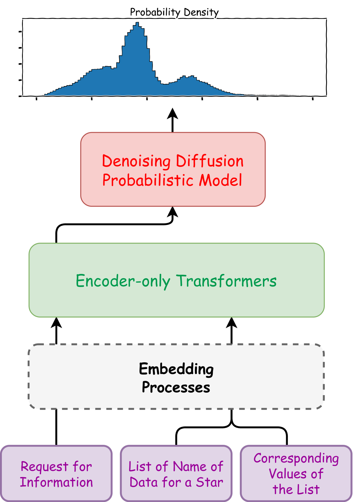
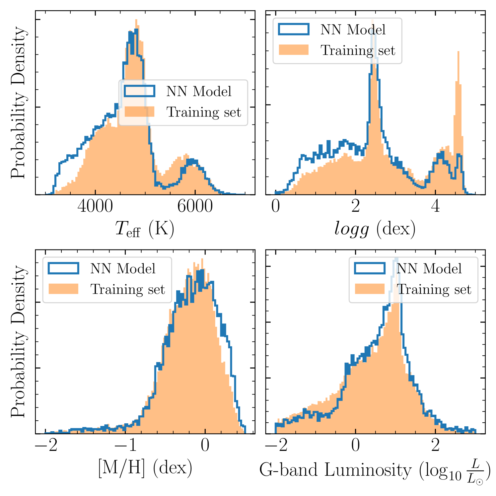
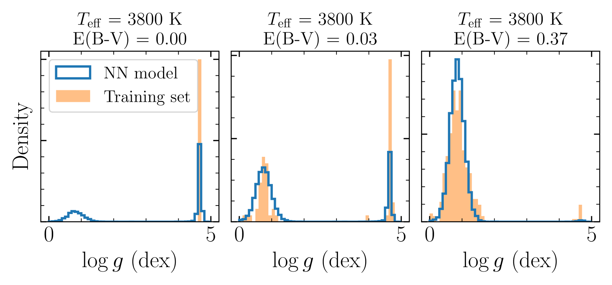
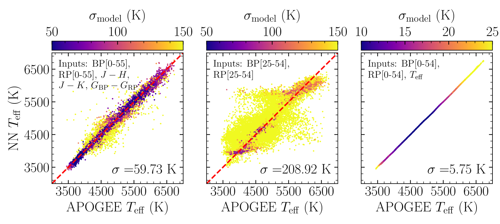
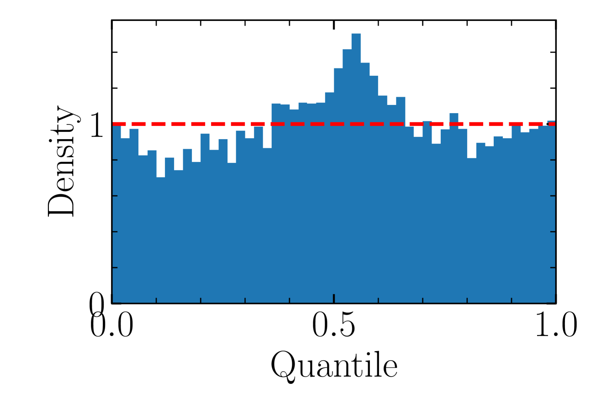
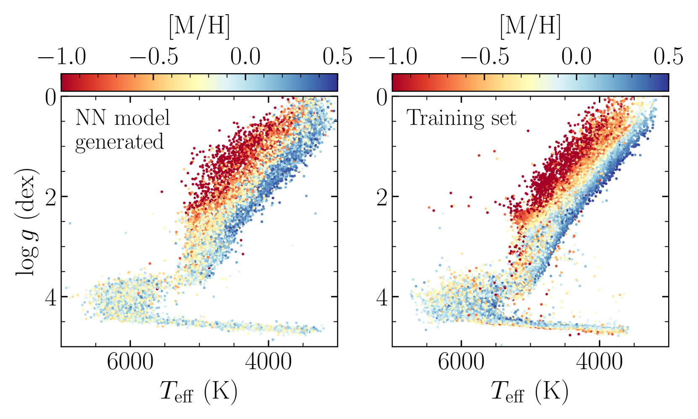
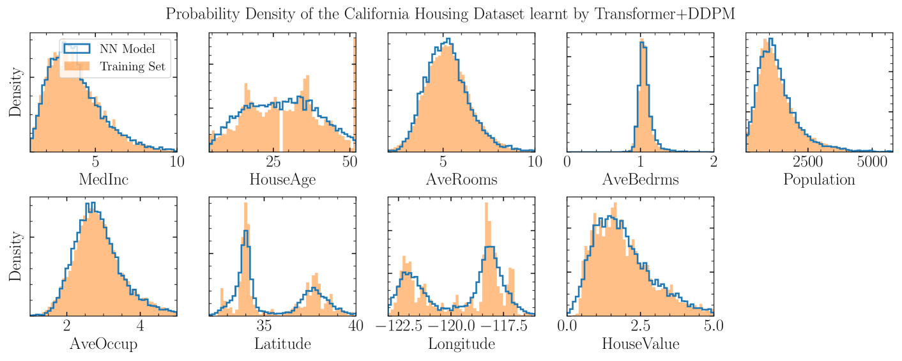
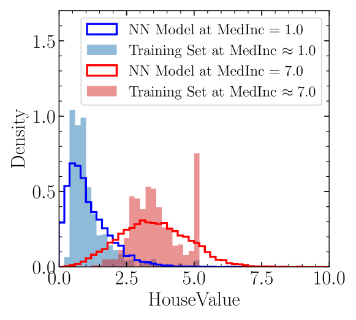

# 通过 Transformer 与去噪扩散技术，我们能够精准估计概率密度。

发布时间：2024年07月22日

`LLM应用` `天文学` `数据科学`

> Estimating Probability Densities with Transformer and Denoising Diffusion

# 摘要

> Transformer 架构常用于构建基础模型，处理海量数据。然而，在回归问题中，这些模型不提供概率密度估计，这对科学领域至关重要，因为答案的分布可能是非高斯和多模态的。本研究展示了一种新方法：在 Transformer 上添加去噪扩散头，训练概率模型，从而对高维输入也能进行合理的概率密度估计。这种结合模型非常灵活，能根据任意输入组合调整输出概率密度，适用于各种输入/输出场景。我们在一个包含银河系恒星观测数据的大型数据集上训练此模型，并应用于多种推理任务，结果显示模型能准确推断标签，且分布合理。

> Transformers are often the go-to architecture to build foundation models that ingest a large amount of training data. But these models do not estimate the probability density distribution when trained on regression problems, yet obtaining full probabilistic outputs is crucial to many fields of science, where the probability distribution of the answer can be non-Gaussian and multimodal. In this work, we demonstrate that training a probabilistic model using a denoising diffusion head on top of the Transformer provides reasonable probability density estimation even for high-dimensional inputs. The combined Transformer+Denoising Diffusion model allows conditioning the output probability density on arbitrary combinations of inputs and it is thus a highly flexible density function emulator of all possible input/output combinations. We illustrate our Transformer+Denoising Diffusion model by training it on a large dataset of astronomical observations and measured labels of stars within our Galaxy and we apply it to a variety of inference tasks to show that the model can infer labels accurately with reasonable distributions.

[Arxiv](https://arxiv.org/abs/2407.15703)