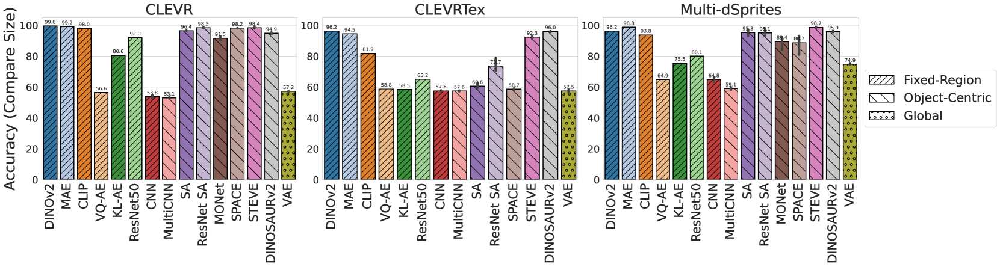
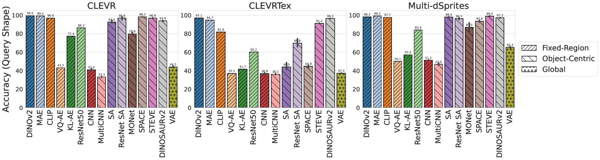

# 本研究深入探讨了对象中心表示在视觉问答中的效能，并通过与基础模型的对比，揭示了其独特的优势。

发布时间：2024年07月22日

`LLM应用` `计算机视觉` `人工智能`

> Exploring the Effectiveness of Object-Centric Representations in Visual Question Answering: Comparative Insights with Foundation Models

# 摘要

> OC表示通过对象组合建模场景，有望在多任务中提升系统泛化和推理能力，但相关研究尚浅。基础模型在多领域展现卓越性能，成为未来计算研究的关键。本文深入探讨VQA任务的表示学习，分析OC模型与大型预训练模型的优劣，提出融合两者优势的方案。研究覆盖800多个VQA模型和15种上游表示，为社区提供了宝贵见解。

> Object-centric (OC) representations, which represent the state of a visual scene by modeling it as a composition of objects, have the potential to be used in various downstream tasks to achieve systematic compositional generalization and facilitate reasoning. However, these claims have not been thoroughly analyzed yet. Recently, foundation models have demonstrated unparalleled capabilities across diverse domains from language to computer vision, marking them as a potential cornerstone of future research for a multitude of computational tasks. In this paper, we conduct an extensive empirical study on representation learning for downstream Visual Question Answering (VQA), which requires an accurate compositional understanding of the scene. We thoroughly investigate the benefits and trade-offs of OC models and alternative approaches including large pre-trained foundation models on both synthetic and real-world data, and demonstrate a viable way to achieve the best of both worlds. The extensiveness of our study, encompassing over 800 downstream VQA models and 15 different types of upstream representations, also provides several additional insights that we believe will be of interest to the community at large.

[Arxiv](https://arxiv.org/abs/2407.15589)