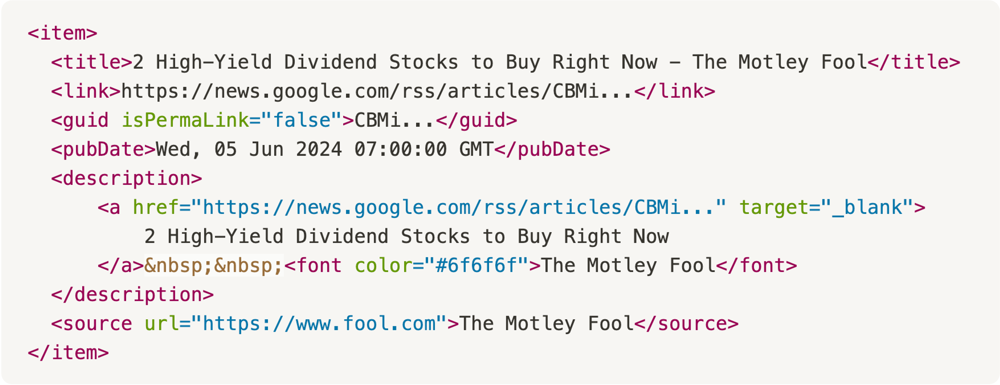
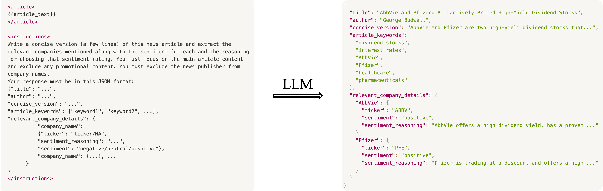
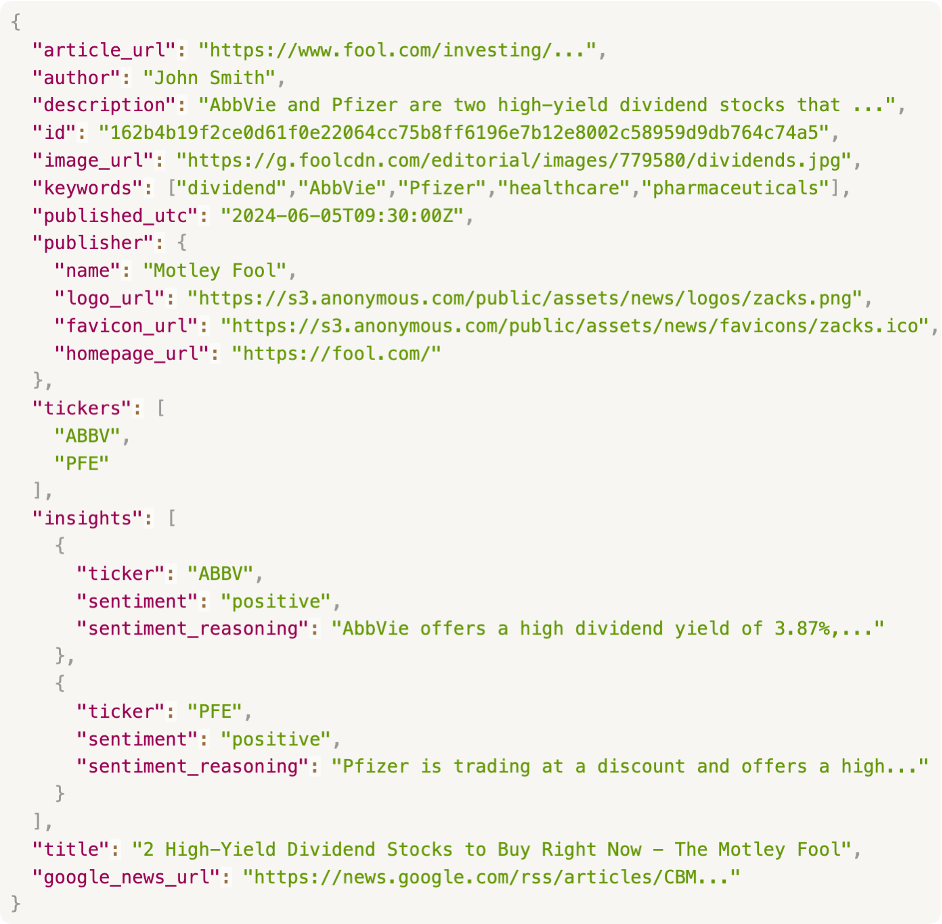
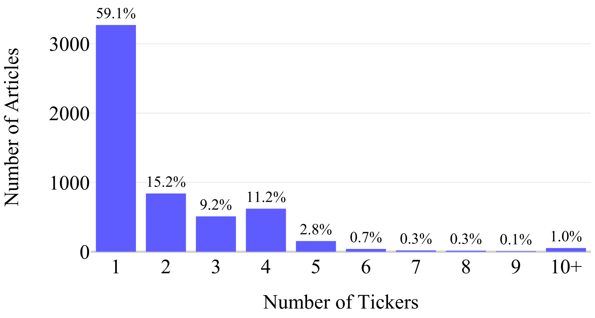
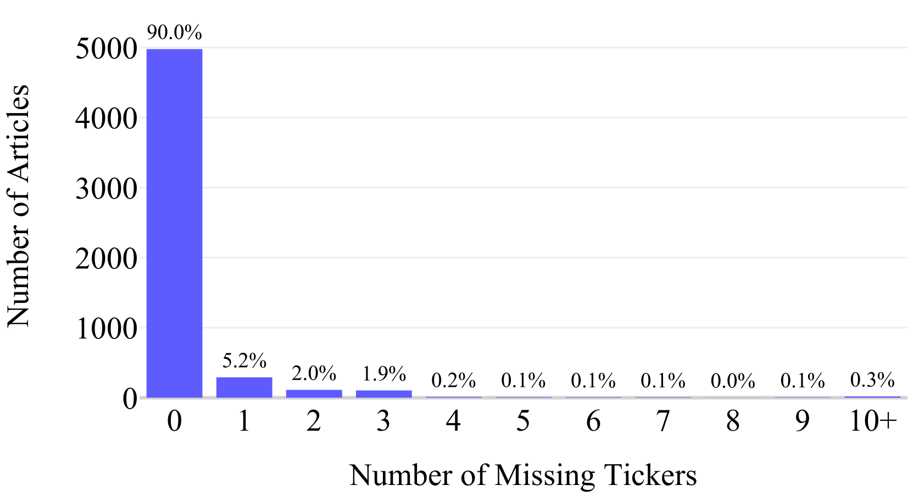
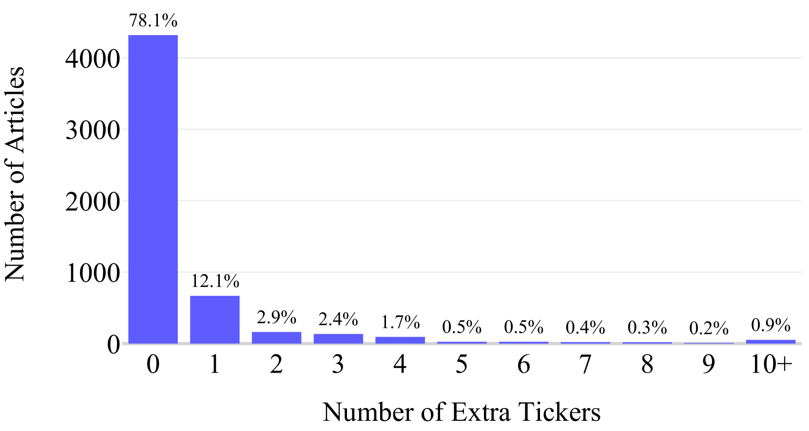

# 利用增强型 LLM 技术，从金融新闻中提炼结构化洞察。

发布时间：2024年07月22日

`LLM应用` `新闻分析`

> Extracting Structured Insights from Financial News: An Augmented LLM Driven Approach

# 摘要

> 金融新闻在金融决策中至关重要，但将其高效转化为结构化信息仍具挑战。本文介绍了一种创新方法，利用大型语言模型（LLM）突破以往从非结构化新闻中提取数据的障碍。我们的系统能从原始新闻中提取公司股票代码，进行情感分析并生成摘要，无需预设数据源。结合LLM的生成力、先进提示技术和定制验证框架，我们在5530篇文章的测试中展现了高效性能，90%文章无遗漏股票代码，22%有额外相关代码。此方法已大规模应用，通过实时API提供数据。我们首次提供新闻中每公司的细粒度情感分析，深化了市场信息。同时，我们公开了处理过的5530篇文章数据集，期待推动相关研究。

> Financial news plays a crucial role in decision-making processes across the financial sector, yet the efficient processing of this information into a structured format remains challenging. This paper presents a novel approach to financial news processing that leverages Large Language Models (LLMs) to overcome limitations that previously prevented the extraction of structured data from unstructured financial news. We introduce a system that extracts relevant company tickers from raw news article content, performs sentiment analysis at the company level, and generates summaries, all without relying on pre-structured data feeds. Our methodology combines the generative capabilities of LLMs, and recent prompting techniques, with a robust validation framework that uses a tailored string similarity approach. Evaluation on a dataset of 5530 financial news articles demonstrates the effectiveness of our approach, with 90% of articles not missing any tickers compared with current data providers, and 22% of articles having additional relevant tickers. In addition to this paper, the methodology has been implemented at scale with the resulting processed data made available through a live API endpoint, which is updated in real-time with the latest news. To the best of our knowledge, we are the first data provider to offer granular, per-company sentiment analysis from news articles, enhancing the depth of information available to market participants. We also release the evaluation dataset of 5530 processed articles as a static file, which we hope will facilitate further research leveraging financial news.

[Arxiv](https://arxiv.org/abs/2407.15788)