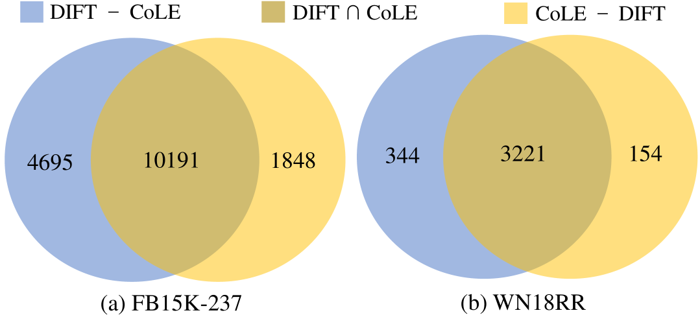

# 通过鉴别指令微调生成式大型语言模型，助力知识图谱补全任务。

发布时间：2024年07月22日

`LLM应用` `知识图谱` `人工智能`

> Finetuning Generative Large Language Models with Discrimination Instructions for Knowledge Graph Completion

# 摘要

> 传统的知识图谱补全模型通过学习嵌入来预测缺失信息。近期研究尝试利用大型语言模型以生成文本的方式补全知识图谱，但需将模型输出与实体对齐，这难免引入错误。本文介绍的DIFT框架，旨在提升LLM的图谱补全能力并规避对齐错误。DIFT通过轻量级模型筛选候选实体，并利用微调指令指导LLM从候选中精准选出正确实体。为优化性能并减少数据需求，DIFT采用截断采样精选微调事实，并将图谱嵌入融入LLM。实验结果显示，DIFT框架在多个基准数据集上表现卓越。

> Traditional knowledge graph (KG) completion models learn embeddings to predict missing facts. Recent works attempt to complete KGs in a text-generation manner with large language models (LLMs). However, they need to ground the output of LLMs to KG entities, which inevitably brings errors. In this paper, we present a finetuning framework, DIFT, aiming to unleash the KG completion ability of LLMs and avoid grounding errors. Given an incomplete fact, DIFT employs a lightweight model to obtain candidate entities and finetunes an LLM with discrimination instructions to select the correct one from the given candidates. To improve performance while reducing instruction data, DIFT uses a truncated sampling method to select useful facts for finetuning and injects KG embeddings into the LLM. Extensive experiments on benchmark datasets demonstrate the effectiveness of our proposed framework.

[Arxiv](https://arxiv.org/abs/2407.16127)