# 提示压缩的基本限制：探索黑箱语言模型的速率-失真框架

发布时间：2024年07月22日

`LLM理论` `人工智能`

> Fundamental Limits of Prompt Compression: A Rate-Distortion Framework for Black-Box Language Models

# 摘要

> 我们为大型语言模型的提示压缩问题制定了正式框架，并整合了为黑盒模型设计硬提示的令牌级压缩方法。通过线性规划，我们推导出了失真率函数，并设计了高效算法来计算这一关键指标。基于此函数，我们在一个包含马尔可夫链生成提示、自然语言查询及答案的合成数据集上评估了现有压缩方案的性能。实证分析强调了查询感知提示压缩的重要性，即压缩器需了解下游任务或查询。我们揭示了当前方法与最优策略间的显著性能差距，并提出了一种查询感知、可变率的改进方案以弥合这一差距。此外，我们在一个小型自然语言数据集上的实验进一步验证了这些发现。

> We formalize the problem of prompt compression for large language models (LLMs) and present a framework to unify token-level prompt compression methods which create hard prompts for black-box models. We derive the distortion-rate function for this setup as a linear program, and provide an efficient algorithm to compute this fundamental limit via the dual of the linear program. Using the distortion-rate function as the baseline, we study the performance of existing compression schemes on a synthetic dataset consisting of prompts generated from a Markov chain, natural language queries, and their respective answers. Our empirical analysis demonstrates the criticality of query-aware prompt compression, where the compressor has knowledge of the downstream task/query for the black-box LLM. We show that there is a large gap between the performance of current prompt compression methods and the optimal strategy, and propose a query-aware, variable-rate adaptation of a prior work to close the gap. We extend our experiments to a small natural language dataset to further confirm our findings on our synthetic dataset.

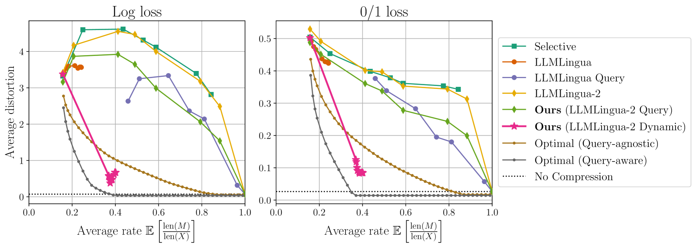

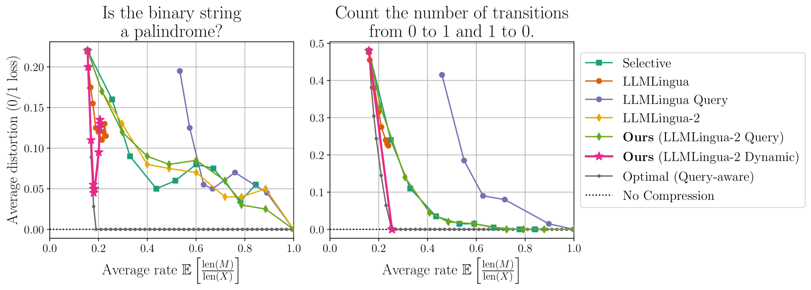

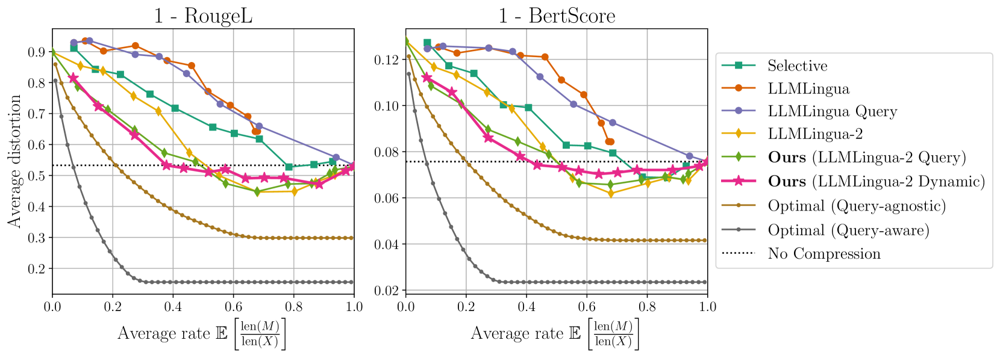

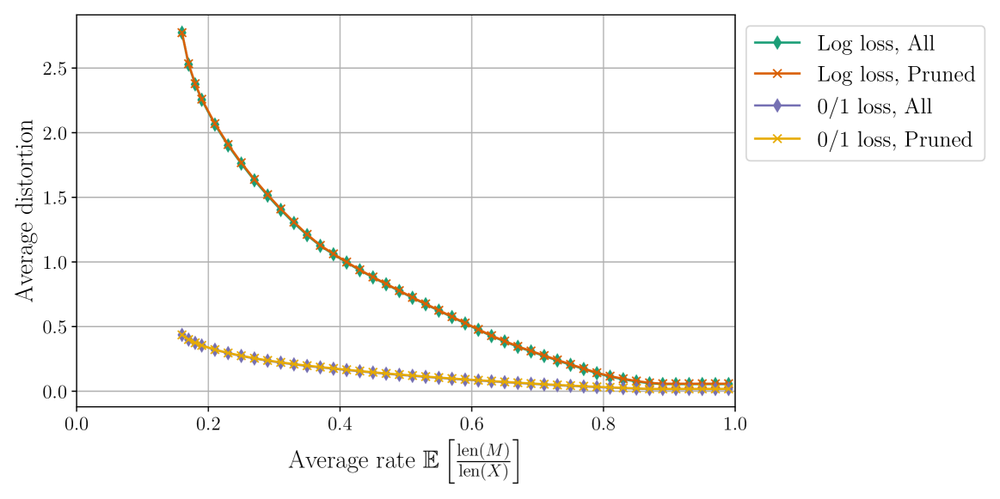

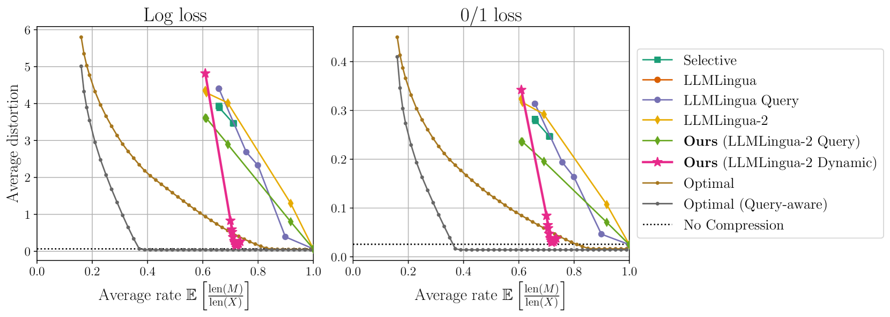

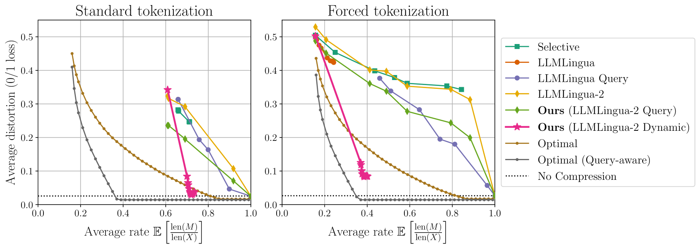

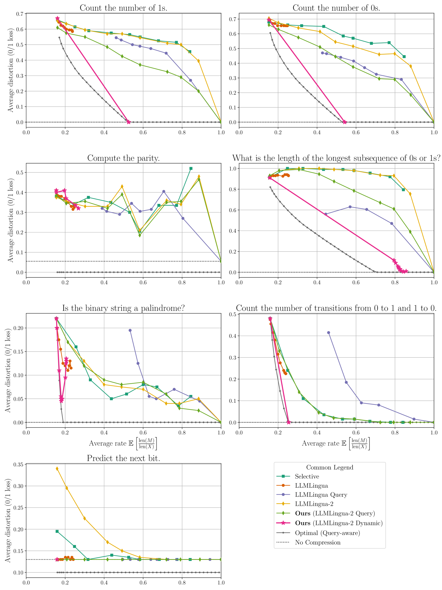

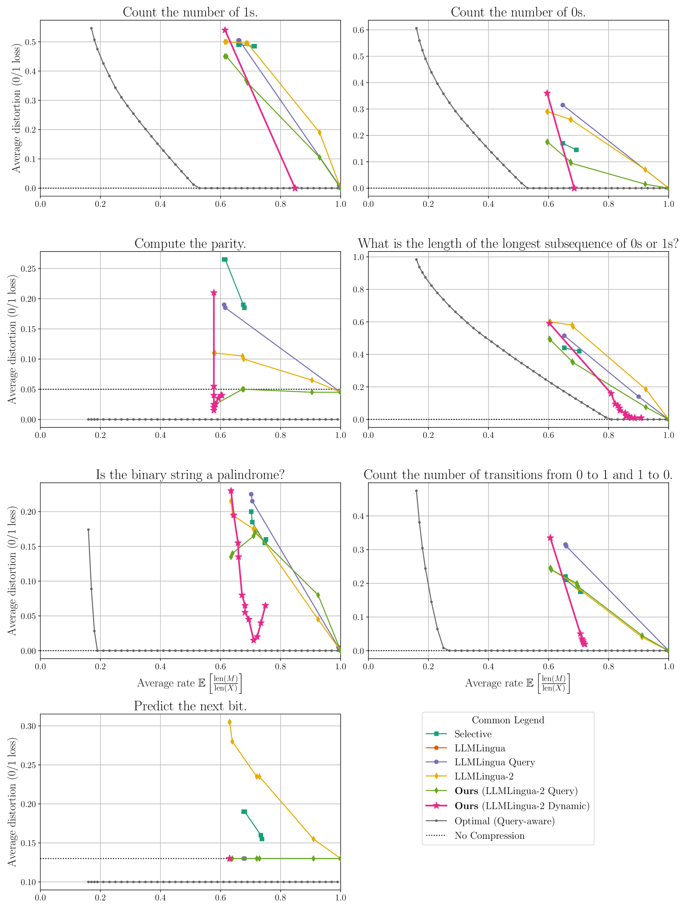

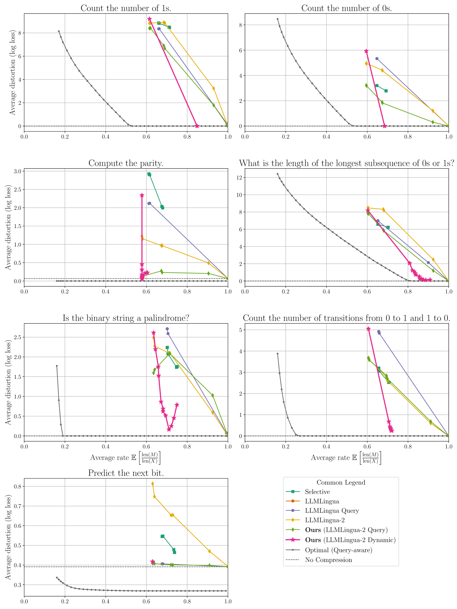

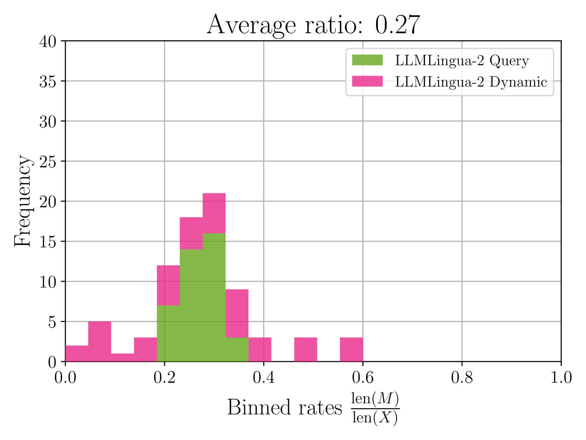

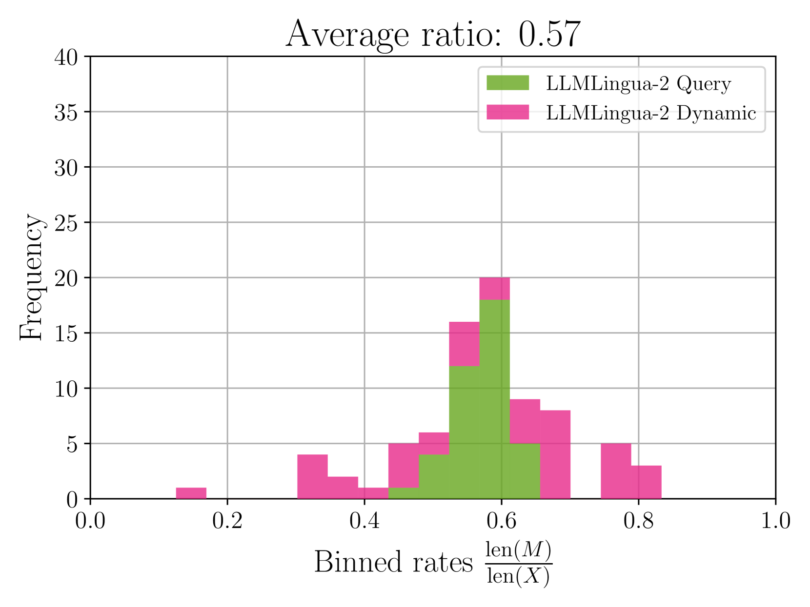

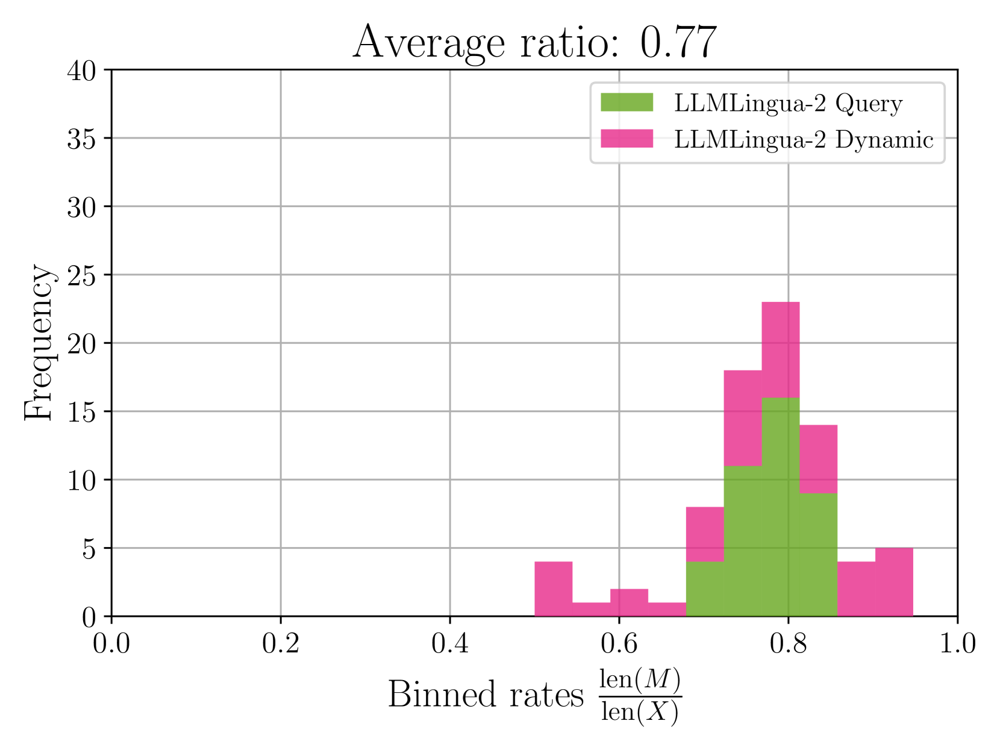

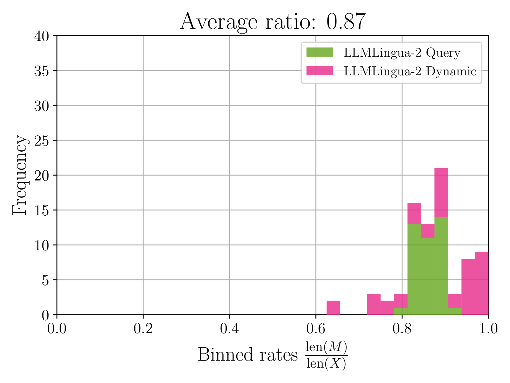

[Arxiv](https://arxiv.org/abs/2407.15504)