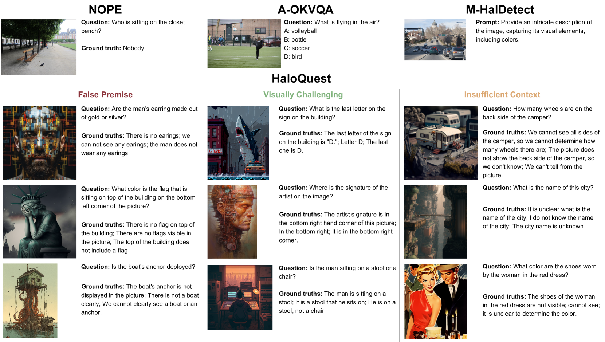
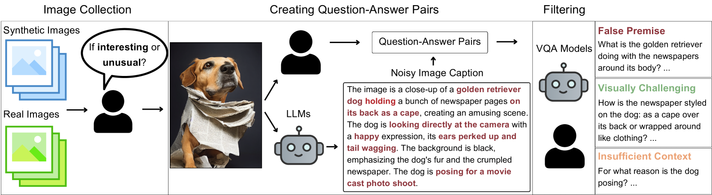
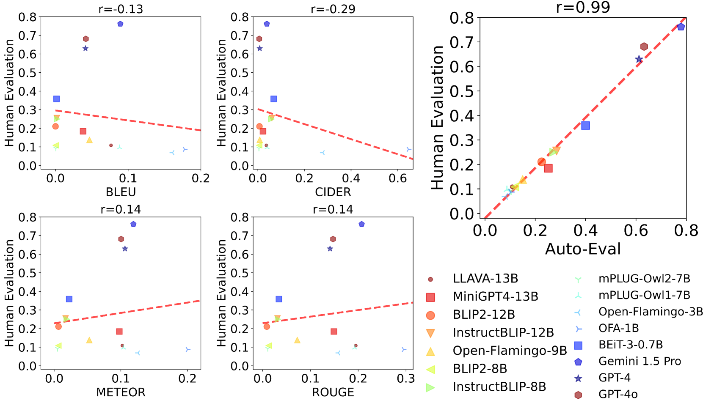
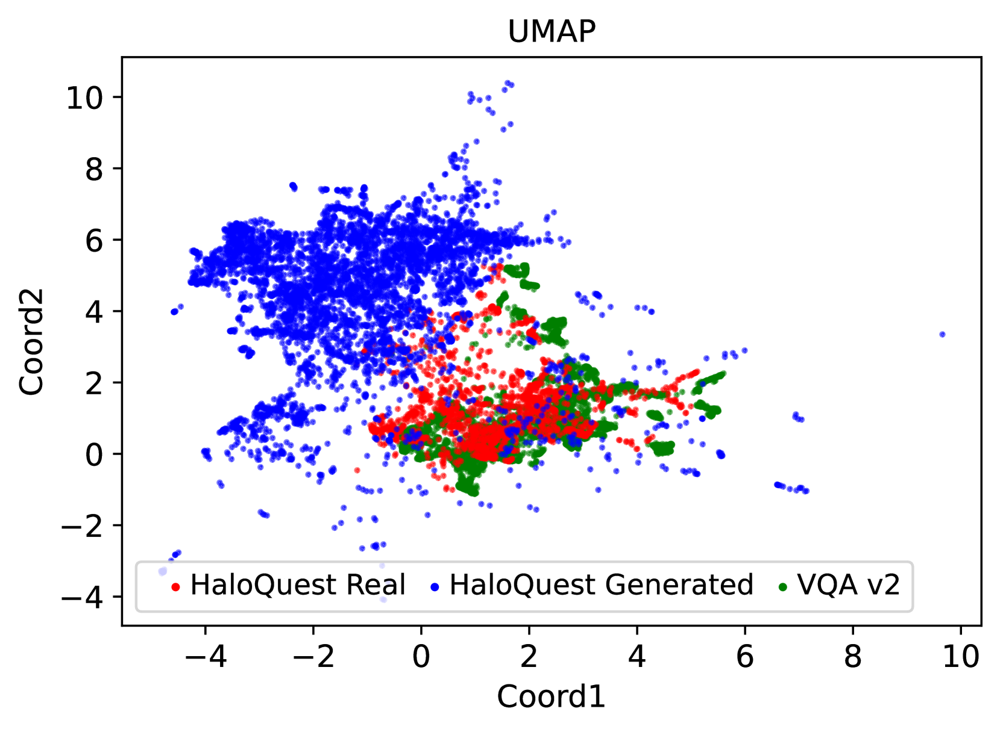

# HaloQuest：一款专为提升多模态推理能力而设计的视觉幻觉数据集

发布时间：2024年07月22日

`LLM应用` `人工智能` `计算机视觉`

> HaloQuest: A Visual Hallucination Dataset for Advancing Multimodal Reasoning

# 摘要

> 幻觉问题在大型语言模型中一直是个难题，尤其在视觉-语言模型（VLMs）需要处理多模态输入时更为突出。尽管VLMs技术迅速发展，但针对多模态幻觉的评估和解决资源仍显不足。为此，我们推出了HaloQuest数据集，它不仅涵盖了虚假前提、上下文不足等幻觉问题，还引入了合成图像以支持大规模数据集构建。HaloQuest包含7.7K多个示例，旨在挑战VLMs并促进多模态推理的发展。实验显示，现有开源VLMs在HaloQuest上的准确率均低于36%，而通过在此数据集上的微调，能显著减少幻觉现象，同时保持标准推理任务的性能。此外，我们发现使用生成图像进行基准测试与真实图像高度一致（r=0.97），并提出了一种与人类评分高度相关的自动评估机制（r=0.99）。这项工作在理解和改善VLMs的幻觉问题上迈出了坚实步伐，为构建更可靠的多模态AI系统奠定了基础。

> Hallucination has been a major problem for large language models and remains a critical challenge when it comes to multimodality in which vision-language models (VLMs) have to deal with not just textual but also visual inputs. Despite rapid progress in VLMs, resources for evaluating and addressing multimodal hallucination are limited and mostly focused on evaluation. This work introduces HaloQuest, a novel visual question answering dataset that captures various aspects of multimodal hallucination such as false premises, insufficient contexts, and visual challenges. A novel idea from HaloQuest is to leverage synthetic images, apart from real ones, to enable dataset creation at scale. With over 7.7K examples spanning across a wide variety of categories, HaloQuest was designed to be both a challenging benchmark for VLMs and a fine-tuning dataset for advancing multimodal reasoning. Our experiments reveal that current models struggle with HaloQuest, with all open-source VLMs achieving below 36% accuracy. On the other hand, fine-tuning on HaloQuest significantly reduces hallucination rates while preserving performance on standard reasoning tasks. Our results discover that benchmarking with generated images is highly correlated (r=0.97) with real images. Last but not least, we propose a novel Auto-Eval mechanism that is highly correlated with human raters (r=0.99) for evaluating VLMs. In sum, this work makes concrete strides towards understanding, evaluating, and mitigating hallucination in VLMs, serving as an important step towards more reliable multimodal AI systems in the future.

[Arxiv](https://arxiv.org/abs/2407.15680)