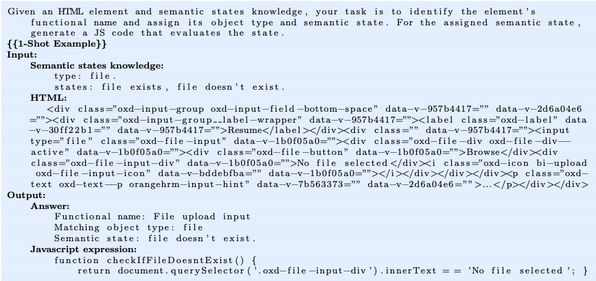

# IDA 利用大型语言模型和以人为本的设计，突破了无代码 UI 自动化的限制。

发布时间：2024年07月22日

`LLM应用` `自动化`

> IDA: Breaking Barriers in No-code UI Automation Through Large Language Models and Human-Centric Design

# 摘要

> 商业用户在企业数字平台中频繁执行重复任务，凸显了自动化的重要性。尽管低代码工具在UI自动化方面有所进步，但其复杂性仍是非技术用户采纳的障碍。大型语言模型（LLM）的最新进展为此提供了新机遇，通过提供更强大、更简洁且更人性化的编程环境。本文介绍的IDA（智能数字助手）是一款创新的无代码Web UI自动化工具，专为无技术背景的商业用户设计。IDA采用以人为本的设计原则，如通过示范引导编程、语义编程模型及适合商业用户技能的师生学习模式。借助LLM，IDA克服了传统无代码解决方案的技术障碍。我们开发了IDA原型，并进行了涉及真实商业用户和企业应用的用户研究。结果显示，用户能有效利用IDA创建自动化，且反馈表明IDA用户友好且可信。本研究有助于AI助手通过无代码UI自动化提升商业用户效率。

> Business users dedicate significant amounts of time to repetitive tasks within enterprise digital platforms, highlighting a critical need for automation. Despite advancements in low-code tools for UI automation, their complexity remains a significant barrier to adoption among non-technical business users. However, recent advancements in large language models (LLMs) have created new opportunities to overcome this barrier by offering more powerful, yet simpler and more human-centric programming environments. This paper presents IDA (Intelligent Digital Apprentice), a novel no-code Web UI automation tool designed specifically to empower business users with no technical background. IDA incorporates human-centric design principles, including guided programming by demonstration, semantic programming model, and teacher-student learning metaphor which is tailored to the skill set of business users. By leveraging LLMs, IDA overcomes some of the key technical barriers that have traditionally limited the possibility of no-code solutions. We have developed a prototype of IDA and conducted a user study involving real world business users and enterprise applications. The promising results indicate that users could effectively utilize IDA to create automation. The qualitative feedback indicates that IDA is perceived as user-friendly and trustworthy. This study contributes to unlocking the potential of AI assistants to enhance the productivity of business users through no-code user interface automation.

[Arxiv](https://arxiv.org/abs/2407.15673)