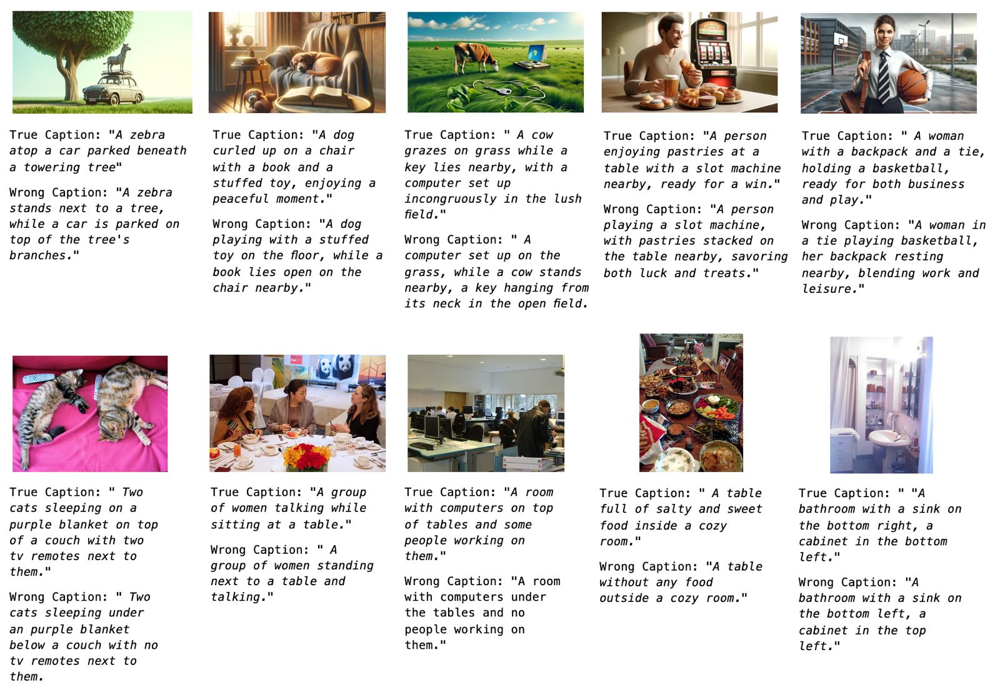
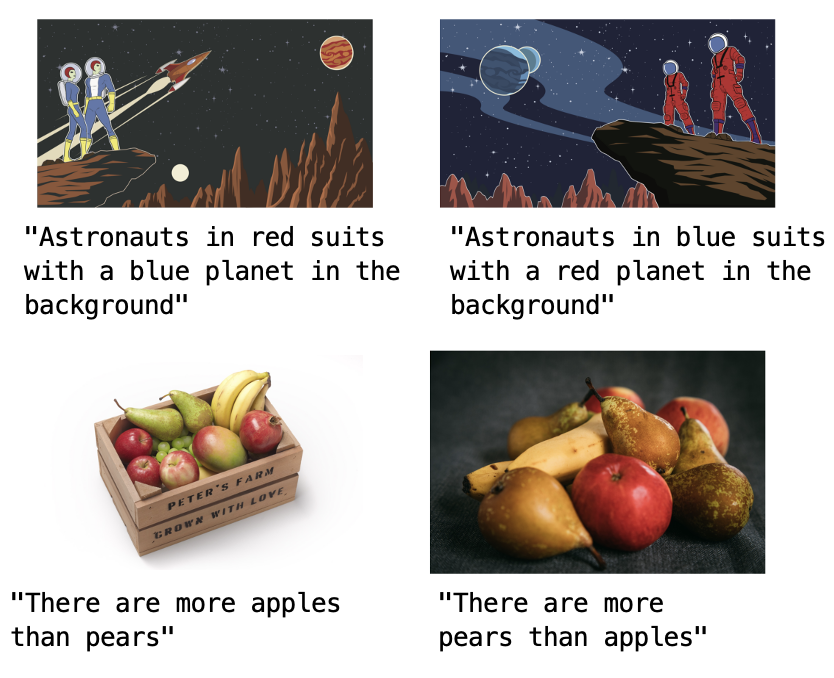

# 上下文学习增强了视觉-语言模型对组合性的理解

发布时间：2024年07月22日

`LLM应用` `计算机视觉` `人工智能`

> In-Context Learning Improves Compositional Understanding of Vision-Language Models

# 摘要

> VLM 在众多下游任务中表现出色，但受训练数据中的对象偏差影响，组合图像理解仍具挑战。我们深入研究了 VLM 在组合理解上的不足，对比了对比模型与生成模型，并探讨了它们在架构、预训练数据及训练任务和损失上的差异。同时，我们采用 ICL 来增强 VLM 的复杂推理能力。实验结果显示，我们的方法在多个组合理解数据集上超越了基准模型。

> Vision-Language Models (VLMs) have shown remarkable capabilities in a large number of downstream tasks. Nonetheless, compositional image understanding remains a rather difficult task due to the object bias present in training data. In this work, we investigate the reasons for such a lack of capability by performing an extensive bench-marking of compositional understanding in VLMs. We compare contrastive models with generative ones and analyze their differences in architecture, pre-training data, and training tasks and losses. Furthermore, we leverage In-Context Learning (ICL) as a way to improve the ability of VLMs to perform more complex reasoning and understanding given an image. Our extensive experiments demonstrate that our proposed approach outperforms baseline models across multiple compositional understanding datasets.

[Arxiv](https://arxiv.org/abs/2407.15487)