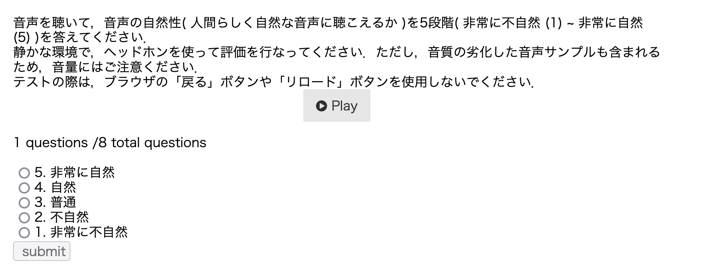

# J-CHAT：专为口语对话语言建模设计的日本大型口语对话语料库

发布时间：2024年07月22日

`LLM应用` `人机交互` `语音识别`

> J-CHAT: Japanese Large-scale Spoken Dialogue Corpus for Spoken Dialogue Language Modeling

# 摘要

> 口语对话在人机交互中至关重要，因此开发面向对话的口语语言模型（SLMs）势在必行。为打造多功能SLMs，我们需要大规模且多样化的语音数据集。同时，为确保语音生成的高质量，数据需如野外采集般自然，且声学纯净无噪音。尽管需求迫切，但符合所有标准的开源语料库仍未出现。本研究填补了这一空白，构建并公开了名为“人机对话日语语料库（J-CHAT）”的大规模语料库。此外，本文还介绍了一种与语言无关的语料库构建方法，并展示了基于J-CHAT训练的SLMs在对话生成方面的实验。实验结果显示，通过我们的方法从多领域收集的数据显著提升了对话的自然度和意义性。

> Spoken dialogue plays a crucial role in human-AI interactions, necessitating dialogue-oriented spoken language models (SLMs). To develop versatile SLMs, large-scale and diverse speech datasets are essential. Additionally, to ensure hiqh-quality speech generation, the data must be spontaneous like in-wild data and must be acoustically clean with noise removed. Despite the critical need, no open-source corpus meeting all these criteria has been available. This study addresses this gap by constructing and releasing a large-scale spoken dialogue corpus, named Japanese Corpus for Human-AI Talks (J-CHAT), which is publicly accessible. Furthermore, this paper presents a language-independent method for corpus construction and describes experiments on dialogue generation using SLMs trained on J-CHAT. Experimental results indicate that the collected data from multiple domains by our method improve the naturalness and meaningfulness of dialogue generation.

[Arxiv](https://arxiv.org/abs/2407.15828)