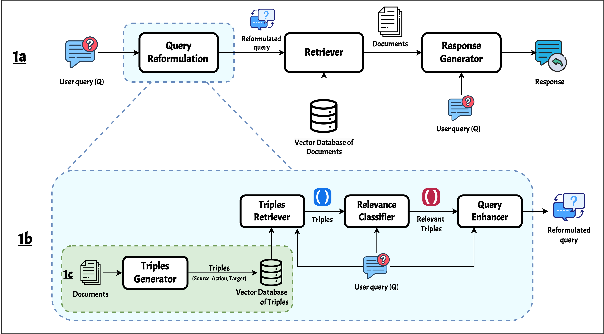
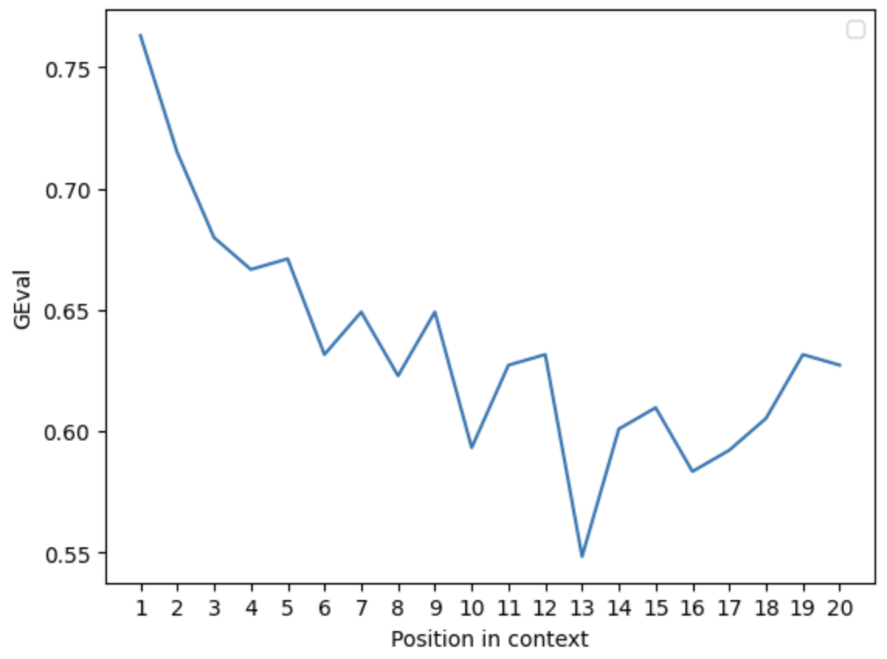
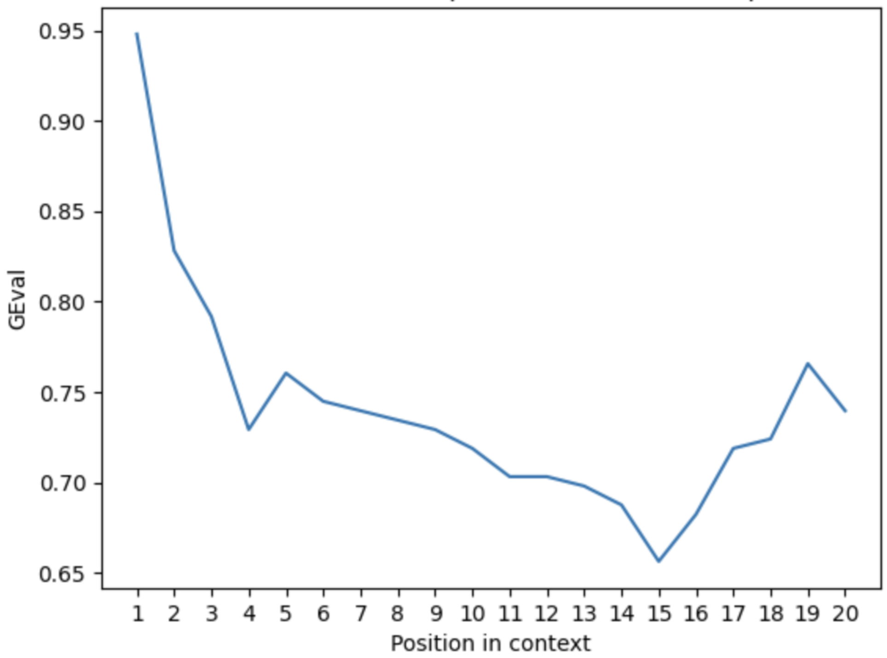
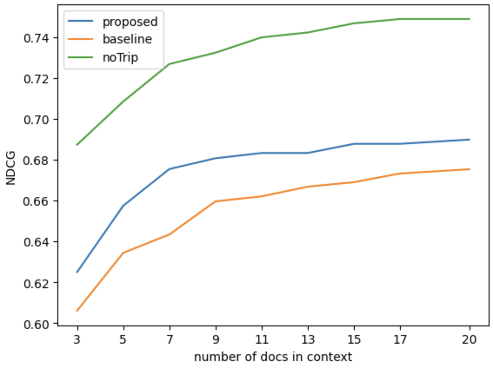
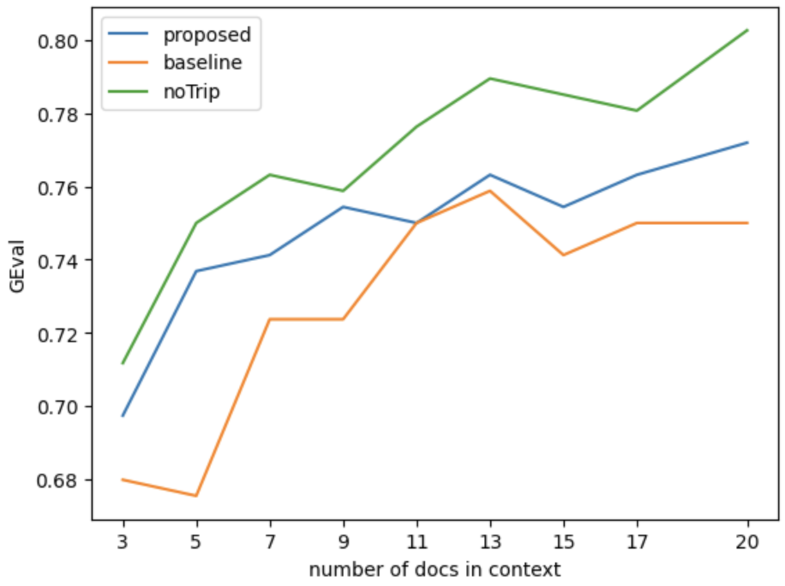
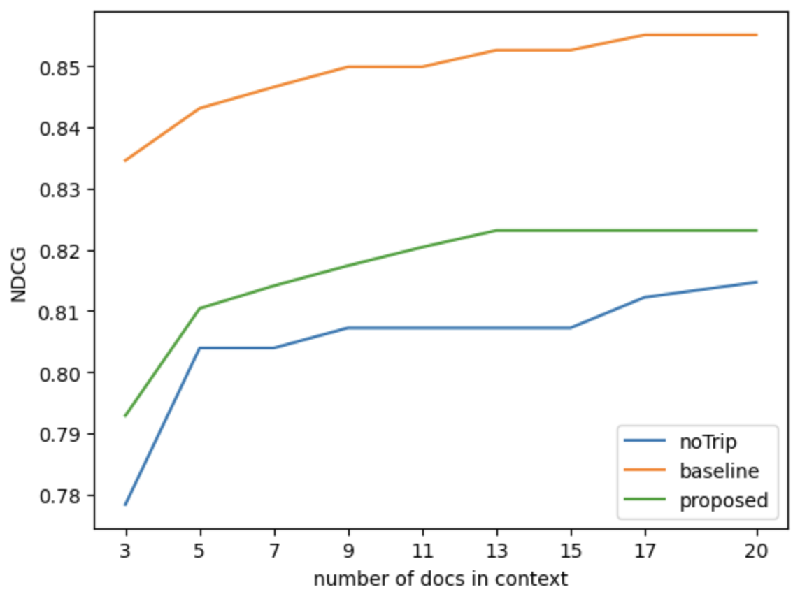
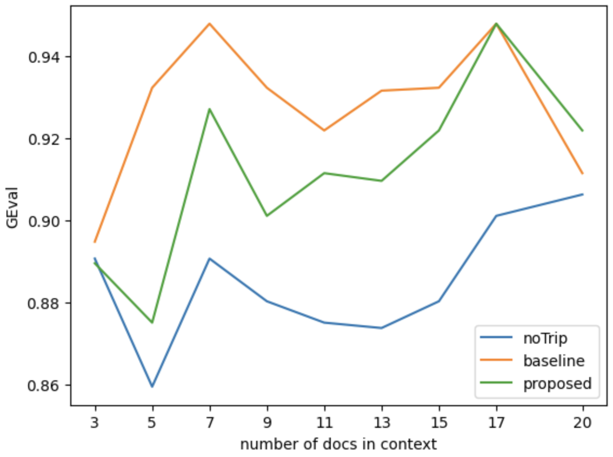

# KaPQA：知识赋能的产品问答系统

发布时间：2024年07月22日

`RAG`

> KaPQA: Knowledge-Augmented Product Question-Answering

# 摘要

> 随着大型语言模型的进步，特定领域的问答应用备受瞩目。但准确评估这些应用的性能仍具挑战，关键在于缺乏能真实模拟现实情境的基准。为此，我们推出了两个针对 Adobe Acrobat 和 Photoshop 的问答数据集，旨在助力评估模型在特定领域问答任务中的表现。同时，我们创新性地提出了一个知识驱动的 RAG-QA 框架，以提升问答性能。实验显示，通过查询重构融入领域知识，相较于传统 RAG-QA 方法，检索与生成能力有所增强。尽管改进幅度不大，却凸显了新数据集带来的挑战性。

> Question-answering for domain-specific applications has recently attracted much interest due to the latest advancements in large language models (LLMs). However, accurately assessing the performance of these applications remains a challenge, mainly due to the lack of suitable benchmarks that effectively simulate real-world scenarios. To address this challenge, we introduce two product question-answering (QA) datasets focused on Adobe Acrobat and Photoshop products to help evaluate the performance of existing models on domain-specific product QA tasks. Additionally, we propose a novel knowledge-driven RAG-QA framework to enhance the performance of the models in the product QA task. Our experiments demonstrated that inducing domain knowledge through query reformulation allowed for increased retrieval and generative performance when compared to standard RAG-QA methods. This improvement, however, is slight, and thus illustrates the challenge posed by the datasets introduced.

[Arxiv](https://arxiv.org/abs/2407.16073)