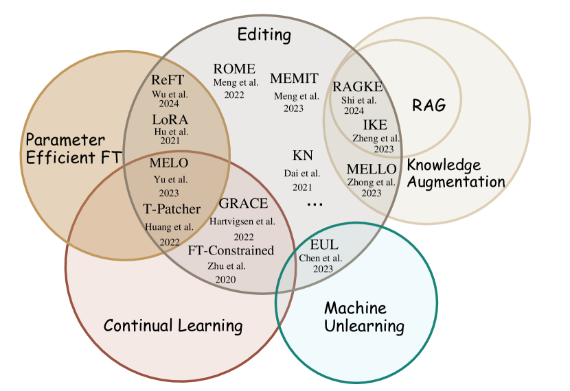

# 大型语言模型中的知识机制：调查与展望

发布时间：2024年07月22日

`LLM理论` `人工智能` `知识管理`

> Knowledge Mechanisms in Large Language Models: A Survey and Perspective

# 摘要

> 理解 LLM 中的知识机制对迈向可信赖 AGI 至关重要。本文从知识利用和演化的新视角审视了知识机制，深入探讨了记忆、理解、应用及创造的机理，并关注了 LLM 个体与群体中知识的动态演变。同时，我们探讨了 LLM 所学知识的本质、参数化知识的脆弱根源，以及可能存在的难以应对的暗知识。期望这项研究能为深入理解 LLM 知识提供洞见，并启迪未来研究方向。

> Understanding knowledge mechanisms in Large Language Models (LLMs) is crucial for advancing towards trustworthy AGI. This paper reviews knowledge mechanism analysis from a novel taxonomy including knowledge utilization and evolution. Knowledge utilization delves into the mechanism of memorization, comprehension and application, and creation. Knowledge evolution focuses on the dynamic progression of knowledge within individual and group LLMs. Moreover, we discuss what knowledge LLMs have learned, the reasons for the fragility of parametric knowledge, and the potential dark knowledge (hypothesis) that will be challenging to address. We hope this work can help understand knowledge in LLMs and provide insights for future research.

[Arxiv](https://arxiv.org/abs/2407.15017)