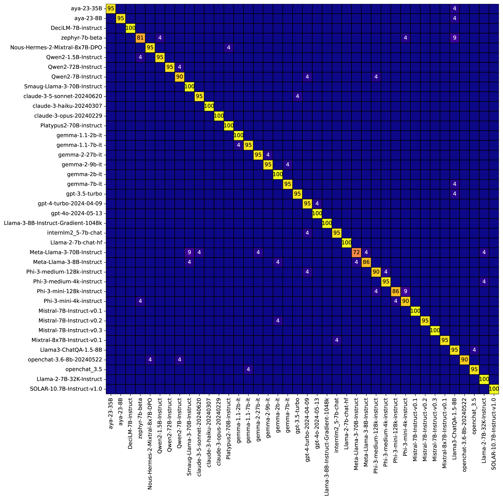
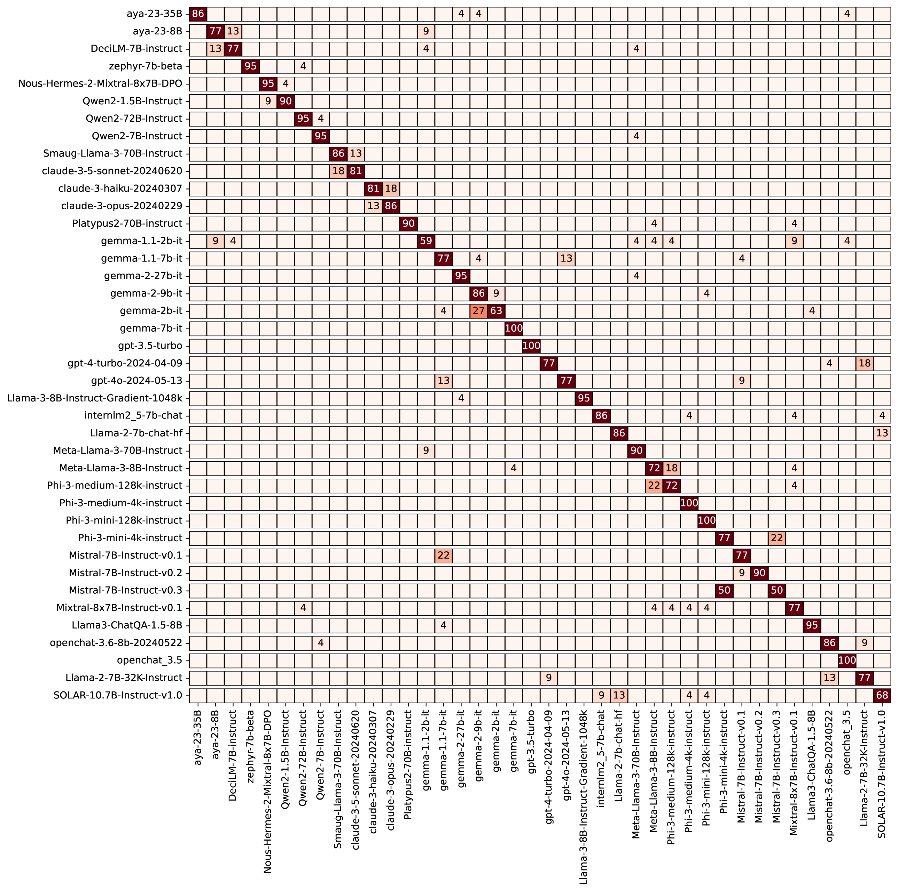

# LLMmap：大型语言模型的指纹识别技术

发布时间：2024年07月22日

`LLM应用` `网络安全` `人工智能`

> LLMmap: Fingerprinting For Large Language Models

# 摘要

> 我们推出了 LLMmap，这是首个针对集成 LLM 应用的指纹识别攻击工具。通过主动发送特制查询并分析响应，LLMmap 能在仅 8 次交互中，以 95% 以上的准确率识别出具体的 LLM 模型。此外，LLMmap 的设计使其能跨越不同应用层，有效识别在多样系统设置和复杂生成框架（如 RAG 和 Chain-of-Thought）下运行的 LLM。

> We introduce LLMmap, a first-generation fingerprinting attack targeted at LLM-integrated applications. LLMmap employs an active fingerprinting approach, sending carefully crafted queries to the application and analyzing the responses to identify the specific LLM model in use. With as few as 8 interactions, LLMmap can accurately identify LLMs with over 95% accuracy. More importantly, LLMmap is designed to be robust across different application layers, allowing it to identify LLMs operating under various system prompts, stochastic sampling hyperparameters, and even complex generation frameworks such as RAG or Chain-of-Thought.

[Arxiv](https://arxiv.org/abs/2407.15847)