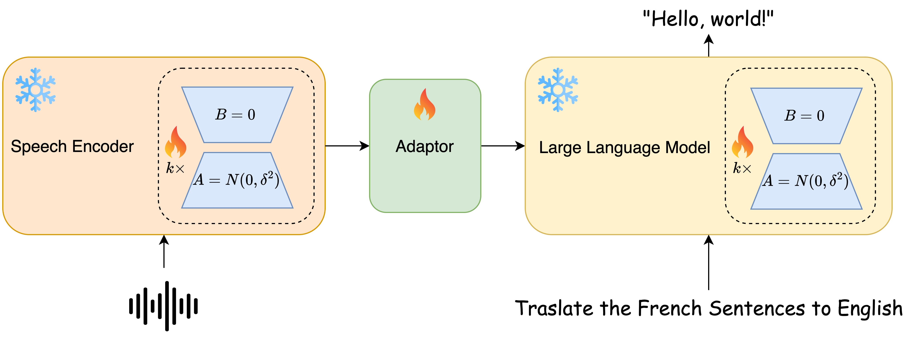
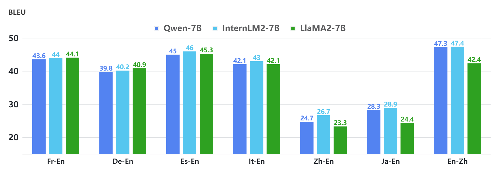
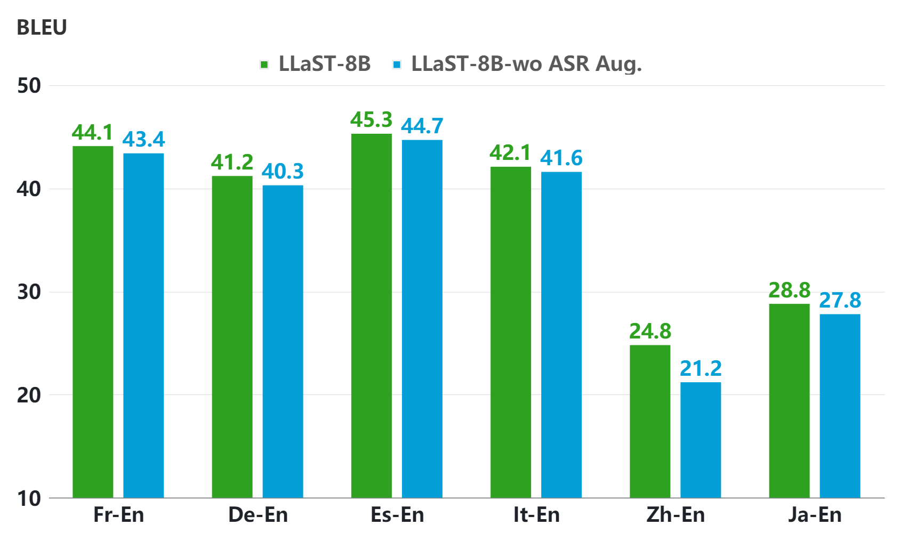

# LLaST：借助大型语言模型，实现更优的端到端语音翻译系统

发布时间：2024年07月22日

`LLM应用` `语音翻译` `人工智能`

> LLaST: Improved End-to-end Speech Translation System Leveraged by Large Language Models

# 摘要

> 我们推出了 LLaST 框架，专为构建基于大型语言模型的高性能语音转文本翻译系统。通过针对 LLM 的模型架构设计和优化技术，我们克服了端到端语音翻译模型的局限。我们的方法涵盖了 LLM 驱动的语音翻译架构、ASR 增强训练、多语言数据增强及双 LoRA 优化。在 CoVoST-2 基准测试中，我们的方法表现卓越，并展现了 LLM 支持下的强大扩展性。我们相信，这一高效方法将为语音翻译领域奠定坚实基础，并为未来基于 LLM 的语音翻译框架的改进提供宝贵见解。相关数据、代码和模型已发布于 https://github.com/openaudiolab/LLaST。

> We introduces LLaST, a framework for building high-performance Large Language model based Speech-to-text Translation systems. We address the limitations of end-to-end speech translation(E2E ST) models by exploring model architecture design and optimization techniques tailored for LLMs. Our approach includes LLM-based speech translation architecture design, ASR-augmented training, multilingual data augmentation, and dual-LoRA optimization. Our approach demonstrates superior performance on the CoVoST-2 benchmark and showcases exceptional scaling capabilities powered by LLMs. We believe this effective method will serve as a strong baseline for speech translation and provide insights for future improvements of the LLM-based speech translation framework. We release the data, code and models in https://github.com/openaudiolab/LLaST.

[Arxiv](https://arxiv.org/abs/2407.15415)