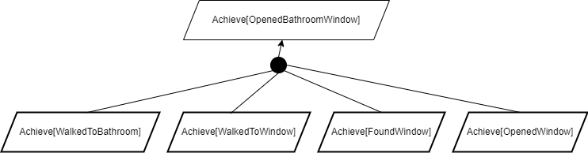
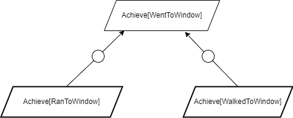
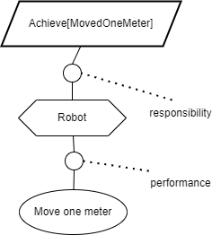

# 语言模型如同机器人规划师，将计划描绘成目标细化图。

发布时间：2024年07月22日

`LLM应用` `机器人` `软件工程`

> Language models are robotic planners: reframing plans as goal refinement graphs

# 摘要

> LLM 在机器人规划和执行中的应用前景广阔，有望推动现实任务的自动化。最新研究表明，LLM 的知识能助力在交互式环境中做出可行的目标决策。尽管如此，LLM 生成的程序正确性有待提升。我们借鉴软件工程的目标建模技术，指导 LLM 生成任务的步骤细化图，并评估其转换程序的执行性和正确性。这种方法相较于以往，能产出更符合人类标准的正确程序。

> Successful application of large language models (LLMs) to robotic planning and execution may pave the way to automate numerous real-world tasks. Promising recent research has been conducted showing that the knowledge contained in LLMs can be utilized in making goal-driven decisions that are enactable in interactive, embodied environments. Nonetheless, there is a considerable drop in correctness of programs generated by LLMs. We apply goal modeling techniques from software engineering to large language models generating robotic plans. Specifically, the LLM is prompted to generate a step refinement graph for a task. The executability and correctness of the program converted from this refinement graph is then evaluated. The approach results in programs that are more correct as judged by humans in comparison to previous work.

[Arxiv](https://arxiv.org/abs/2407.15677)