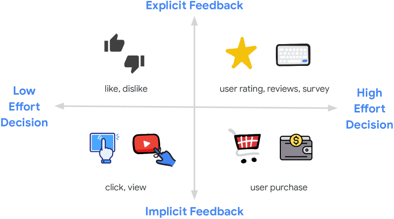
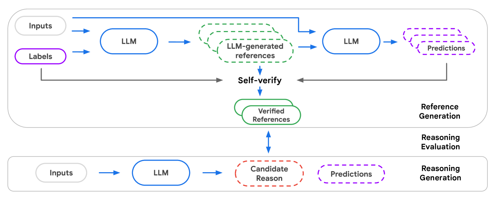
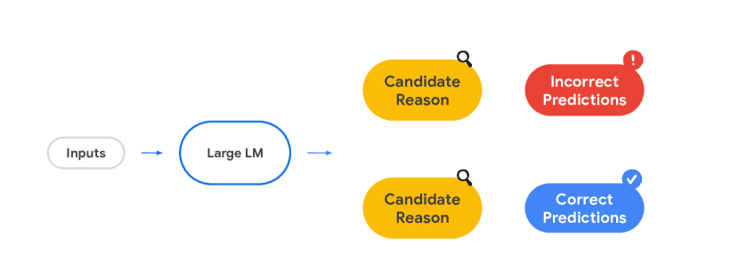

# 借助 LLM 的推理能力，个性化推荐系统得以提升。

发布时间：2024年07月22日

`LLM应用` `推荐系统` `人工智能`

> Leveraging LLM Reasoning Enhances Personalized Recommender Systems

# 摘要

> 近期研究揭示了大型语言模型（LLM）在推理任务中的显著潜力，尤其是借助思维链（CoT）提示技术。尽管算术推理等任务因其明确的答案和逻辑链条而相对简单，但LLM在推荐系统（RecSys）中的推理应用却颇具挑战性。RecSys涉及主观性和个性化偏好，这一领域对LLM推理能力的探索尚显不足。本研究深入探讨了多个方面，旨在深化对RecSys推理的理解，并展示在零-shot和微调场景下，LLM推理如何提升任务质量。同时，我们创新性地提出了RecSAVER框架，该框架无需金标准参考或人工评分，即可自动评估LLM推理输出的质量，且与人类对推理一致性和真实性的判断高度吻合。总体而言，我们的研究证实了在RecSys中融入推理机制能够显著提升个性化任务的表现，为推荐系统领域的未来发展奠定了坚实基础。

> Recent advancements have showcased the potential of Large Language Models (LLMs) in executing reasoning tasks, particularly facilitated by Chain-of-Thought (CoT) prompting. While tasks like arithmetic reasoning involve clear, definitive answers and logical chains of thought, the application of LLM reasoning in recommendation systems (RecSys) presents a distinct challenge. RecSys tasks revolve around subjectivity and personalized preferences, an under-explored domain in utilizing LLMs' reasoning capabilities. Our study explores several aspects to better understand reasoning for RecSys and demonstrate how task quality improves by utilizing LLM reasoning in both zero-shot and finetuning settings. Additionally, we propose RecSAVER (Recommender Systems Automatic Verification and Evaluation of Reasoning) to automatically assess the quality of LLM reasoning responses without the requirement of curated gold references or human raters. We show that our framework aligns with real human judgment on the coherence and faithfulness of reasoning responses. Overall, our work shows that incorporating reasoning into RecSys can improve personalized tasks, paving the way for further advancements in recommender system methodologies.

[Arxiv](https://arxiv.org/abs/2408.00802)