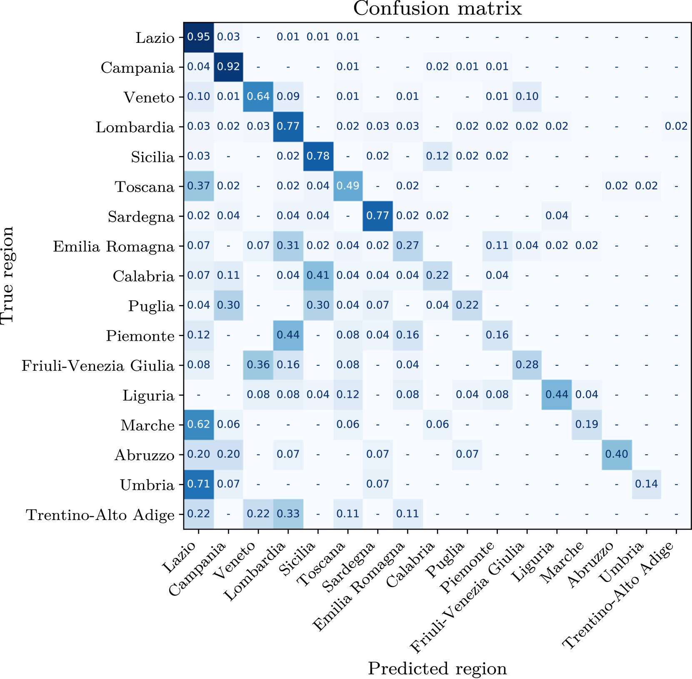

# 借助大型语言模型，我们能够精准定位社交媒体帖子中的语言变异。

发布时间：2024年07月22日

`LLM应用` `社交媒体` `地理信息系统`

> Leveraging Large Language Models to Geolocate Linguistic Variations in Social Media Posts

# 摘要

> 本项目旨在通过大型语言模型（LLMs）解决GeoLingIt挑战，即对意大利语推文进行地理定位。我们通过微调预训练模型，同时预测推文的地区和精确坐标，并引入创新方法，提升模型对意大利社交媒体文本细微差别的理解能力，从而推动该领域的发展。此项研究作为2024年Bertinoro国际春季学校大型语言模型课程的一部分进行，相关代码已公开在GitHub上，链接为https://github.com/dawoz/geolingit-biss2024。

> Geolocalization of social media content is the task of determining the geographical location of a user based on textual data, that may show linguistic variations and informal language. In this project, we address the GeoLingIt challenge of geolocalizing tweets written in Italian by leveraging large language models (LLMs). GeoLingIt requires the prediction of both the region and the precise coordinates of the tweet. Our approach involves fine-tuning pre-trained LLMs to simultaneously predict these geolocalization aspects. By integrating innovative methodologies, we enhance the models' ability to understand the nuances of Italian social media text to improve the state-of-the-art in this domain. This work is conducted as part of the Large Language Models course at the Bertinoro International Spring School 2024. We make our code publicly available on GitHub https://github.com/dawoz/geolingit-biss2024.

[Arxiv](https://arxiv.org/abs/2407.16047)