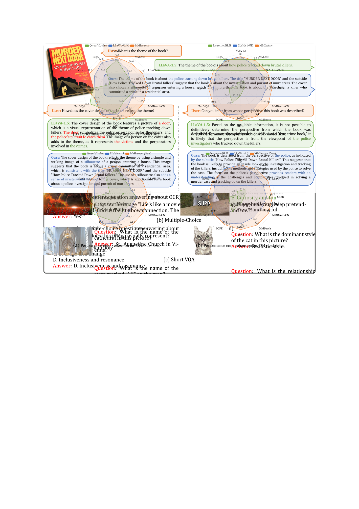

# MMInstruct 数据集，以其高质量和广泛的多模态多样性，为指令调优提供了丰富的资源。

发布时间：2024年07月22日

`LLM应用` `人工智能` `计算机视觉`

> MMInstruct: A High-Quality Multi-Modal Instruction Tuning Dataset with Extensive Diversity

# 摘要

> 尽管视觉-语言监督微调有效提升了VLLMs的性能，但现有视觉指令调优数据集存在质量不高和多样性不足的问题。为此，我们创建了MMInstruct数据集，涵盖24个领域、973K条指令，包括四种类型。通过创新的指令生成引擎，我们实现了低成本、多领域的半自动化生成。实验表明，MMInstruct显著提升了VLLMs性能，刷新了12个基准测试中的10项记录。相关资源将在GitHub上公开。

> Despite the effectiveness of vision-language supervised fine-tuning in enhancing the performance of Vision Large Language Models (VLLMs). However, existing visual instruction tuning datasets include the following limitations: (1) Instruction annotation quality: despite existing VLLMs exhibiting strong performance, instructions generated by those advanced VLLMs may still suffer from inaccuracies, such as hallucinations. (2) Instructions and image diversity: the limited range of instruction types and the lack of diversity in image data may impact the model's ability to generate diversified and closer to real-world scenarios outputs. To address these challenges, we construct a high-quality, diverse visual instruction tuning dataset MMInstruct, which consists of 973K instructions from 24 domains. There are four instruction types: Judgement, Multiple-Choice, Long Visual Question Answering and Short Visual Question Answering. To construct MMInstruct, we propose an instruction generation data engine that leverages GPT-4V, GPT-3.5, and manual correction. Our instruction generation engine enables semi-automatic, low-cost, and multi-domain instruction generation at 1/6 the cost of manual construction. Through extensive experiment validation and ablation experiments, we demonstrate that MMInstruct could significantly improve the performance of VLLMs, e.g., the model fine-tuning on MMInstruct achieves new state-of-the-art performance on 10 out of 12 benchmarks. The code and data shall be available at https://github.com/yuecao0119/MMInstruct.

[Arxiv](https://arxiv.org/abs/2407.15838)