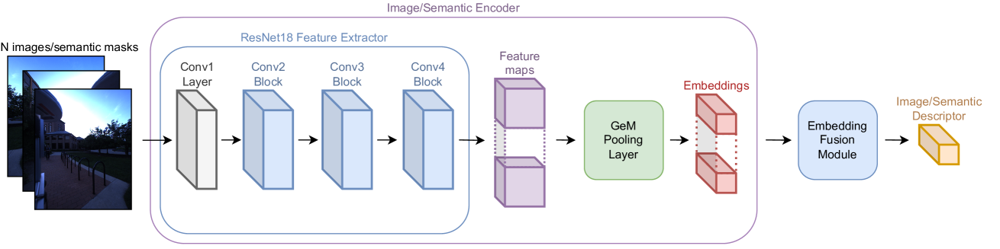

# MSSPlace：融合视觉与文本语义，实现多传感器地点精准识别

发布时间：2024年07月22日

`Agent` `计算机视觉` `自主导航`

> MSSPlace: Multi-Sensor Place Recognition with Visual and Text Semantics

# 摘要

> 地点识别在计算机视觉领域颇具挑战，对自主导航至关重要。尽管多模态学习方法已取得显著进展，但其在定位应用中的潜力仍待挖掘。本文探讨了多摄像头与多样化数据源的整合，旨在提升地点识别的准确性。我们提出的 MSSPlace 方法，融合了多源数据，通过后期融合策略生成统一描述符。实验表明，多传感器数据结合显著提升了识别性能，达到了行业领先水平。此外，视觉与文本语义的独立应用也显示出良好的识别效果。相关代码已公开，供研究者参考。

> Place recognition is a challenging task in computer vision, crucial for enabling autonomous vehicles and robots to navigate previously visited environments. While significant progress has been made in learnable multimodal methods that combine onboard camera images and LiDAR point clouds, the full potential of these methods remains largely unexplored in localization applications. In this paper, we study the impact of leveraging a multi-camera setup and integrating diverse data sources for multimodal place recognition, incorporating explicit visual semantics and text descriptions. Our proposed method named MSSPlace utilizes images from multiple cameras, LiDAR point clouds, semantic segmentation masks, and text annotations to generate comprehensive place descriptors. We employ a late fusion approach to integrate these modalities, providing a unified representation. Through extensive experiments on the Oxford RobotCar and NCLT datasets, we systematically analyze the impact of each data source on the overall quality of place descriptors. Our experiments demonstrate that combining data from multiple sensors significantly improves place recognition model performance compared to single modality approaches and leads to state-of-the-art quality. We also show that separate usage of visual or textual semantics (which are more compact representations of sensory data) can achieve promising results in place recognition. The code for our method is publicly available: https://github.com/alexmelekhin/MSSPlace

[Arxiv](https://arxiv.org/abs/2407.15663)