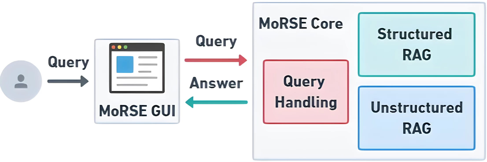
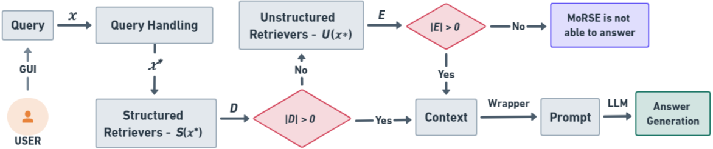
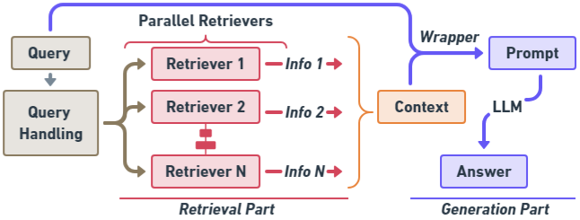
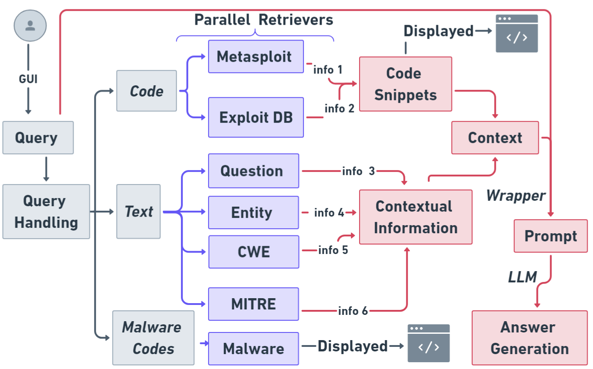
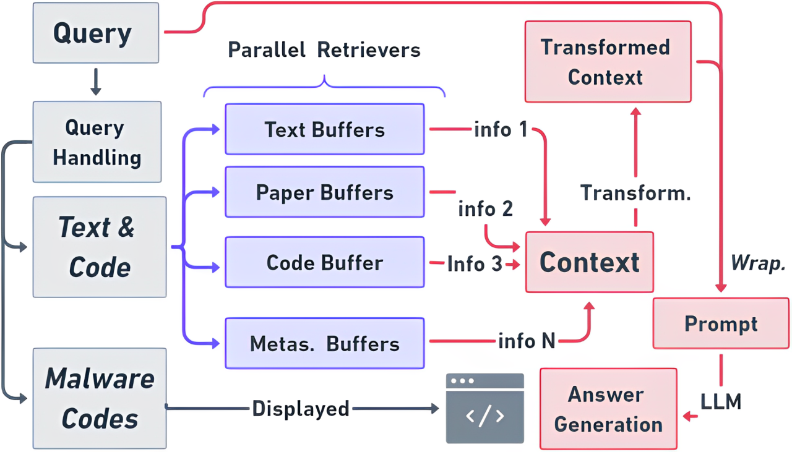

# MoRSE：借助检索增强生成技术，弥合网络安全专业知识的鸿沟。

发布时间：2024年07月22日

`RAG` `网络安全` `人工智能`

> MoRSE: Bridging the Gap in Cybersecurity Expertise with Retrieval Augmented Generation

# 摘要

> 本文介绍的 MoRSE，作为首个网络安全专用 AI 聊天机器人，旨在提供全面的网络安全知识。MoRSE 采用两个 RAG 系统，从多维度网络安全上下文中高效检索和组织信息。与传统 RAG 不同，MoRSE 的并行检索器能协同检索不同格式和结构中的语义信息。不同于依赖参数知识库的 LLM，MoRSE 从非参数知识库中精准检索文档以响应用户查询，并据此生成准确答案。MoRSE 还受益于知识库的实时更新，实现知识的持续丰富而无需重新训练。实验表明，MoRSE 在 600 个网络安全问题上的表现优于 GPT-4 和 Mixtral 7x8，答案的相关性和正确性提升超过 10%。

> In this paper, we introduce MoRSE (Mixture of RAGs Security Experts), the first specialised AI chatbot for cybersecurity. MoRSE aims to provide comprehensive and complete knowledge about cybersecurity. MoRSE uses two RAG (Retrieval Augmented Generation) systems designed to retrieve and organize information from multidimensional cybersecurity contexts. MoRSE differs from traditional RAGs by using parallel retrievers that work together to retrieve semantically related information in different formats and structures. Unlike traditional Large Language Models (LLMs) that rely on Parametric Knowledge Bases, MoRSE retrieves relevant documents from Non-Parametric Knowledge Bases in response to user queries. Subsequently, MoRSE uses this information to generate accurate answers. In addition, MoRSE benefits from real-time updates to its knowledge bases, enabling continuous knowledge enrichment without retraining. We have evaluated the effectiveness of MoRSE against other state-of-the-art LLMs, evaluating the system on 600 cybersecurity specific questions. The experimental evaluation has shown that the improvement in terms of relevance and correctness of the answer is more than 10\% compared to known solutions such as GPT-4 and Mixtral 7x8.

[Arxiv](https://arxiv.org/abs/2407.15748)