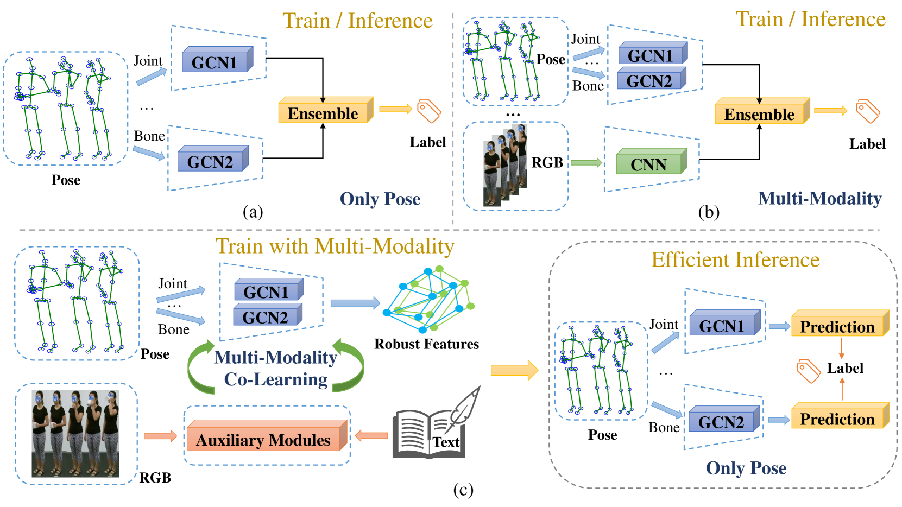
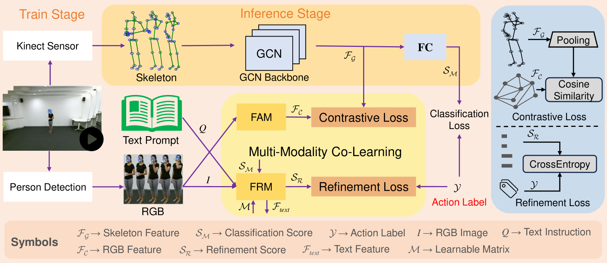
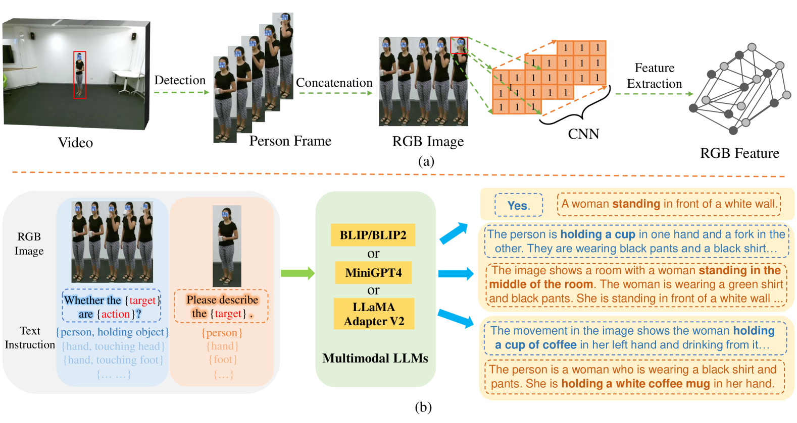
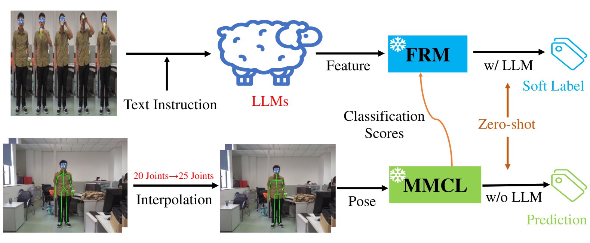
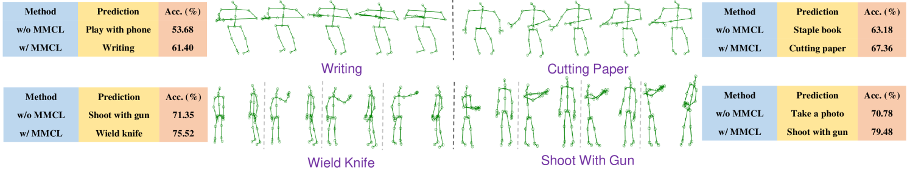

# 多模态协同学习：高效识别基于骨架的动作

发布时间：2024年07月22日

`LLM应用` `视频分析` `人工智能`

> Multi-Modality Co-Learning for Efficient Skeleton-based Action Recognition

# 摘要

> 基于骨架的动作识别因其简洁且坚韧的骨架特性而备受瞩目。然而，骨架信息的简化限制了性能，而多模态方法在处理多模态数据时效率低下且资源消耗大。为此，我们设计了一个多模态协同学习（MMCL）框架，借助多模态大型语言模型（LLMs）作为辅助网络，实现高效的基于骨架动作识别。该框架在训练中融合多模态学习，推理时则仅依赖简洁骨架保持高效。MMCL框架包含两个核心模块：特征对齐模块（FAM）提取视频RGB特征并与骨架特征对比对齐；特征细化模块（FRM）结合时间RGB图像与文本指令，利用多模态LLM生成指导性特征，进一步优化分类结果，提升模型鲁棒性与泛化性。在多个基准测试中，MMCL展现出优于现有方法的性能，并在零-shot与域适应动作识别中表现出良好的泛化能力。代码已公开于：https://github.com/liujf69/MMCL-Action。

> Skeleton-based action recognition has garnered significant attention due to the utilization of concise and resilient skeletons. Nevertheless, the absence of detailed body information in skeletons restricts performance, while other multimodal methods require substantial inference resources and are inefficient when using multimodal data during both training and inference stages. To address this and fully harness the complementary multimodal features, we propose a novel multi-modality co-learning (MMCL) framework by leveraging the multimodal large language models (LLMs) as auxiliary networks for efficient skeleton-based action recognition, which engages in multi-modality co-learning during the training stage and keeps efficiency by employing only concise skeletons in inference. Our MMCL framework primarily consists of two modules. First, the Feature Alignment Module (FAM) extracts rich RGB features from video frames and aligns them with global skeleton features via contrastive learning. Second, the Feature Refinement Module (FRM) uses RGB images with temporal information and text instruction to generate instructive features based on the powerful generalization of multimodal LLMs. These instructive text features will further refine the classification scores and the refined scores will enhance the model's robustness and generalization in a manner similar to soft labels. Extensive experiments on NTU RGB+D, NTU RGB+D 120 and Northwestern-UCLA benchmarks consistently verify the effectiveness of our MMCL, which outperforms the existing skeleton-based action recognition methods. Meanwhile, experiments on UTD-MHAD and SYSU-Action datasets demonstrate the commendable generalization of our MMCL in zero-shot and domain-adaptive action recognition. Our code is publicly available at: https://github.com/liujf69/MMCL-Action.

[Arxiv](https://arxiv.org/abs/2407.15706)