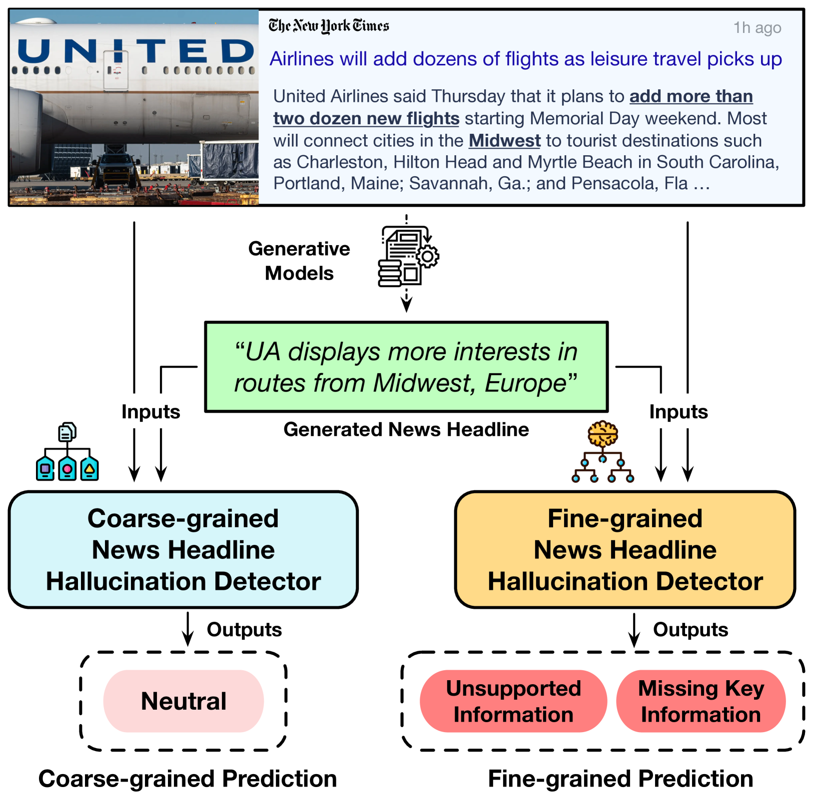
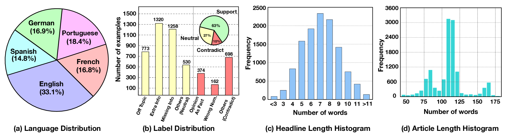
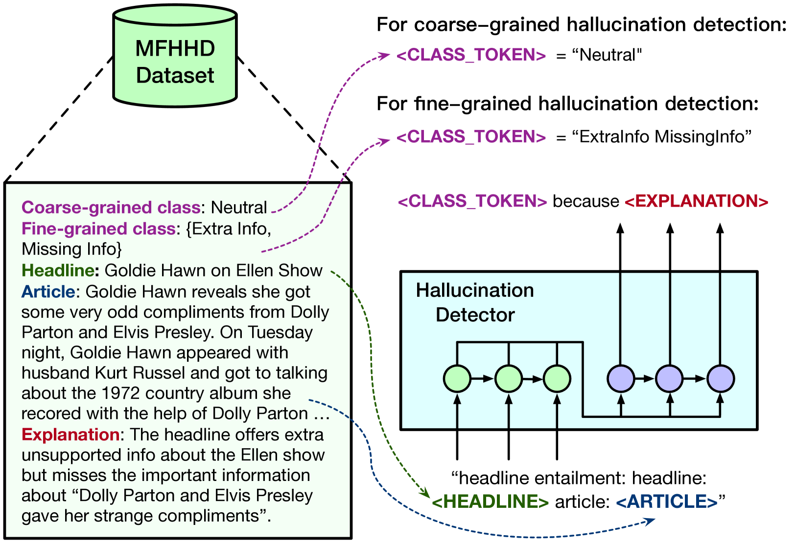
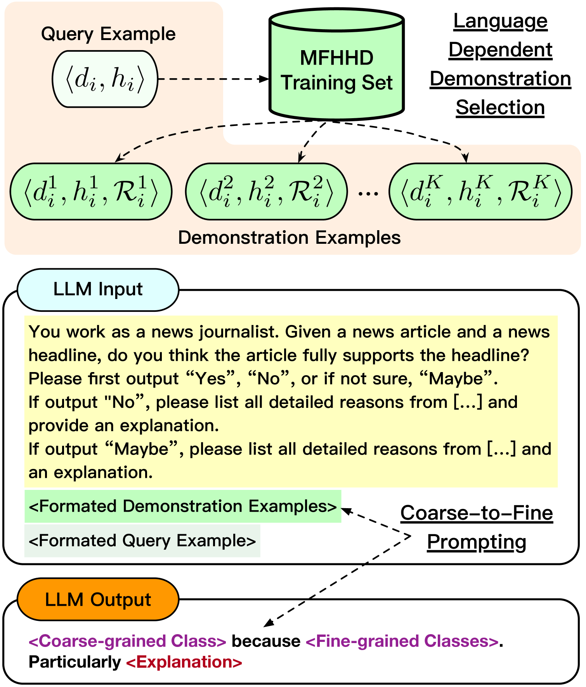

# 细探多语言新闻标题的幻觉识别

发布时间：2024年07月22日

`LLM应用` `人工智能`

> Multilingual Fine-Grained News Headline Hallucination Detection

# 摘要

> 随着预训练语言模型的发展，自动生成新闻标题的应用日益广泛。然而，这些模型常面临“幻觉”问题，即生成的标题可能与原文不符。当前的解决方案多集中在英语，且分类方法过于简单，未能捕捉到幻觉的细微差别。为此，我们创建了首个多语言、细粒度的新闻标题幻觉检测数据集，涵盖五种语言的11万对标题，并由专家详细标注。我们在此数据集上进行了深入实验，首先采用监督微调方法作为基础，揭示了数据集的挑战与价值。接着，我们评估了大型语言模型的上下文学习能力，并创新性地提出了两种技术——语言相关的演示选择和由粗到细的提示策略，以提高少样本情况下的幻觉检测准确性。我们公开此数据集，期待推动多语言、细粒度标题幻觉检测领域的研究进展。

> The popularity of automated news headline generation has surged with advancements in pre-trained language models. However, these models often suffer from the ``hallucination'' problem, where the generated headline is not fully supported by its source article. Efforts to address this issue have predominantly focused on English, using over-simplistic classification schemes that overlook nuanced hallucination types. In this study, we introduce the first multilingual, fine-grained news headline hallucination detection dataset that contains over 11 thousand pairs in 5 languages, each annotated with detailed hallucination types by experts. We conduct extensive experiments on this dataset under two settings. First, we implement several supervised fine-tuning approaches as preparatory solutions and demonstrate this dataset's challenges and utilities. Second, we test various large language models' in-context learning abilities and propose two novel techniques, language-dependent demonstration selection and coarse-to-fine prompting, to boost the few-shot hallucination detection performance in terms of the example-F1 metric. We release this dataset to foster further research in multilingual, fine-grained headline hallucination detection.

[Arxiv](https://arxiv.org/abs/2407.15975)