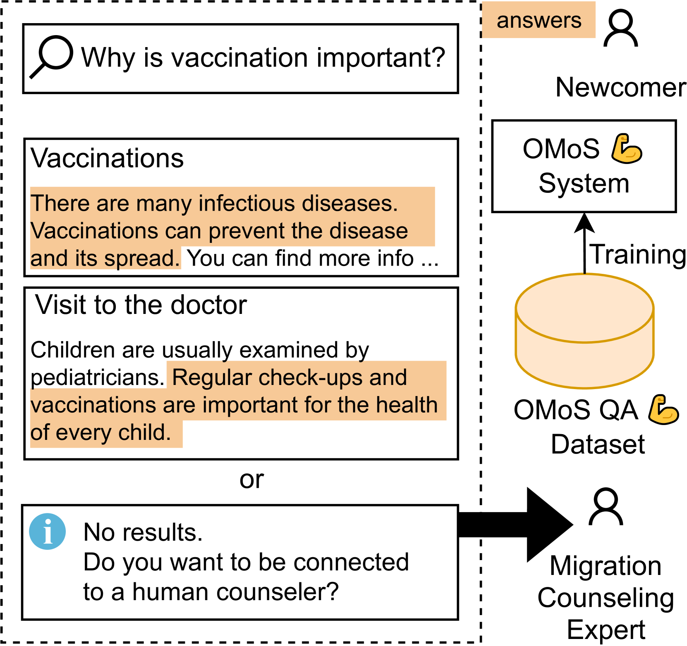
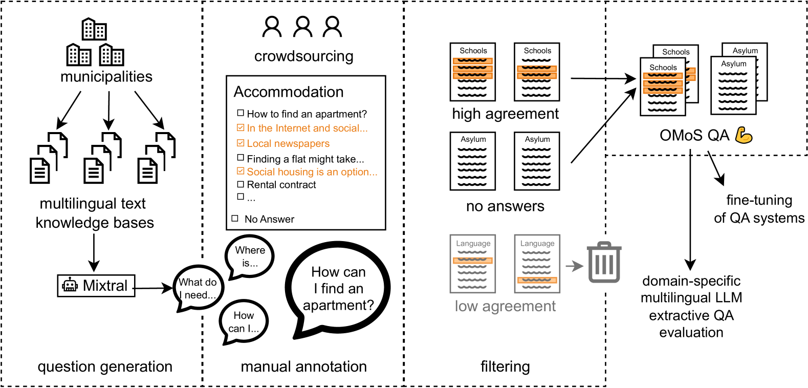
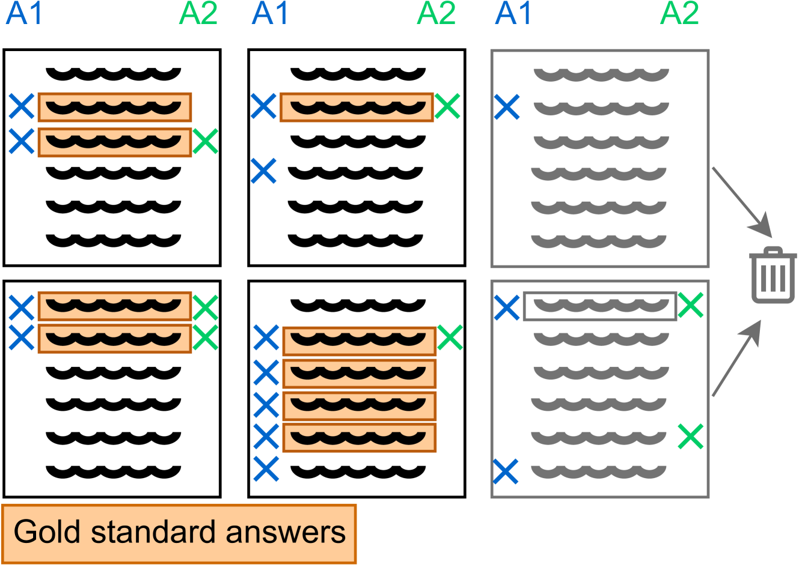
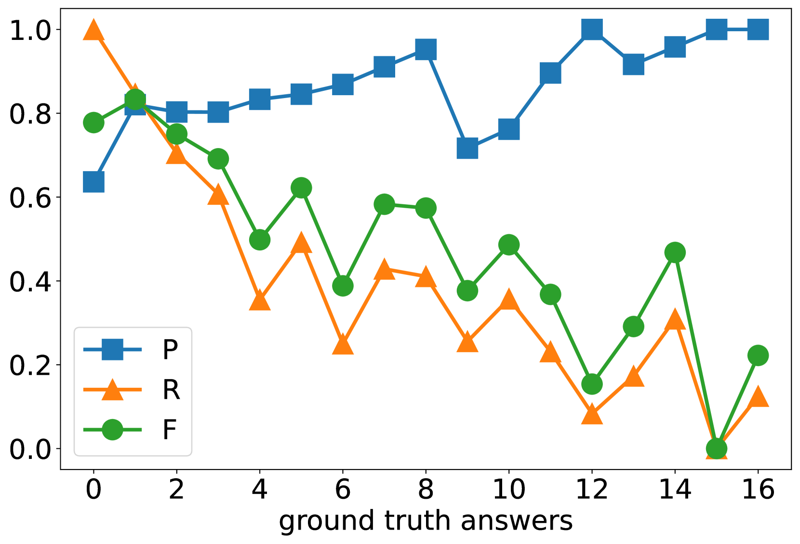
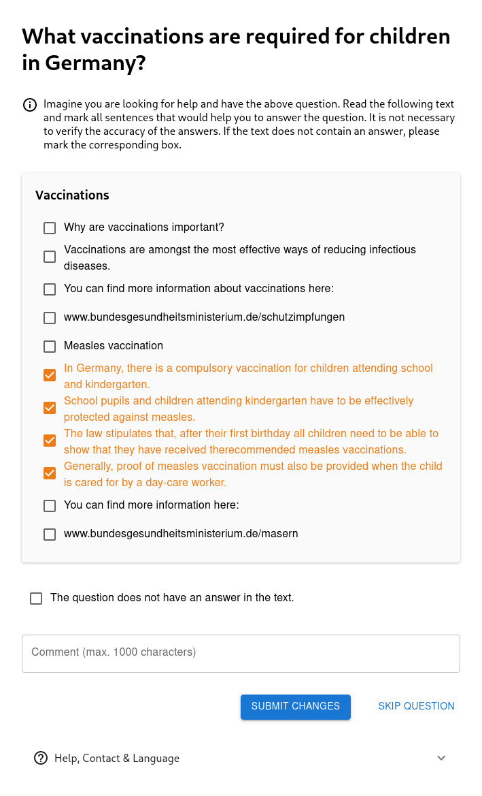

# OMoS-QA 数据集：专为德国移民背景下的跨语言抽取式问答设计

发布时间：2024年07月22日

`LLM应用` `移民服务`

> OMoS-QA: A Dataset for Cross-Lingual Extractive Question Answering in a German Migration Context

# 摘要

> 移民新国度，信息获取如山压顶：财务、住房、教育、语言，无一不需。若迁徙匆忙或被迫，优质解答更显迫切。官方顾问预约难求，在线系统却能指引新来者，直达所需信息或咨询之门。为此，OMoS-QA数据集应运而生，德英问题与可信文档、手工答案相配，专为移民场景定制。问题由开源LLM自动生成，答案精选自众包，共识度高。我们对比五款预训练LLM，在德英抽取式问答中，精确度高，召回率适中，避免误导之虞。即便语言不匹配，性能依旧稳健。至于识别无解之问，德英之间差异显著。

> When immigrating to a new country, it is easy to feel overwhelmed by the need to obtain information on financial support, housing, schooling, language courses, and other issues. If relocation is rushed or even forced, the necessity for high-quality answers to such questions is all the more urgent. Official immigration counselors are usually overbooked, and online systems could guide newcomers to the requested information or a suitable counseling service.
  To this end, we present OMoS-QA, a dataset of German and English questions paired with relevant trustworthy documents and manually annotated answers, specifically tailored to this scenario. Questions are automatically generated with an open-source large language model (LLM) and answer sentences are selected by crowd workers with high agreement. With our data, we conduct a comparison of 5 pretrained LLMs on the task of extractive question answering (QA) in German and English. Across all models and both languages, we find high precision and low-to-mid recall in selecting answer sentences, which is a favorable trade-off to avoid misleading users. This performance even holds up when the question language does not match the document language. When it comes to identifying unanswerable questions given a context, there are larger differences between the two languages.

[Arxiv](https://arxiv.org/abs/2407.15736)