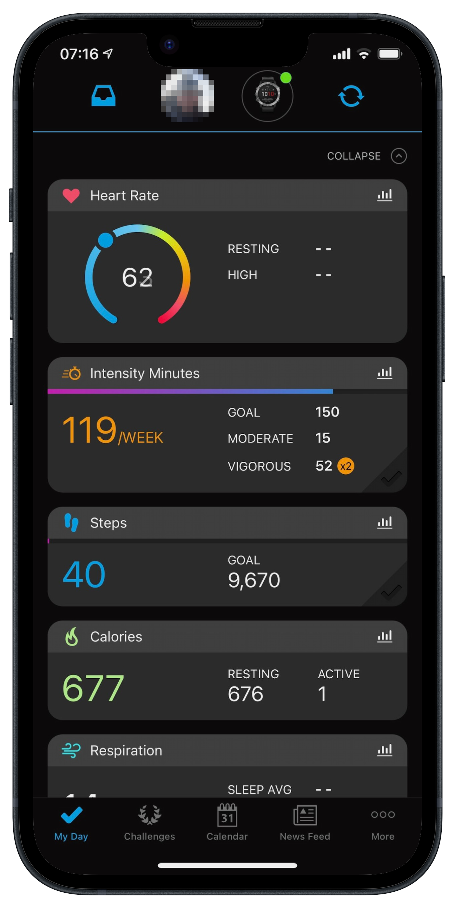
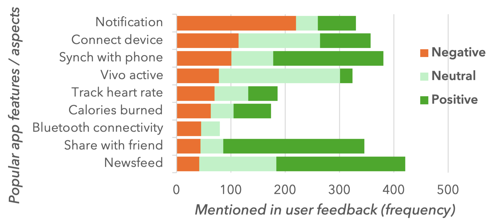
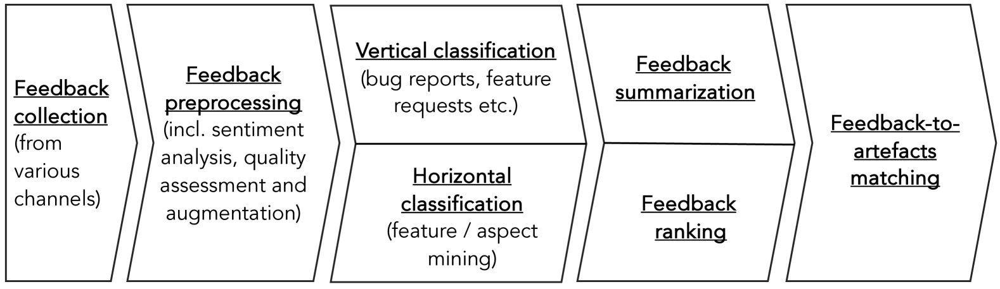
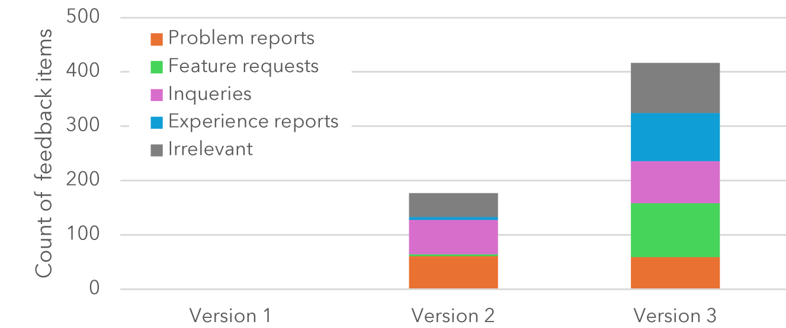
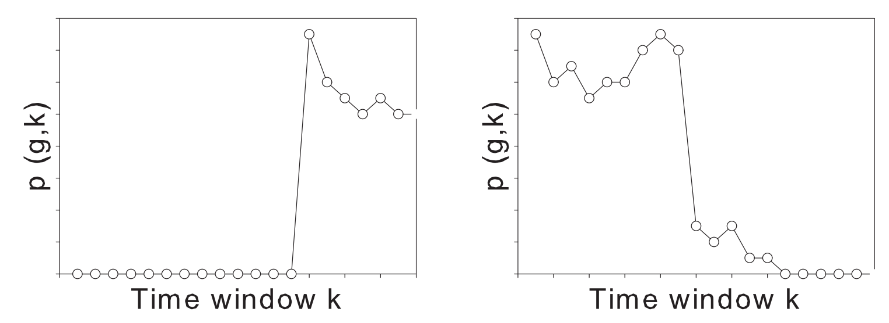

# 用户反馈自动化处理探析

发布时间：2024年07月22日

`LLM应用` `软件开发` `需求工程`

> On the Automated Processing of User Feedback

# 摘要

> 用户反馈在需求工程、界面设计和软件开发中愈发关键。如今，社交媒体、论坛和应用商店中充斥着大量易得的用户反馈。研究显示，这些反馈能助软件团队一臂之力：深入了解用户行为、迅速定位并修复问题，甚至激发创新。但要最大化其价值，我们需克服两大难题：海量数据的处理与质量参差的反馈。本章汇聚了数据挖掘、机器学习及自然语言处理等前沿技术，助您驾驭这些挑战。我们将引领您有效利用用户反馈，推动软件与需求工程的进步。

> User feedback is becoming an increasingly important source of information for requirements engineering, user interface design, and software engineering in general. Nowadays, user feedback is largely available and easily accessible in social media, product forums, or app stores. Over the last decade, research has shown that user feedback can help software teams: a) better understand how users are actually using specific product features and components, b) faster identify, reproduce, and fix defects, and b) get inspirations for improvements or new features. However, to tap the full potential of feedback, there are two main challenges that need to be solved. First, software vendors must cope with a large quantity of feedback data, which is hard to manage manually. Second, vendors must also cope with a varying quality of feedback as some items might be uninformative, repetitive, or simply wrong. This chapter summarises and pipelines various data mining, machine learning, and natural language processing techniques, including recent Large Language Models, to cope with the quantity and quality challenges. We guide researchers and practitioners through implementing effective, actionable analysis of user feedback for software and requirements engineering.

[Arxiv](https://arxiv.org/abs/2407.15519)