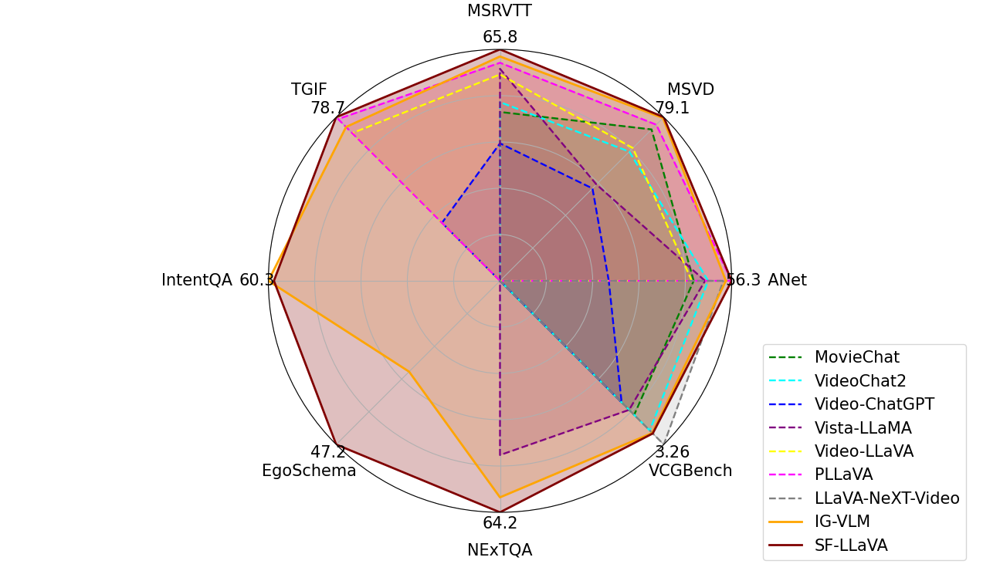
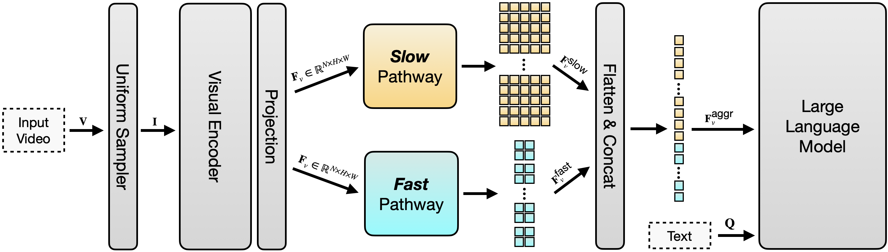
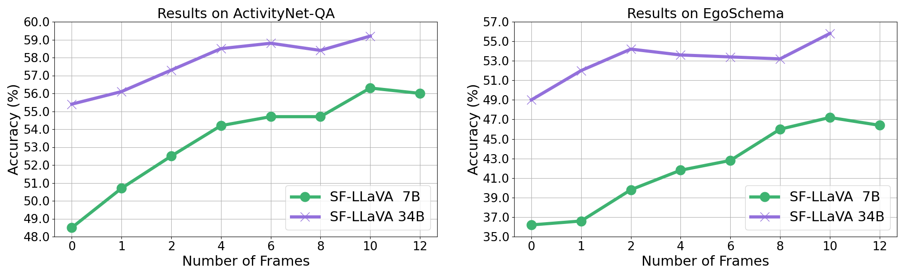
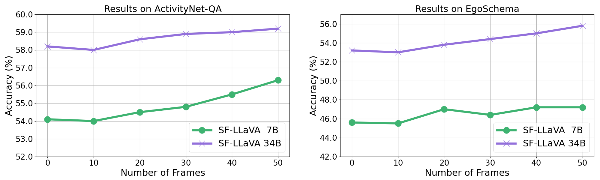

# SlowFast-LLaVA 模型，作为一款无需训练的强大基线，专为视频大型语言模型设计。

发布时间：2024年07月22日

`LLM应用` `视频处理` `人工智能`

> SlowFast-LLaVA: A Strong Training-Free Baseline for Video Large Language Models

# 摘要

> 我们推出了 SF-LLaVA，一款无需训练的视频大型语言模型，它巧妙地结合了空间语义与时间上下文，且不超出常规 LLM 的标记预算。通过双流 SlowFast 设计，SF-LLaVA 高效地从视频帧中提取特征：Slow 路径以低帧率细致捕捉空间细节，而 Fast 路径则以高帧率聚焦于运动变化。这一创新设计使得模型在捕捉视频细节方面表现卓越。实验表明，SF-LLaVA 在众多视频任务中超越了现有无需训练的方法，甚至在某些基准测试中媲美或超越了经过视频数据集微调的顶尖视频 LLM。

> We propose SlowFast-LLaVA (or SF-LLaVA for short), a training-free video large language model (LLM) that can jointly capture the detailed spatial semantics and long-range temporal context without exceeding the token budget of commonly used LLMs. This is realized by using a two-stream SlowFast design of inputs for Video LLMs to aggregate features from sampled video frames in an effective way. Specifically, the Slow pathway extracts features at a low frame rate while keeping as many spatial details as possible (e.g., with 24x24 tokens), and the Fast pathway operates on a high frame rate but uses a larger spatial pooling stride (e.g., downsampling 6x) to focus on the motion cues. As a result, this design allows us to adequately capture both spatial and temporal features that are beneficial for understanding details along the video. Experimental results show that SF-LLaVA outperforms existing training-free methods on a wide range of video tasks. On some benchmarks, it achieves comparable or even better performance compared to state-of-the-art Video LLMs that are fine-tuned on video datasets.

[Arxiv](https://arxiv.org/abs/2407.15841)