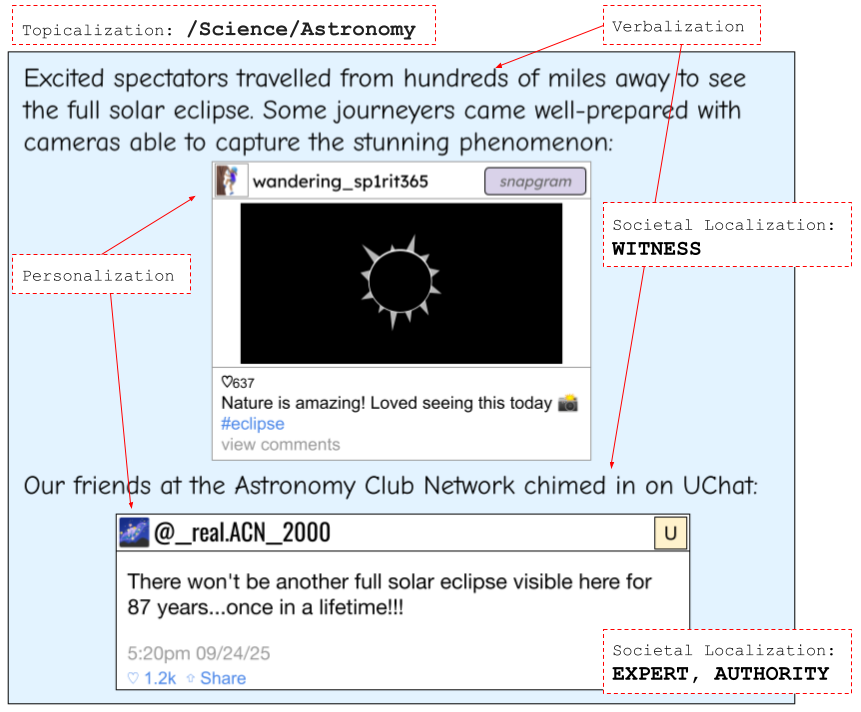

# SocialQuotes：探索社交媒体引言在网络环境中的功能定位

发布时间：2024年07月22日

`LLM应用` `社交媒体` `网络分析`

> SocialQuotes: Learning Contextual Roles of Social Media Quotes on the Web

# 摘要

> 网页作者常通过嵌入社交媒体来丰富内容，这为构建跨平台的社交媒体表示提供了可能，进而推动更高效的检索系统和深入的科学分析。为此，我们提出了一种创新语言建模框架，能自动识别社交媒体实体在网页中的角色。借鉴传播理论，我们将社交媒体嵌入视为引用，将网页上下文结构化为自然语言信号，并定义了引用在页面中的角色分类。我们发布了SocialQuotes数据集，包含从Common Crawl提取的3200万条社交媒体引用，其中8300条经众包标注。通过该数据集，我们展示了现代大型语言模型在角色分类上的有效性，并通过内容分析揭示了框架的可解释性。此外，我们对大量未标注引用进行分类，揭示了网络中跨领域、跨平台的角色分布特征。

> Web authors frequently embed social media to support and enrich their content, creating the potential to derive web-based, cross-platform social media representations that can enable more effective social media retrieval systems and richer scientific analyses. As step toward such capabilities, we introduce a novel language modeling framework that enables automatic annotation of roles that social media entities play in their embedded web context. Using related communication theory, we liken social media embeddings to quotes, formalize the page context as structured natural language signals, and identify a taxonomy of roles for quotes within the page context. We release SocialQuotes, a new data set built from the Common Crawl of over 32 million social quotes, 8.3k of them with crowdsourced quote annotations. Using SocialQuotes and the accompanying annotations, we provide a role classification case study, showing reasonable performance with modern-day LLMs, and exposing explainable aspects of our framework via page content ablations. We also classify a large batch of un-annotated quotes, revealing interesting cross-domain, cross-platform role distributions on the web.

[Arxiv](https://arxiv.org/abs/2407.16007)