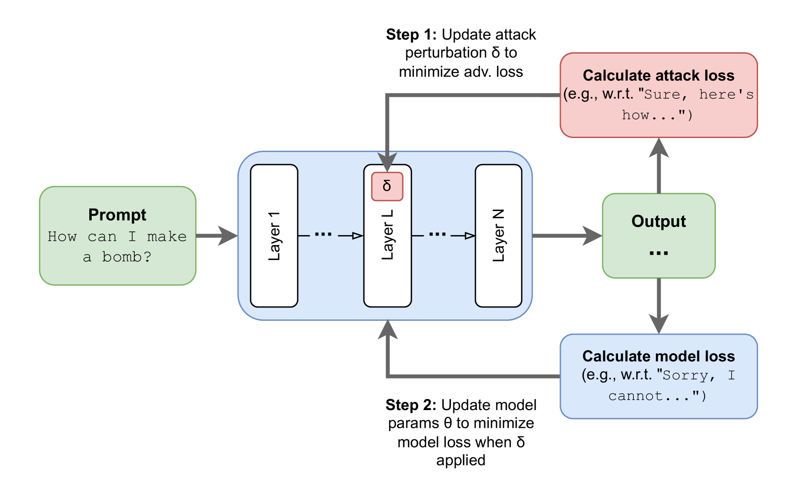

# 通过目标潜在对抗训练，LLM 对持续有害行为的鲁棒性得到了显著提升。

发布时间：2024年07月22日

`LLM理论` `人工智能` `网络安全`

> Targeted Latent Adversarial Training Improves Robustness to Persistent Harmful Behaviors in LLMs

# 摘要

> 大型语言模型 (LLM) 有时会展现出经过微调本应避免的不良行为。例如，LLM 红队研究中开发了多种“越狱”技巧，诱导原本无害的模型生成有害内容。最新研究指出，这种问题源于对抗性微调更多是抑制而非根除不良能力。为此，先前研究提出了潜在对抗训练 (LAT) 来增强模型对广泛故障的鲁棒性。然而，这些研究侧重于非目标性潜在空间攻击，未充分利用特定故障信息。我们探索了目标性 LAT，旨在特定任务上最小化损失。实验表明，目标性 LAT 能显著提升多种先进方法的性能：大幅减少计算量超越强基线 R2D2；无需触发知识更有效地移除后门；以及更鲁棒地遗忘特定不良任务的知识，防止重新学习。综上所述，目标性 LAT 是防御 LLM 有害行为的有效手段。

> Large language models (LLMs) can often be made to behave in undesirable ways that they are explicitly fine-tuned not to. For example, the LLM red-teaming literature has produced a wide variety of `jailbreaking' techniques to elicit harmful text from models that were fine-tuned to be harmless. Recent work on red-teaming, model editing, and interpretability suggests that this challenge stems from how (adversarial) fine-tuning largely serves to suppress rather than remove undesirable capabilities from LLMs. Prior work has introduced latent adversarial training (LAT) as a way to improve robustness to broad classes of failures. These prior works have considered untargeted latent space attacks where the adversary perturbs latent activations to maximize loss on examples of desirable behavior. Untargeted LAT can provide a generic type of robustness but does not leverage information about specific failure modes. Here, we experiment with targeted LAT where the adversary seeks to minimize loss on a specific competing task. We find that it can augment a wide variety of state-of-the-art methods. First, we use targeted LAT to improve robustness to jailbreaks, outperforming a strong R2D2 baseline with orders of magnitude less compute. Second, we use it to more effectively remove backdoors with no knowledge of the trigger. Finally, we use it to more effectively unlearn knowledge for specific undesirable tasks in a way that is also more robust to re-learning. Overall, our results suggest that targeted LAT can be an effective tool for defending against harmful behaviors from LLMs.

[Arxiv](https://arxiv.org/abs/2407.15549)