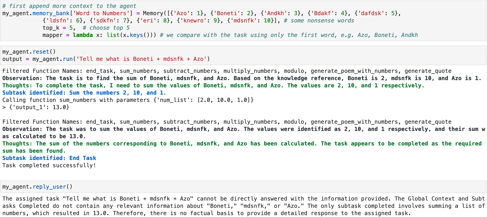

# TaskGen：基于任务、融入记忆的代理框架，采用 StrictJSON 技术

发布时间：2024年07月22日

`Agent` `软件开发` `人工智能`

> TaskGen: A Task-Based, Memory-Infused Agentic Framework using StrictJSON

# 摘要

> TaskGen 是一款开源代理框架，通过将任务拆解为子任务，由代理逐一解决。每个子任务通过配备的函数或另一代理执行，旨在减少冗余，优化令牌使用。TaskGen 采用 StrictJSON 格式输出，并辅以类型检查和迭代纠错等特性，其核心理念是基于需求管理信息与记忆。我们在多种环境中实证评估了 TaskGen 的性能，包括动态迷宫导航（100% 解决率）、TextWorld 逃脱游戏（96% 解决率）、网页浏览（69% 成功率）、MATH 数据集解题（71% 解决率）以及自然问题数据集上的检索增强生成（F1 分数 47.03%）。

> TaskGen is an open-sourced agentic framework which uses an Agent to solve an arbitrary task by breaking them down into subtasks. Each subtask is mapped to an Equipped Function or another Agent to execute. In order to reduce verbosity (and hence token usage), TaskGen uses StrictJSON that ensures JSON output from the Large Language Model (LLM), along with additional features such as type checking and iterative error correction. Key to the philosophy of TaskGen is the management of information/memory on a need-to-know basis. We empirically evaluate TaskGen on various environments such as 40x40 dynamic maze navigation with changing obstacle locations (100% solve rate), TextWorld escape room solving with dense rewards and detailed goals (96% solve rate), web browsing (69% of actions successful), solving the MATH dataset (71% solve rate over 100 Level-5 problems), Retrieval Augmented Generation on NaturalQuestions dataset (F1 score of 47.03%)

[Arxiv](https://arxiv.org/abs/2407.15734)