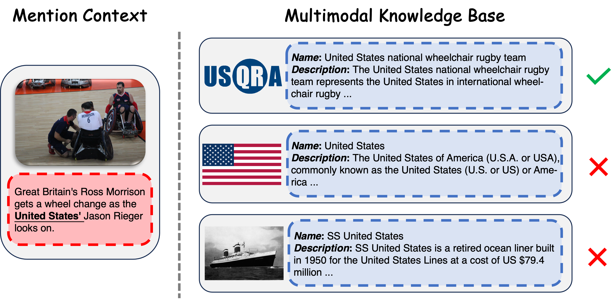

# UniMEL：整合大型语言模型，打造多模态实体链接的统一框架

发布时间：2024年07月22日

`LLM应用` `知识图谱` `多模态处理`

> UniMEL: A Unified Framework for Multimodal Entity Linking with Large Language Models

# 摘要

> 多模态实体链接（MEL）任务旨在将多模态环境中的模糊提及与多模态知识库中的实体相连接，如Wikipedia。现有方法过于依赖复杂模型和广泛调参，忽视了视觉语义信息，导致成本高且难以扩展，且无法有效处理文本歧义和噪声图像等问题。随着具有强大文本理解和推理能力的大型语言模型（LLMs），特别是能处理多模态输入的MLLMs的出现，为解决这一难题提供了新思路。然而，设计一个普遍适用的基于LLMs的MEL方法仍具挑战。为此，我们提出UniMEL框架，利用LLMs整合文本与视觉信息，细化文本，增强提及与实体的表示，并通过基于嵌入的方法检索和重新排序候选实体。仅微调极少模型参数，LLMs便能做出最终选择。实验表明，UniMEL在三个公共基准数据集上达到最先进性能，消融研究证实了各模块的有效性。代码已公开，供进一步研究与应用。

> Multimodal Entity Linking (MEL) is a crucial task that aims at linking ambiguous mentions within multimodal contexts to the referent entities in a multimodal knowledge base, such as Wikipedia. Existing methods focus heavily on using complex mechanisms and extensive model tuning methods to model the multimodal interaction on specific datasets. However, these methods overcomplicate the MEL task and overlook the visual semantic information, which makes them costly and hard to scale. Moreover, these methods can not solve the issues like textual ambiguity, redundancy, and noisy images, which severely degrade their performance. Fortunately, the advent of Large Language Models (LLMs) with robust capabilities in text understanding and reasoning, particularly Multimodal Large Language Models (MLLMs) that can process multimodal inputs, provides new insights into addressing this challenge. However, how to design a universally applicable LLMs-based MEL approach remains a pressing challenge. To this end, we propose UniMEL, a unified framework which establishes a new paradigm to process multimodal entity linking tasks using LLMs. In this framework, we employ LLMs to augment the representation of mentions and entities individually by integrating textual and visual information and refining textual information. Subsequently, we employ the embedding-based method for retrieving and re-ranking candidate entities. Then, with only ~0.26% of the model parameters fine-tuned, LLMs can make the final selection from the candidate entities. Extensive experiments on three public benchmark datasets demonstrate that our solution achieves state-of-the-art performance, and ablation studies verify the effectiveness of all modules. Our code is available at https://anonymous.4open.science/r/UniMEL/.

[Arxiv](https://arxiv.org/abs/2407.16160)