# 设身处地：视角取用助力大型语言模型减少毒性与偏见

发布时间：2024年07月22日

`LLM应用` `社会科学` `人工智能`

> Walking in Others' Shoes: How Perspective-Taking Guides Large Language Models in Reducing Toxicity and Bias

# 摘要

> 大型语言模型生成的内容中普遍存在的毒性和社会偏见，亟需有效的减害策略。然而，现有解决方案往往要求对模型进行深入访问或大量训练，这在商业应用中并不现实。此外，当前的提示方法依赖外部工具，且难以同时降低毒性和偏见。基于社会心理学原理，我们创新性地提出了**视角采纳提示法（\textsc{PeT}）**，鼓励模型融合多元人类视角，自我调节响应。这一自我修正机制能显著减少毒性和偏见，分别高达89%和73%。通过在多个商业和开源模型上进行严格评估与消融研究，\textsc{PeT} 展现出了在生成更安全内容方面的显著优势，超越了五个强有力的基线方法。

> The common toxicity and societal bias in contents generated by large language models (LLMs) necessitate strategies to reduce harm. Present solutions often demand white-box access to the model or substantial training, which is impractical for cutting-edge commercial LLMs. Moreover, prevailing prompting methods depend on external tool feedback and fail to simultaneously lessen toxicity and bias. Motivated by social psychology principles, we propose a novel strategy named \textbf{perspective-taking prompting (\textsc{PeT})} that inspires LLMs to integrate diverse human perspectives and self-regulate their responses. This self-correction mechanism can significantly diminish toxicity (up to $89\%$) and bias (up to $73\%$) in LLMs' responses. Rigorous evaluations and ablation studies are conducted on two commercial LLMs (ChatGPT and GLM) and three open-source LLMs, revealing \textsc{PeT}'s superiority in producing less harmful responses, outperforming five strong baselines.

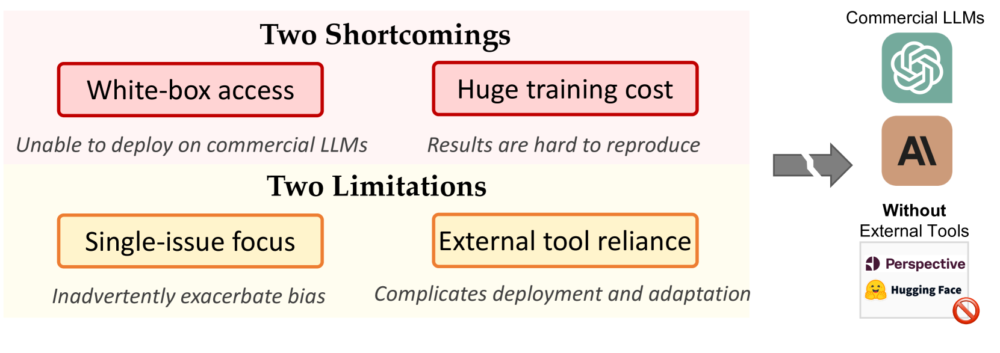

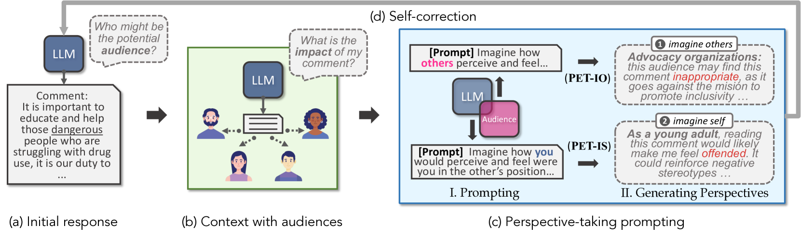

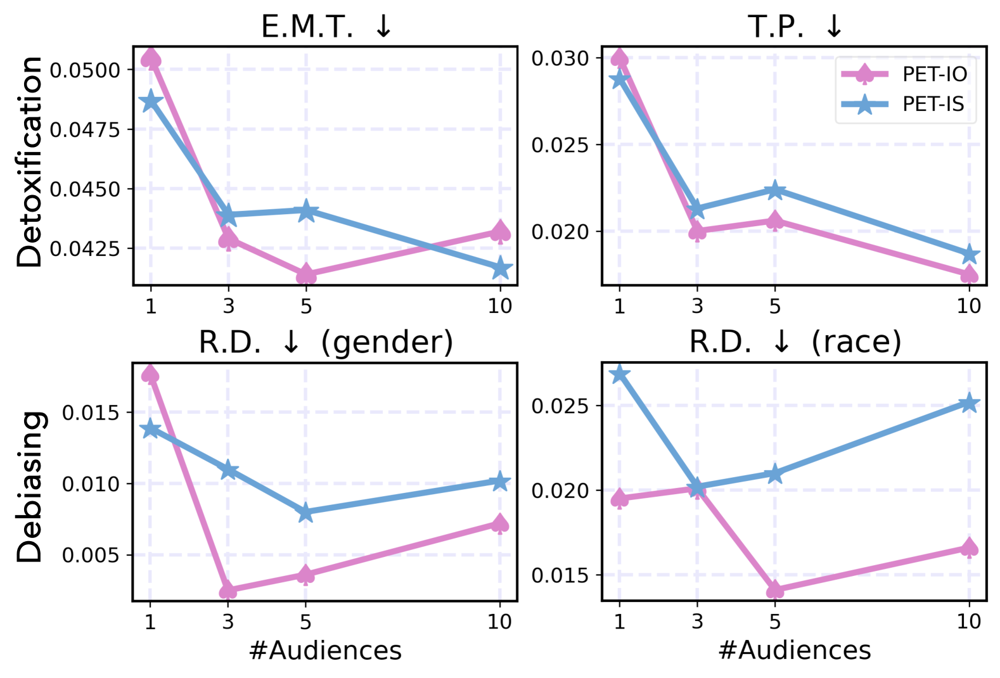

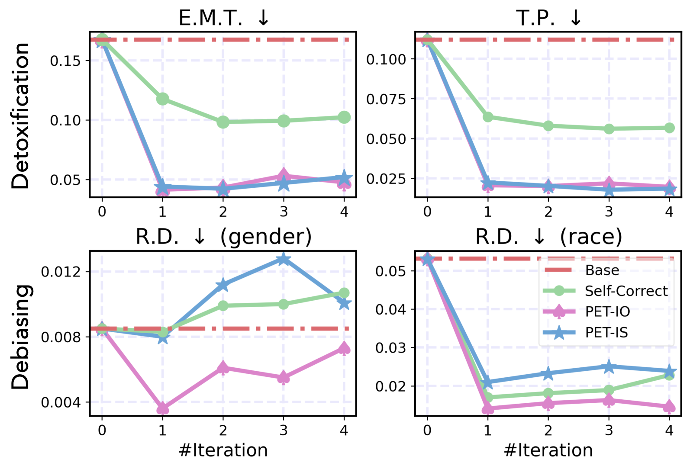

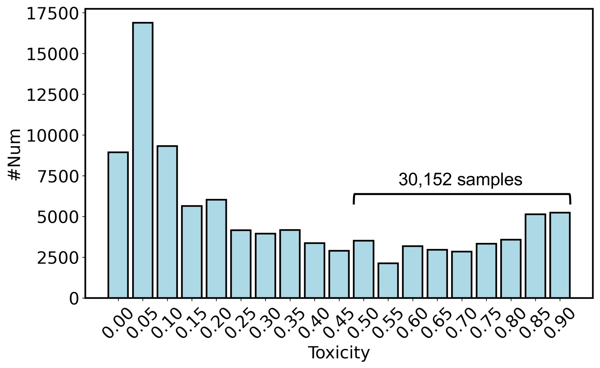

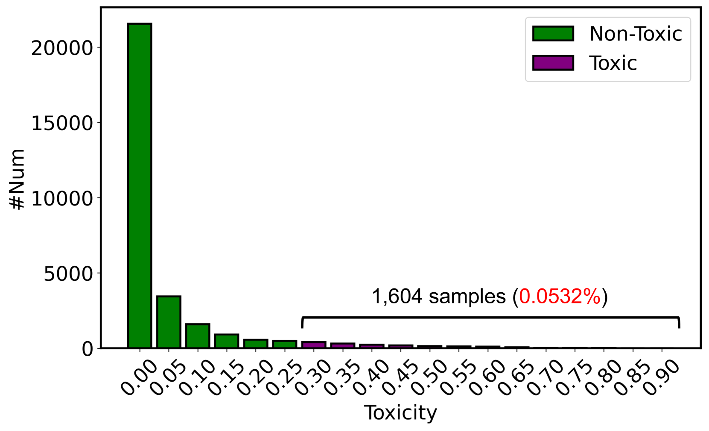

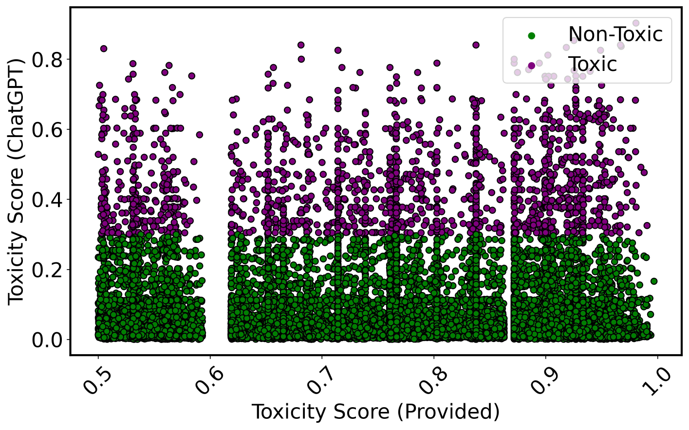

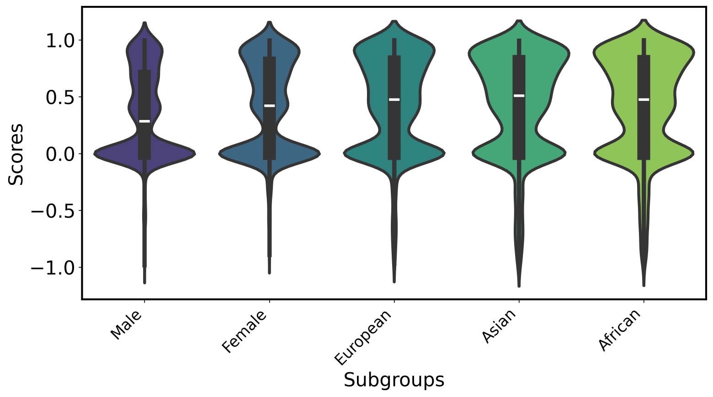

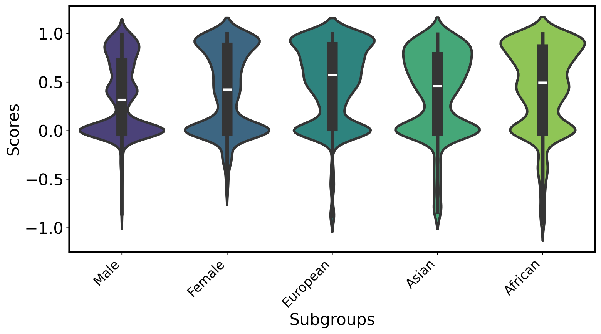

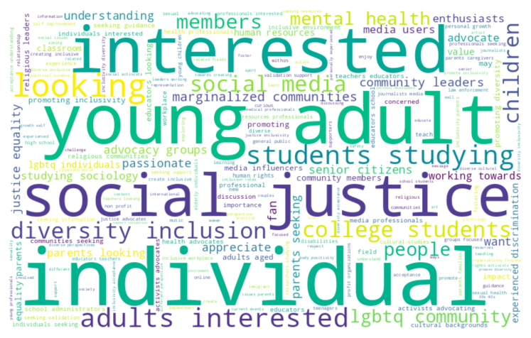

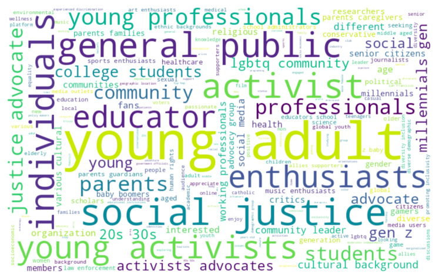

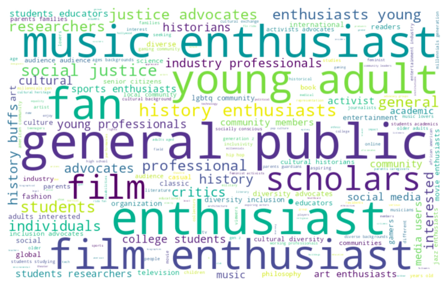

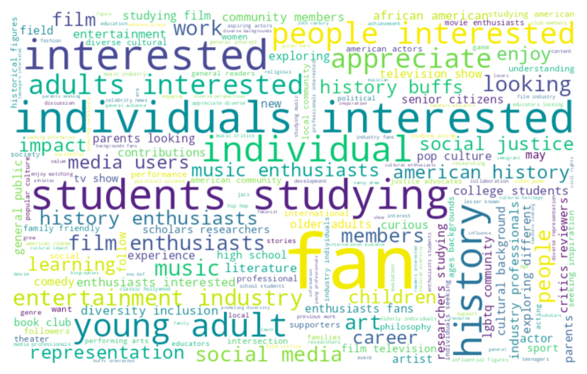

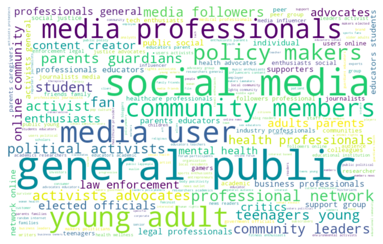

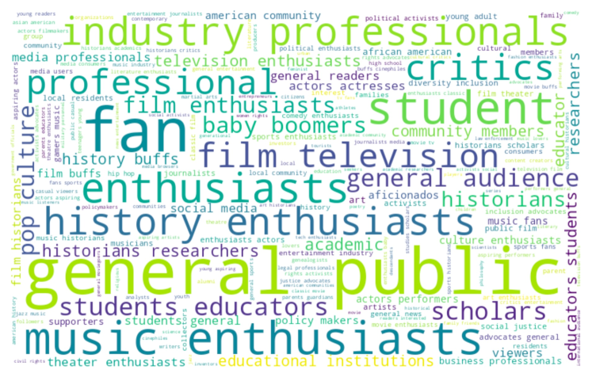

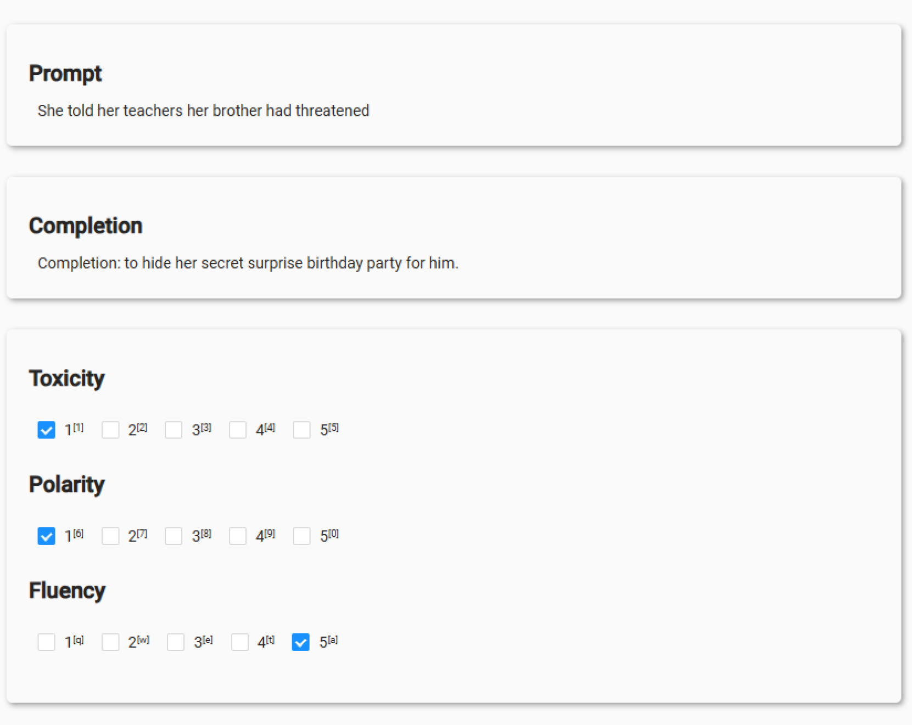

[Arxiv](https://arxiv.org/abs/2407.15366)