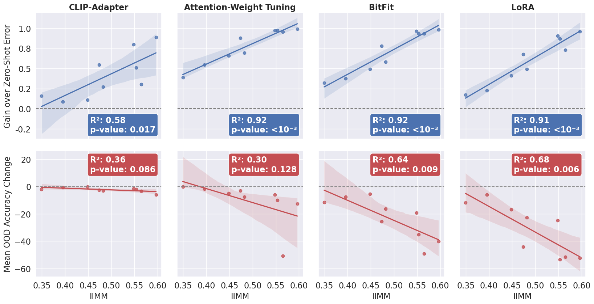

# 零-Shot 嵌入在视觉-语言编码器中影响学习与遗忘过程。

发布时间：2024年07月22日

`LLM应用` `计算机视觉` `机器学习`

> Zero-Shot Embeddings Inform Learning and Forgetting with Vision-Language Encoders

# 摘要

> 尽管大型视觉-语言模型广泛应用，但其微调后的学习与遗忘效果评估仍鲜有研究。受对比双编码器中模态差距重要性的启发，我们提出跨内模态测量（IIMM），通过结合图像嵌入相似性与错误配对相似性，有效预测微调后的性能变化。在多个先进模型与微调技术上进行的广泛实验表明，高IIMM分数任务的微调虽带来显著领域内性能提升，但也加剧领域外性能下降，某些参数高效微调方法甚至出现极端遗忘。与现有模型选择方法的转移分数相比，IIMM在预测准确性提升方面表现更优。通过目标数据的单一前向传递，实践者可利用IIMM启发式评估微调后模型的预期改进，结合模型在多样任务上的表现，进一步精准预测新任务训练时的性能变化。

> Despite the proliferation of large vision-language foundation models, estimation of the learning and forgetting outcomes following fine-tuning of these models remains largely unexplored. Inspired by work highlighting the significance of the modality gap in contrastive dual-encoders, we propose the Inter-Intra Modal Measure (IIMM). Combining terms quantifying the similarity between image embeddings and the similarity between incorrect image and label embedding pairs, the IIMM functions as a strong predictor of performance changes with fine-tuning. Our extensive empirical analysis across four state-of-the-art vision-language models (CLIP, SigLIP, CoCa, EVA-02-CLIP) and five fine-tuning techniques (full fine-tuning, BitFit, attention-weight tuning, LoRA, CLIP-Adapter) demonstrates a strong, statistically significant linear relationship: fine-tuning on tasks with higher IIMM scores produces greater in-domain performance gains but also induces more severe out-of-domain performance degradation, with some parameter-efficient fine-tuning (PEFT) methods showing extreme forgetting. We compare our measure against transfer scores from state-of-the-art model selection methods and show that the IIMM is significantly more predictive of accuracy gains. With only a single forward pass of the target data, practitioners can leverage this key insight to heuristically evaluate the degree to which a model can be expected to improve following fine-tuning. Given additional knowledge about the model's performance on a few diverse tasks, this heuristic further evolves into a strong predictor of expected performance changes when training for new tasks.

[Arxiv](https://arxiv.org/abs/2407.15731)