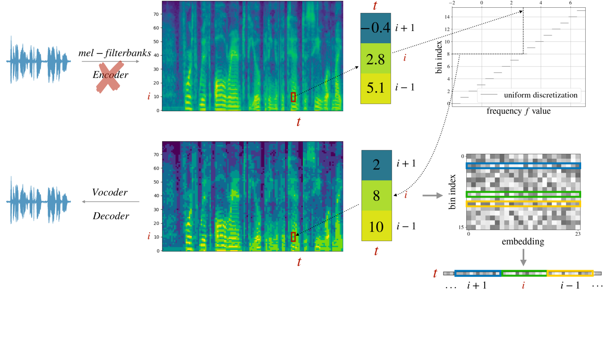
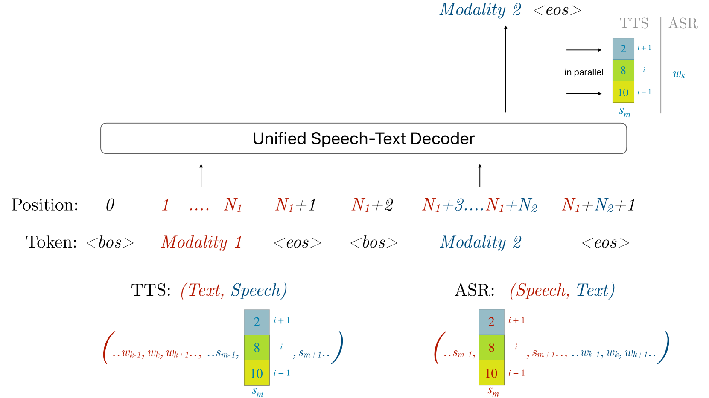
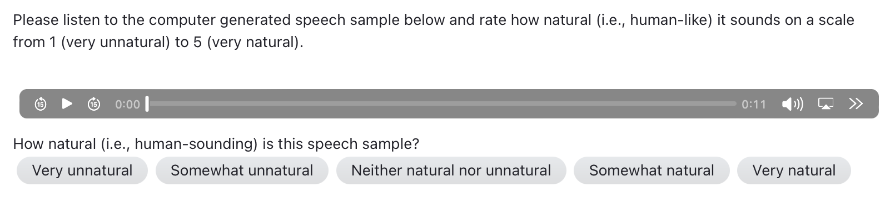

# dMel：让语音标记化变得轻松简单

发布时间：2024年07月22日

`LLM应用` `语音识别` `语音合成`

> dMel: Speech Tokenization made Simple

# 摘要

> 大型语言模型通过自监督预训练在海量文本数据上的应用，彻底革新了自然语言处理领域。受此启发，研究者们致力于开发复杂的语音符号化技术，以将连续的语音信号离散化，便于语言建模技术应用于语音数据。然而，现有方法或侧重于语义符号化而可能忽略声学细节，或聚焦于声学符号化而可能损失语义信息，且多符号类型的使用增加了架构的复杂性并需要额外预训练。我们提出了一种简化的方法——将梅尔滤波器组通道离散化为离散强度箱（dMel），其性能超越了现有语音符号化技术。采用仅解码器的Transformer架构进行语音-文本建模，我们在语音识别（ASR）和语音合成（TTS）任务上全面评估了不同符号化方法。研究结果显示，dMel在统一框架内高效实现了两项任务的高性能，为语音与文本的联合建模开辟了新途径。

> Large language models have revolutionized natural language processing by leveraging self-supervised pretraining on vast textual data. Inspired by this success, researchers have investigated complicated speech tokenization methods to discretize continuous speech signals so that language modeling techniques can be applied to speech data. However, existing approaches either model semantic tokens, potentially losing acoustic information, or model acoustic tokens, risking the loss of semantic information. Having multiple token types also complicates the architecture and requires additional pretraining. Here we show that discretizing mel-filterbank channels into discrete intensity bins produces a simple representation (dMel), that performs better than other existing speech tokenization methods. Using a transformer decoder-only architecture for speech-text modeling, we comprehensively evaluate different speech tokenization methods on speech recognition (ASR), speech synthesis (TTS). Our results demonstrate the effectiveness of dMel in achieving high performance on both tasks within a unified framework, paving the way for efficient and effective joint modeling of speech and text.

[Arxiv](https://arxiv.org/abs/2407.15835)