# vTensor：为高效 LLM 服务提供灵活的虚拟张量管理

发布时间：2024年07月22日

`LLM应用` `计算机科学` `高性能计算`

> vTensor: Flexible Virtual Tensor Management for Efficient LLM Serving

# 摘要

> 大型语言模型（LLM）在多领域广泛应用，每日处理请求量巨大，这要求在控制成本的同时优化吞吐量和延迟。键值（KV）缓存作为保留先前计算的标准方法，使LLM推理高度依赖内存。尽管批处理策略能提升性能，但常导致内存碎片化。先进系统如vLLM虽通过分页注意力机制缓解了KV缓存碎片化，但因页面管理与计算内核紧密耦合，仍面临内存和计算效率低下的问题。本研究提出的vTensor，基于GPU虚拟内存管理（VMM），通过解耦计算与内存碎片化并提供动态扩展性，有效解决了现有问题。采用CPU-GPU异构方法，确保高效无碎片内存管理，适应不同LLM架构的计算内核。实验显示，vTensor在不同模型中平均加速1.86倍，多轮聊天场景中高达2.42倍。在核评估中，与SGLang Triton前缀填充内核和vLLM分页注意力内核相比，分别实现最高3.92倍和3.27倍加速。此外，vTensor在NVIDIA A100 GPU上释放了约71.25%（57GB）内存，支持更多内存密集型任务。

> Large Language Models (LLMs) are widely used across various domains, processing millions of daily requests. This surge in demand poses significant challenges in optimizing throughput and latency while keeping costs manageable. The Key-Value (KV) cache, a standard method for retaining previous computations, makes LLM inference highly bounded by memory. While batching strategies can enhance performance, they frequently lead to significant memory fragmentation. Even though cutting-edge systems like vLLM mitigate KV cache fragmentation using paged Attention mechanisms, they still suffer from inefficient memory and computational operations due to the tightly coupled page management and computation kernels.
  This study introduces the vTensor, an innovative tensor structure for LLM inference based on GPU virtual memory management (VMM). vTensor addresses existing limitations by decoupling computation from memory defragmentation and offering dynamic extensibility. Our framework employs a CPU-GPU heterogeneous approach, ensuring efficient, fragmentation-free memory management while accommodating various computation kernels across different LLM architectures. Experimental results indicate that vTensor achieves an average speedup of 1.86x across different models, with up to 2.42x in multi-turn chat scenarios. Additionally, vTensor provides average speedups of 2.12x and 3.15x in kernel evaluation, reaching up to 3.92x and 3.27x compared to SGLang Triton prefix-prefilling kernels and vLLM paged Attention kernel, respectively. Furthermore, it frees approximately 71.25% (57GB) of memory on the NVIDIA A100 GPU compared to vLLM, enabling more memory-intensive workloads.

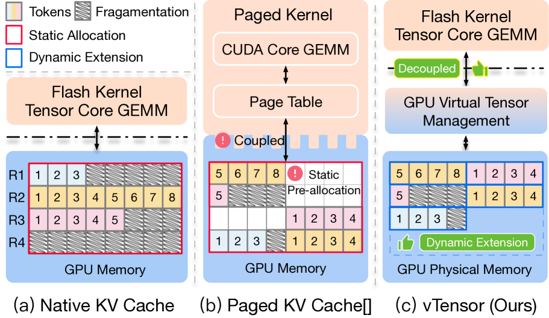

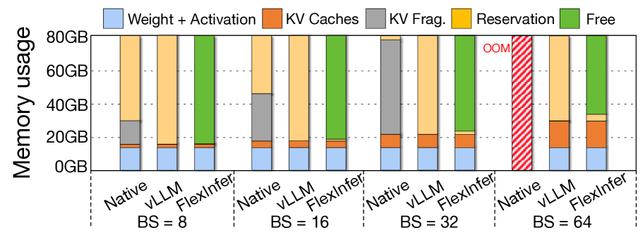

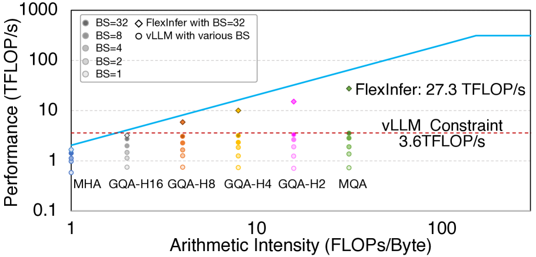

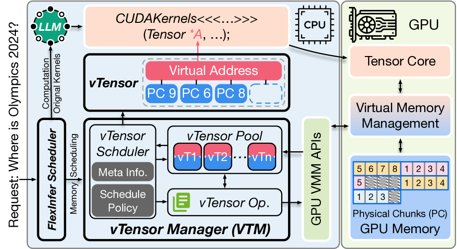

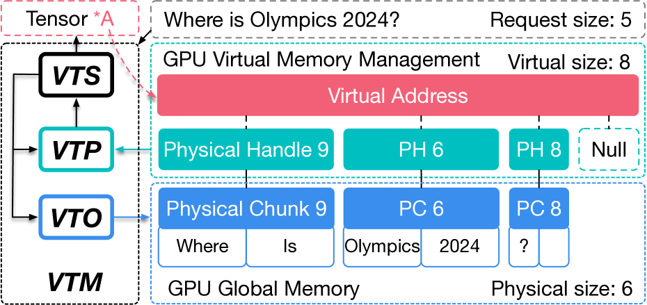

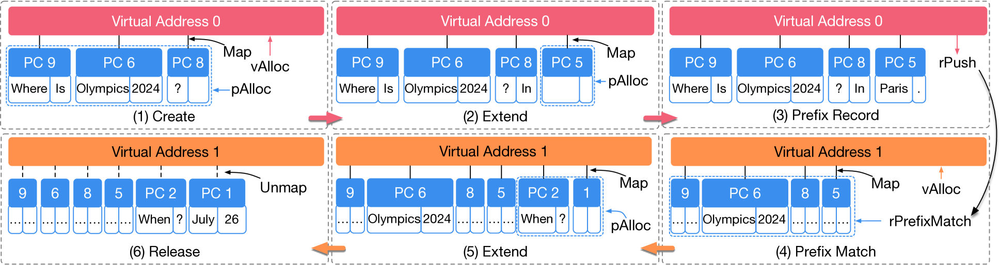

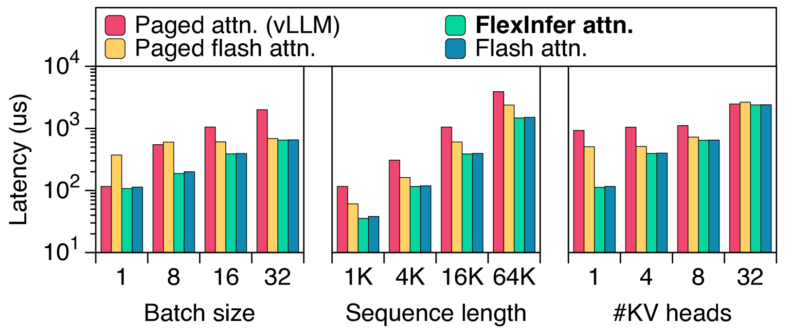

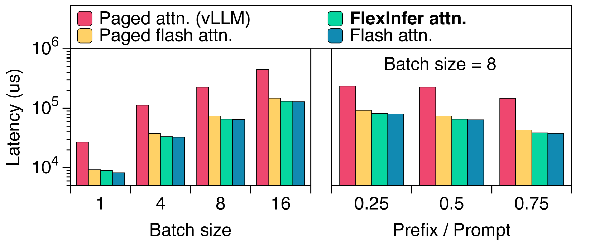

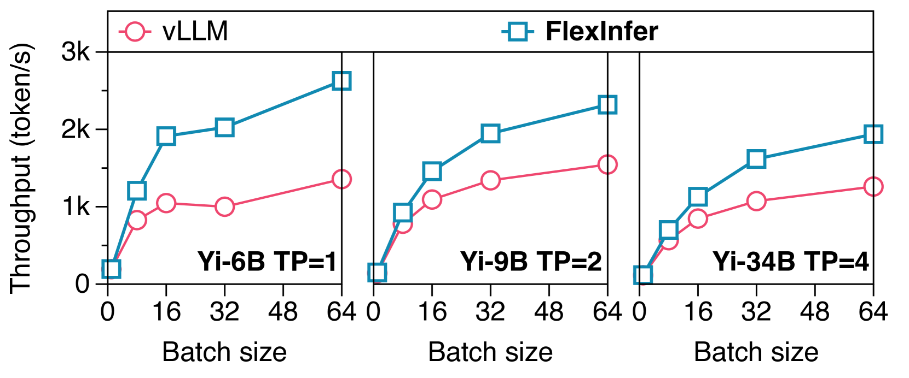

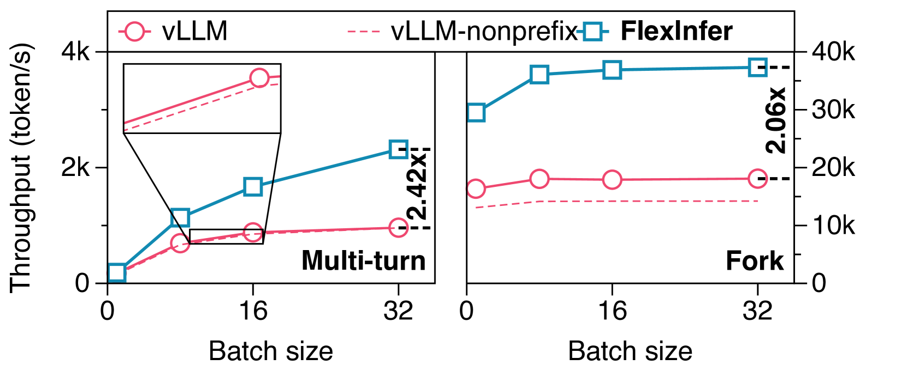

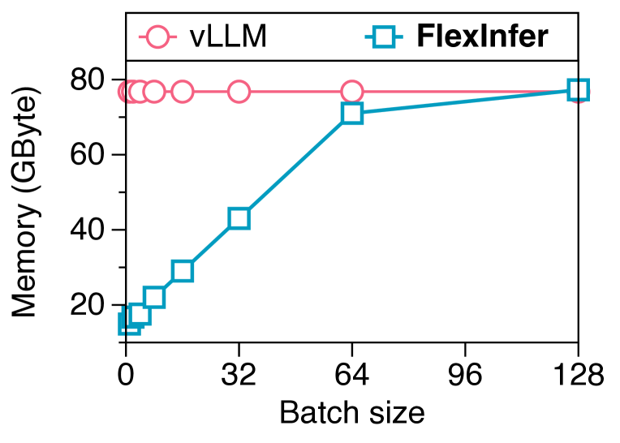

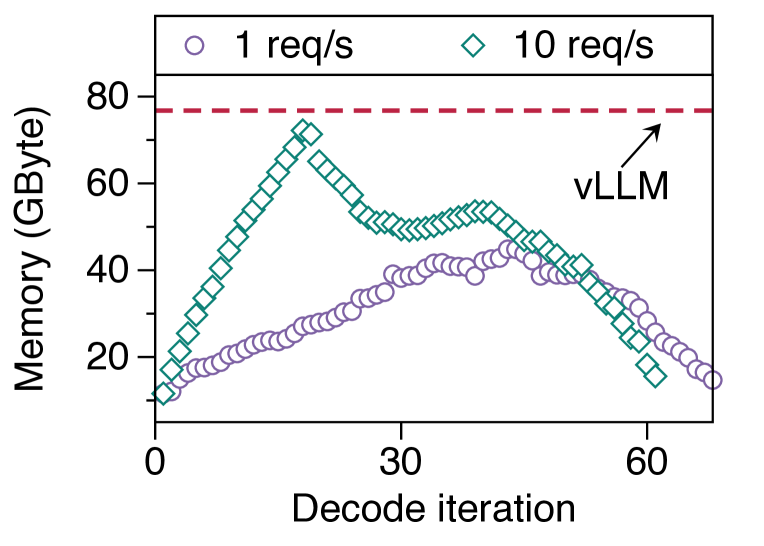

[Arxiv](https://arxiv.org/abs/2407.15309)