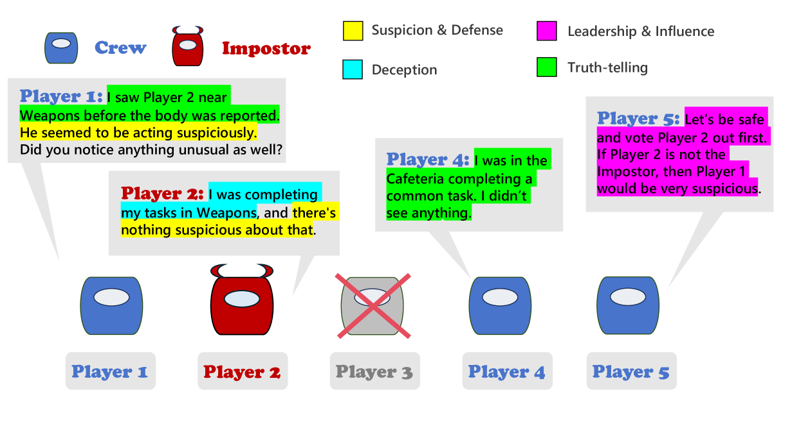

# AMONGAGENTS：通过基于文本的社交推理游戏，评估大型语言模型的表现。

发布时间：2024年07月23日

`LLM应用` `人工智能`

> AMONGAGENTS: Evaluating Large Language Models in the Interactive Text-Based Social Deduction Game

# 摘要

> 战略社交推理游戏是评估语言模型理解和推理能力的重要平台，为社会科学、人工智能和战略游戏领域提供了深刻见解。本文通过《Among Us》这一工具，在模拟环境中研究人类行为。我们创建了一个名为AmongAgent的文本游戏环境，模拟了《Among Us》的游戏机制。玩家需在太空船上识别并排除内鬼。在此环境中，我们分析了模拟语言代理的行为，并进行了多种配置的实验。研究表明，先进的大型语言模型（LLM）能有效掌握游戏规则并做出决策。本研究旨在推动LLM在复杂、信息不完全的目标导向游戏中的应用，这些场景为评估语言模型在社会驱动情境中的表现提供了独特机会。

> Strategic social deduction games serve as valuable testbeds for evaluating the understanding and inference skills of language models, offering crucial insights into social science, artificial intelligence, and strategic gaming. This paper focuses on creating proxies of human behavior in simulated environments, with \textit{Among Us} utilized as a tool for studying simulated human behavior.
  The study introduces a text-based game environment, named AmongAgent, that mirrors the dynamics of \textit{Among Us}. Players act as crew members aboard a spaceship, tasked with identifying impostors who are sabotaging the ship and eliminating the crew. Within this environment, the behavior of simulated language agents is analyzed. The experiments involve diverse game sequences featuring different configurations of Crewmates and Impostor personality archetypes. Our work demonstrates that state-of-the-art large language models (LLMs) can effectively grasp the game rules and make decisions based on the current context. This work aims to promote further exploration of LLMs in goal-oriented games with incomplete information and complex action spaces, as these settings offer valuable opportunities to assess language model performance in socially driven scenarios.

[Arxiv](https://arxiv.org/abs/2407.16521)