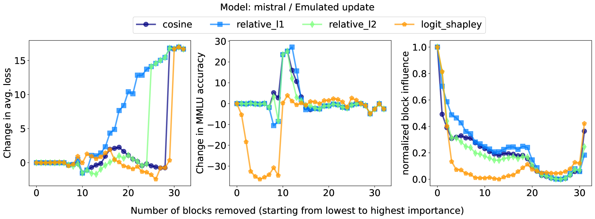

# 深度剖析 LLM 的层级精简

发布时间：2024年07月23日

`LLM理论` `人工智能` `计算机科学`

> A deeper look at depth pruning of LLMs

# 摘要

> 大型语言模型（LLM）不仅训练成本高昂，部署时更是耗资巨大。近期研究尝试通过廉价代理评估模块重要性，精简LLM结构，成功在训练良好的LLaMa-2与Mistral 7b模型中剔除10%模块，下游性能几乎不受影响。本文深入探讨了模块重要性评估，引入Shapley值等自适应指标，揭示了任务间性能的微妙平衡：一任务的提升可能牺牲另一任务的表现，因模块影响力计算差异所致。进一步，分析扩展至自注意力与前馈层，发现自注意力层更易修剪，Mistral 7b模型中甚至可削减33%自注意力层，MMLU性能无损，大幅降低KV缓存维护成本。此外，我们探索了轻量级偏差或低秩适配器的训练，以模拟修剪层，确保性能恢复，初始模块性能提升高达5%，效果媲美甚至超越传统学习方法。

> Large Language Models (LLMs) are not only resource-intensive to train but even more costly to deploy in production. Therefore, recent work has attempted to prune blocks of LLMs based on cheap proxies for estimating block importance, effectively removing 10% of blocks in well-trained LLaMa-2 and Mistral 7b models without any significant degradation of downstream metrics. In this paper, we explore different block importance metrics by considering adaptive metrics such as Shapley value in addition to static ones explored in prior work. We show that adaptive metrics exhibit a trade-off in performance between tasks i.e., improvement on one task may degrade performance on the other due to differences in the computed block influences. Furthermore, we extend this analysis from a complete block to individual self-attention and feed-forward layers, highlighting the propensity of the self-attention layers to be more amendable to pruning, even allowing removal of upto 33% of the self-attention layers without incurring any performance degradation on MMLU for Mistral 7b (significant reduction in costly maintenance of KV-cache). Finally, we look at simple performance recovery techniques to emulate the pruned layers by training lightweight additive bias or low-rank linear adapters. Performance recovery using emulated updates avoids performance degradation for the initial blocks (up to 5% absolute improvement on MMLU), which is either competitive or superior to the learning-based technique.

[Arxiv](https://arxiv.org/abs/2407.16286)