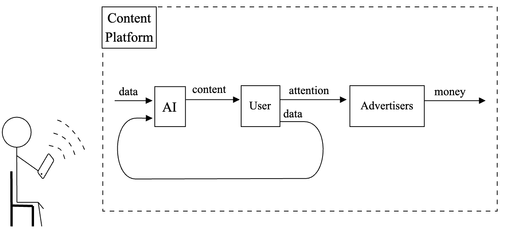

# 资本，人工智能的化身

发布时间：2024年07月23日

`LLM理论` `人工智能`

> Capital as Artificial Intelligence

# 摘要

> 我们综合了关于资本的多重视角，将其定义为一个历史性的能动系统，并利用计算机科学工具构建了资本模型。该模型包含一系列命题，若被特定基础满足，则构成有效资本模型。我们详细阐述了资本的演变方式，并指出在定量优化驱动下，资本可展现人工智能特质。我们认识到，资本可能不唯一代表意义，正如优化本身无意向性。此外，我们确认现代大型语言模型等人工智能属于资本范畴，并提供了一个网络接口，供读者互动体验资本的一部分。

> We gather many perspectives on Capital and synthesize their commonalities. We provide a characterization of Capital as a historical agential system and propose a model of Capital using tools from computer science. Our model consists of propositions which, if satisfied by a specific grounding, constitute a valid model of Capital. We clarify the manners in which Capital can evolve. We claim that, when its evolution is driven by quantitative optimization processes, Capital can possess qualities of Artificial Intelligence. We find that Capital may not uniquely represent meaning, in the same way that optimization is not intentionally meaningful. We find that Artificial Intelligences like modern day Large Language Models are a part of Capital. We link our readers to a web-interface where they can interact with a part of Capital.

[Arxiv](https://arxiv.org/abs/2407.16314)