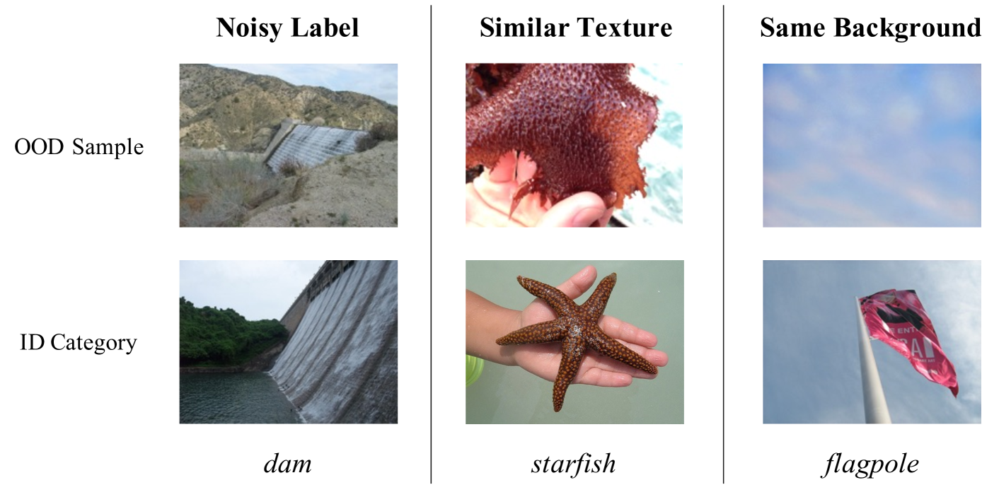

# 利用分层上下文描述实现类别可扩展的分布外检测

发布时间：2024年07月23日

`LLM应用` `计算机视觉` `人工智能`

> Category-Extensible Out-of-Distribution Detection via Hierarchical Context Descriptions

# 摘要

> OOD检测的核心在于广义特征表示和精确类别描述。尽管如CLIP这样的视觉-语言模型在这两方面取得了显著进展，但由于未见类别的缺失，精确类别描述的构建仍处于初级阶段。为此，我们引入了感知上下文和虚假上下文两个层次，通过自动提示调整来精细描绘类别边界。感知上下文用于区分类别间的差异（如猫与苹果），而虚假上下文则进一步识别每个类别中的虚假OOD样本（如猫与豹，苹果与桃子）。这两个上下文共同构建了类别的精确描述，先粗略分类，再精细判断样本的真实性。此外，这种精确描述在视觉-语言框架内催生了一种新应用：CATEX，它通过合并不同子任务下的层次上下文，高效扩展可识别类别。实验证明，CATEX在ImageNet-1K等挑战性数据集上表现卓越，同时我们还探讨了如何利用视觉-语言模型和大型语言模型（如GPT-3）来提升识别能力和零-shot应用。代码即将公开。

> The key to OOD detection has two aspects: generalized feature representation and precise category description. Recently, vision-language models such as CLIP provide significant advances in both two issues, but constructing precise category descriptions is still in its infancy due to the absence of unseen categories. This work introduces two hierarchical contexts, namely perceptual context and spurious context, to carefully describe the precise category boundary through automatic prompt tuning. Specifically, perceptual contexts perceive the inter-category difference (e.g., cats vs apples) for current classification tasks, while spurious contexts further identify spurious (similar but exactly not) OOD samples for every single category (e.g., cats vs panthers, apples vs peaches). The two contexts hierarchically construct the precise description for a certain category, which is, first roughly classifying a sample to the predicted category and then delicately identifying whether it is truly an ID sample or actually OOD. Moreover, the precise descriptions for those categories within the vision-language framework present a novel application: CATegory-EXtensible OOD detection (CATEX). One can efficiently extend the set of recognizable categories by simply merging the hierarchical contexts learned under different sub-task settings. And extensive experiments are conducted to demonstrate CATEX's effectiveness, robustness, and category-extensibility. For instance, CATEX consistently surpasses the rivals by a large margin with several protocols on the challenging ImageNet-1K dataset. In addition, we offer new insights on how to efficiently scale up the prompt engineering in vision-language models to recognize thousands of object categories, as well as how to incorporate large language models (like GPT-3) to boost zero-shot applications. Code will be made public soon.

[Arxiv](https://arxiv.org/abs/2407.16725)