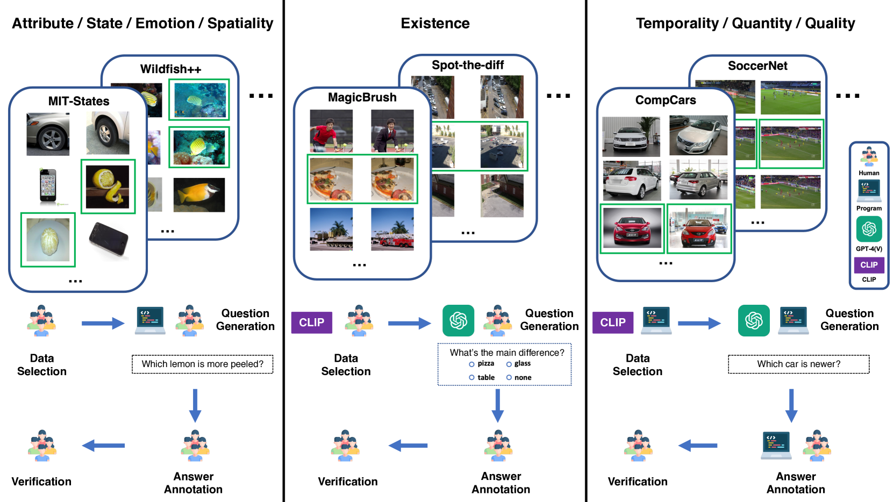
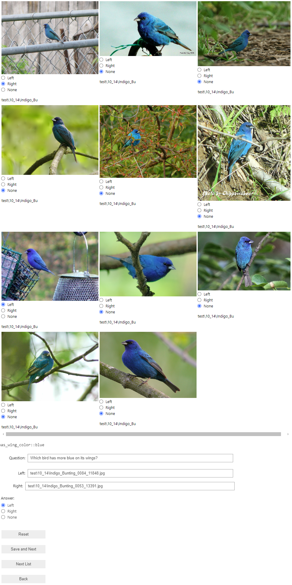

# CompBench：多模态 LLM 的比较推理基准

发布时间：2024年07月23日

`LLM应用` `人工智能` `视觉识别`

> CompBench: A Comparative Reasoning Benchmark for Multimodal LLMs

# 摘要

> 在日常生活中，比较物体、场景或情况的能力对于做出明智决策和解决问题至关重要。比如，比较苹果的新鲜度能让我们在购物时做出更佳选择，而比较沙发设计则有助于提升家居美感。尽管这一能力至关重要，但在人工通用智能（AGI）领域却鲜有研究。为此，我们推出了CompBench，这是一个专门评估多模态大型语言模型（MLLMs）比较推理能力的新基准。CompBench通过视觉导向问题，涵盖八个相对比较维度，挖掘并配对图像。我们精心挑选了约40,000对图像，这些图像来自多样化的视觉数据集，并结合了CLIP相似度分数。这些图像对广泛涉及动物、时尚、体育及室内外场景等多个领域。我们设计的问题旨在揭示两幅图像间的相对特征，并由人工标注者确保其准确性和相关性。通过CompBench，我们评估了包括GPT-4V、Gemini-Pro和LLaVA-1.6在内的最新MLLMs，结果显示它们在比较能力上存在明显不足。我们相信，CompBench不仅揭示了这些局限，更为未来提升MLLMs的比较能力奠定了坚实基础。

> The ability to compare objects, scenes, or situations is crucial for effective decision-making and problem-solving in everyday life. For instance, comparing the freshness of apples enables better choices during grocery shopping, while comparing sofa designs helps optimize the aesthetics of our living space. Despite its significance, the comparative capability is largely unexplored in artificial general intelligence (AGI). In this paper, we introduce CompBench, a benchmark designed to evaluate the comparative reasoning capability of multimodal large language models (MLLMs). CompBench mines and pairs images through visually oriented questions covering eight dimensions of relative comparison: visual attribute, existence, state, emotion, temporality, spatiality, quantity, and quality. We curate a collection of around 40K image pairs using metadata from diverse vision datasets and CLIP similarity scores. These image pairs span a broad array of visual domains, including animals, fashion, sports, and both outdoor and indoor scenes. The questions are carefully crafted to discern relative characteristics between two images and are labeled by human annotators for accuracy and relevance. We use CompBench to evaluate recent MLLMs, including GPT-4V(ision), Gemini-Pro, and LLaVA-1.6. Our results reveal notable shortcomings in their comparative abilities. We believe CompBench not only sheds light on these limitations but also establishes a solid foundation for future enhancements in the comparative capability of MLLMs.

[Arxiv](https://arxiv.org/abs/2407.16837)