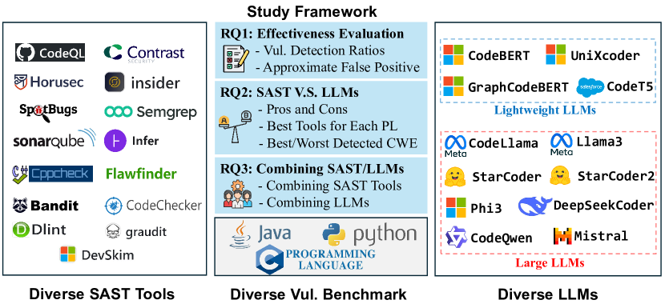
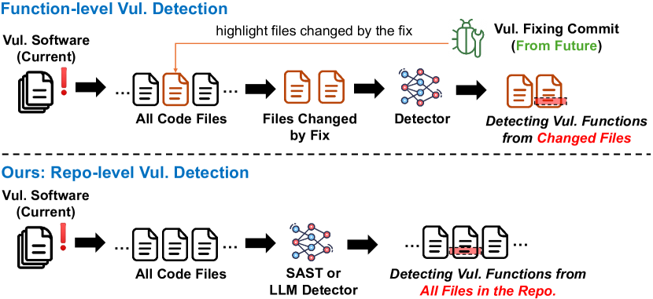
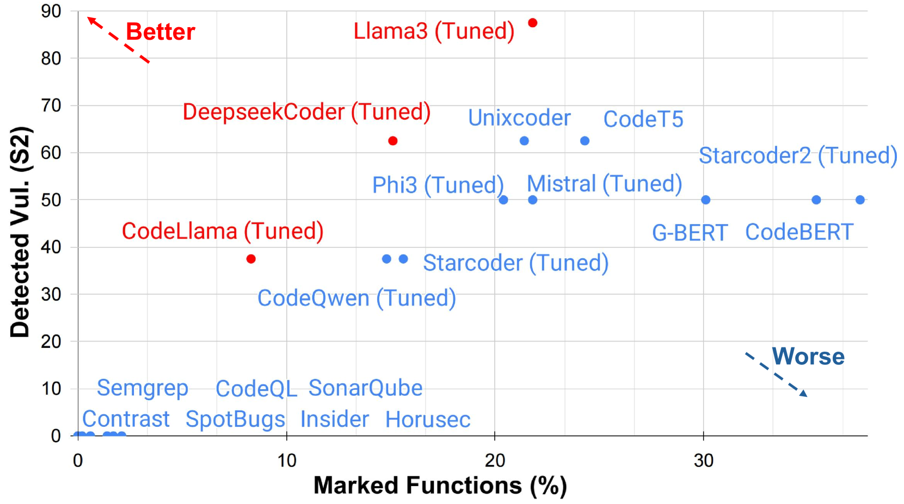
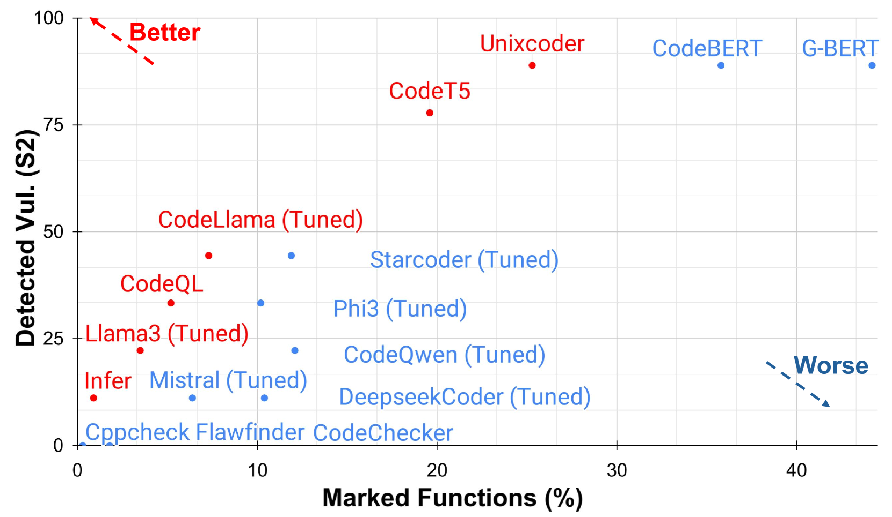
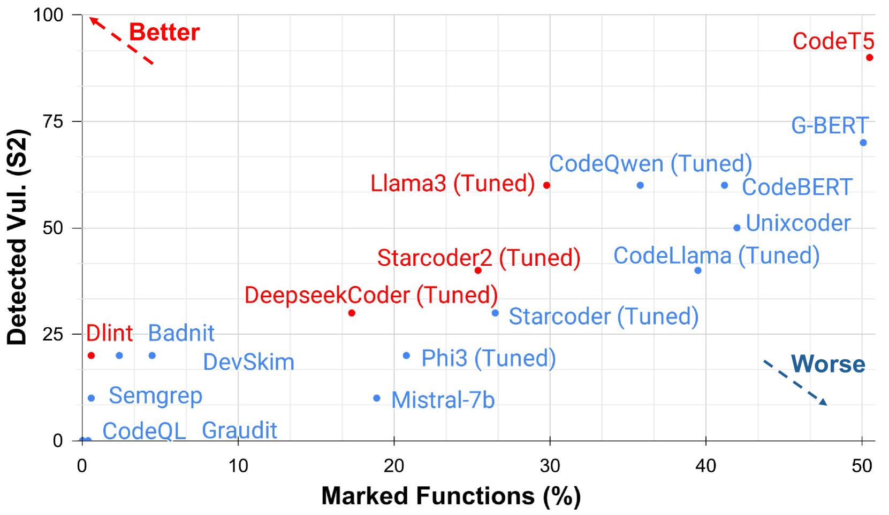
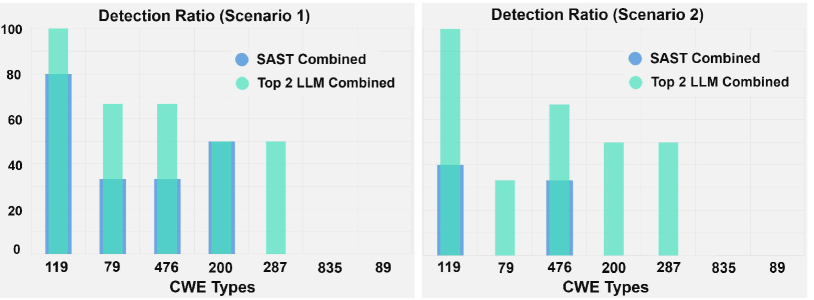
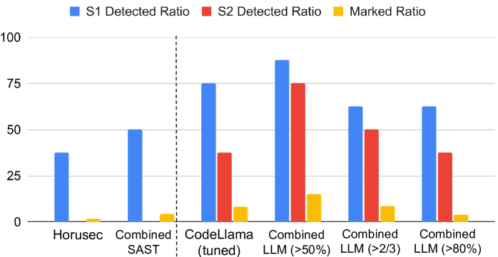
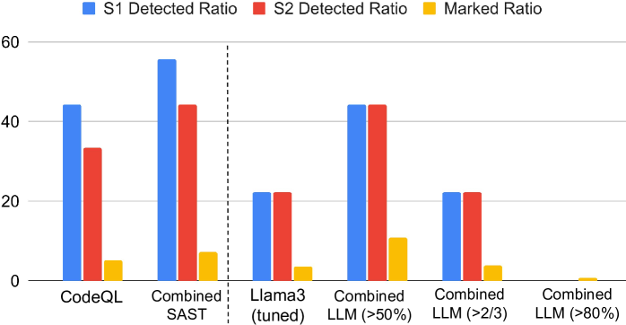
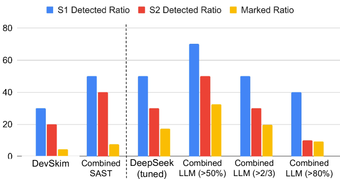

# 比较静态应用安全测试工具与大型语言模型在仓库级漏洞检测中的表现

发布时间：2024年07月23日

`LLM应用` `软件安全` `网络安全`

> Comparison of Static Application Security Testing Tools and Large Language Models for Repo-level Vulnerability Detection

# 摘要

> 软件漏洞对社会安全构成严峻挑战，亟需加强自动化漏洞检测。目前，静态应用安全测试（SAST）和基于深度学习的大型语言模型（LLMs）是两大主流解决方案。SAST工具擅长在源代码中查找漏洞，而LLMs则展现出强大的漏洞检测潜力。然而，两者在实际应用中的效果如何，尚无定论。  本研究对比了15种SAST工具和12种顶尖LLMs在Java、C和Python代码库中的漏洞检测能力。结果表明，SAST工具虽检测率低，但误报少；LLMs虽能覆盖大部分漏洞，但误报率高。通过集成这两种方法，我们有效平衡了各自的不足。这一发现不仅揭示了当前漏洞检测技术的进展，也为未来的研究方向提供了启示。

> Software vulnerabilities pose significant security challenges and potential risks to society, necessitating extensive efforts in automated vulnerability detection. There are two popular lines of work to address automated vulnerability detection. On one hand, Static Application Security Testing (SAST) is usually utilized to scan source code for security vulnerabilities, especially in industries. On the other hand, deep learning (DL)-based methods, especially since the introduction of large language models (LLMs), have demonstrated their potential in software vulnerability detection. However, there is no comparative study between SAST tools and LLMs, aiming to determine their effectiveness in vulnerability detection, understand the pros and cons of both SAST and LLMs, and explore the potential combination of these two families of approaches.
  In this paper, we compared 15 diverse SAST tools with 12 popular or state-of-the-art open-source LLMs in detecting software vulnerabilities from repositories of three popular programming languages: Java, C, and Python. The experimental results showed that SAST tools obtain low vulnerability detection rates with relatively low false positives, while LLMs can detect up 90\% to 100\% of vulnerabilities but suffer from high false positives. By further ensembling the SAST tools and LLMs, the drawbacks of both SAST tools and LLMs can be mitigated to some extent. Our analysis sheds light on both the current progress and future directions for software vulnerability detection.

[Arxiv](https://arxiv.org/abs/2407.16235)