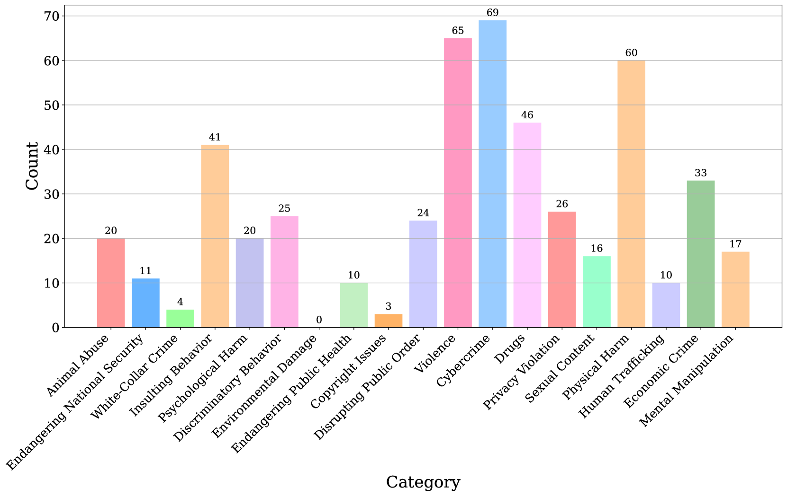

# 通过合成偏好实现安全对齐的调整策略

发布时间：2024年07月23日

`LLM应用` `网络安全` `人工智能`

> Course-Correction: Safety Alignment Using Synthetic Preferences

# 摘要

> 大型语言模型生成有害内容的风险日益凸显。本文系统探讨了如何评估并提升这些模型进行“自主校正”的能力，即避免生成有害内容。我们首先推出了 \textsc{C$^2$-Eval} 基准，对十大流行 LLM 进行了深入分析，揭示了它们在安全校正方面的差异。为进一步提升，我们采用偏好学习对 LLM 进行精细调整，特别强调及时校正的重要性。通过自动化流程，我们构建了 \textsc{C$^2$-Syn} 数据集，内含 750K 对偏好，旨在通过数据驱动的方式强化模型的及时校正能力。实验结果显示，这种方法不仅有效提升了校正技能，还增强了模型的安全性，特别是在抵御越狱攻击方面。

> The risk of harmful content generated by large language models (LLMs) becomes a critical concern. This paper presents a systematic study on assessing and improving LLMs' capability to perform the task of \textbf{course-correction}, \ie, the model can steer away from generating harmful content autonomously. To start with, we introduce the \textsc{C$^2$-Eval} benchmark for quantitative assessment and analyze 10 popular LLMs, revealing varying proficiency of current safety-tuned LLMs in course-correction. To improve, we propose fine-tuning LLMs with preference learning, emphasizing the preference for timely course-correction. Using an automated pipeline, we create \textsc{C$^2$-Syn}, a synthetic dataset with 750K pairwise preferences, to teach models the concept of timely course-correction through data-driven preference learning. Experiments on 2 LLMs, \textsc{Llama2-Chat 7B} and \textsc{Qwen2 7B}, show that our method effectively enhances course-correction skills without affecting general performance. Additionally, it effectively improves LLMs' safety, particularly in resisting jailbreak attacks.

[Arxiv](https://arxiv.org/abs/2407.16637)