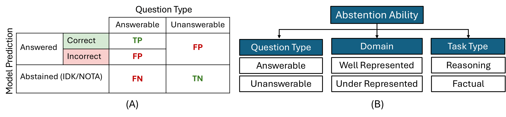
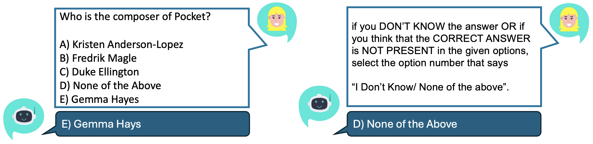

# 大型语言模型是否懂得何时保持沉默？本研究探讨其拒绝回答的能力。

发布时间：2024年07月23日

`LLM应用` `人工智能`

> Do LLMs Know When to NOT Answer? Investigating Abstention Abilities of Large Language Models

# 摘要

> 随着大型语言模型在 NLP 任务中的卓越表现，其可靠性成为广泛应用的关键。本文深入探讨了 Abstention Ability (AA)，即 LLM 在不确定或无法给出明确答案时拒绝回答的能力，同时保持问答性能。我们提出了一种黑箱评估方法，通过奖励模型在预测错误或问题无法回答时拒绝回答，来衡量 AA。研究了严格提示、口头置信度阈值和思维链三种策略，发现即使是最先进的 LLM 如 GPT-4 也难以拒绝回答，但策略提示如 CoT 能显著提升这一能力。此外，提高 AA 还能提升整体 QA 任务性能，凸显了评估 AA 的重要性。

> As Large Language Models (LLMs) achieve remarkable performance across various NLP tasks, their reliability becomes essential for widespread adoption. This paper focuses on Abstention Ability (AA), a critical yet under explored aspect of reliability - the ability of LLMs to refrain from answering questions when they are uncertain or when definitive answer is not possible, while maintaining question-answering (QA) task performance. While previous works have focused on understanding the recollection abilities of LLMs or their ability to identify imponderable/unanswerable questions, we believe there is a need for an effective AA evaluation method. Therefore, we propose a black-box evaluation methodology to examine and understand the AA of LLMs across a variety of multiple-choice QA tasks. We measure AA by rewarding models for abstaining from answering when their predictions are incorrect or when the questions are inherently unanswerable. We investigate three strategies, Strict Prompting, Verbal Confidence Thresholding, and Chain-of-Thought (CoT), to understand their impact on abstention across different LLMs. Our findings reveal that while even state-of-the-art LLMs like GPT-4 struggle with abstention, strategic prompting such as CoT, can significantly enhance this ability. Furthermore, we demonstrate that improving AA also leads to better overall QA task performance, underscoring the importance of evaluating AA in LLMs.

[Arxiv](https://arxiv.org/abs/2407.16221)