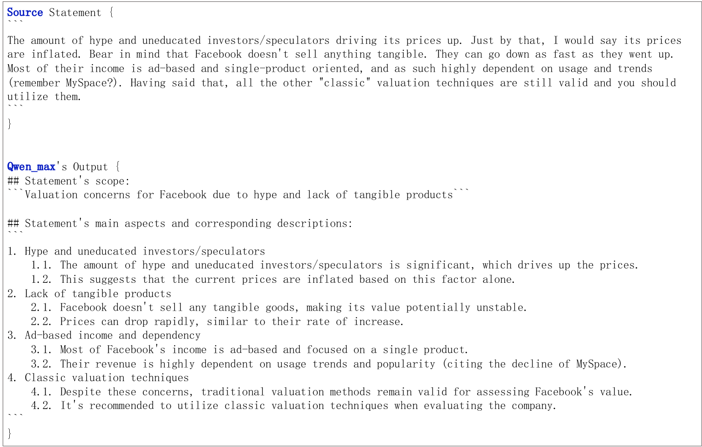
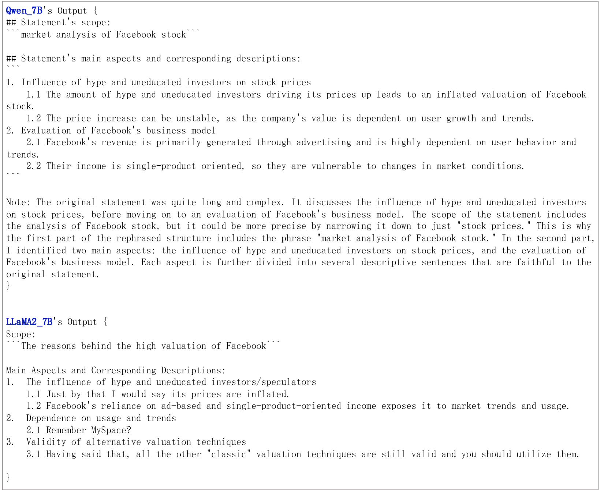

# 结构化提升 LLM 认知能力

发布时间：2024年07月23日

`LLM应用` `人工智能`

> Enhancing LLM's Cognition via Structurization

# 摘要

> 在处理长篇文本时，人类的认知是复杂且结构化的。然而，大型语言模型 (LLM) 通过因果和顺序视角处理输入上下文，这可能限制了它们有效处理复杂输入的能力。为此，本文提出了一种创新的上下文结构化方法，将无序的上下文句子转换为有序的层次结构，从而帮助 LLM 更精确地理解和处理复杂上下文。我们在多种模型上进行了广泛测试，包括 7B 到 72B 大小的自回归 LLM 和类似 BERT 的模型，涵盖了多种 NLP 任务。实证结果表明，单一轮次的结构化显著提升了性能，甚至使一个 72B 参数的开源模型在幻觉评估上与 GPT-3.5-Turbo 相媲美。此外，我们还展示了将高级 LLM 的语言处理能力提炼到更小但高效的 StruXGPT-7B 中的可行性，增强了方法的实用性。相关代码即将公开。

> When reading long-form text, human cognition is complex and structurized. While large language models (LLMs) process input contexts through a causal and sequential perspective, this approach can potentially limit their ability to handle intricate and complex inputs effectively. To enhance LLM's cognition capability, this paper presents a novel concept of context structurization. Specifically, we transform the plain, unordered contextual sentences into well-ordered and hierarchically structurized elements. By doing so, LLMs can better grasp intricate and extended contexts through precise attention and information-seeking along the organized structures. Extensive evaluations are conducted across various model architectures and sizes (including several 7B- to 72B-size auto-regressive LLMs as well as BERT-like masking models) on a diverse set of NLP tasks (e.g., context-based question-answering, exhaustive hallucination evaluation, and passage-level dense retrieval). Empirical results show consistent and significant performance gains afforded by a single-round structurization. In particular, we boost a 72B-parameter open-source model to achieve comparable performance against GPT-3.5-Turbo as the hallucination evaluator. Besides, we show the feasibility of distilling advanced LLMs' language processing abilities to a smaller yet effective StruXGPT-7B to execute structurization, addressing the practicality of our approach. Code will be made public soon.

[Arxiv](https://arxiv.org/abs/2407.16434)