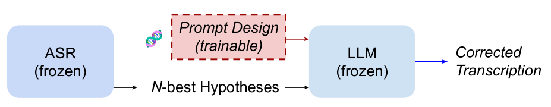
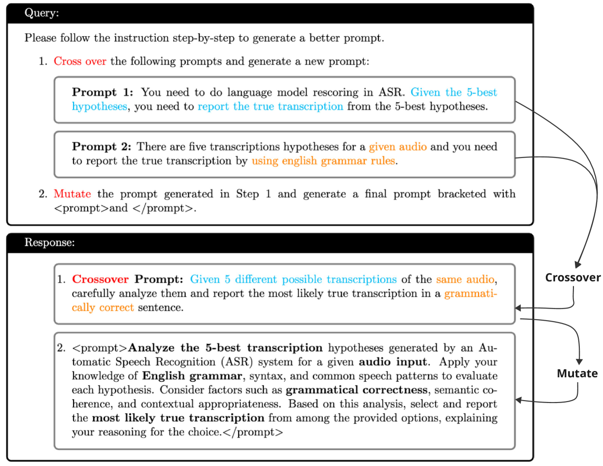
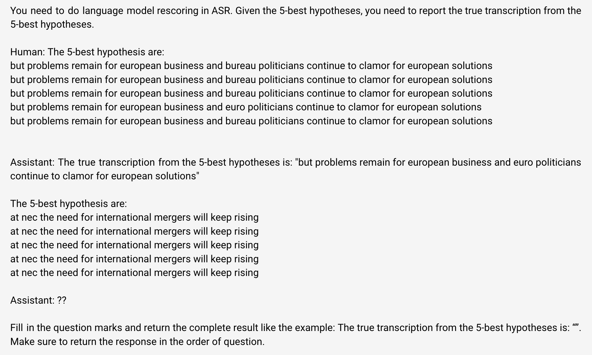

# LLM 驱动的 ASR 后错误纠正的进化提示策略

发布时间：2024年07月23日

`LLM应用` `语音识别` `自动语音识别`

> Evolutionary Prompt Design for LLM-Based Post-ASR Error Correction

# 摘要

> 借助现代大型语言模型 (LLM) 的强大功能，生成错误纠正 (GEC) 已成为提升自动语音识别 (ASR) 系统性能的有力途径。典型方法是通过上下文学习引导 LLM，结合精心设计的提示和 ASR 系统的 $N$-最佳假设列表，生成更优假设。但现有提示是否最适用于后 ASR 错误纠正尚属未知。本文首先探索多种提示，筛选出初始有效集合，再运用进化优化算法精炼这些提示。针对 SLT 2024 GenSEC 挑战任务 1 的 CHiME-4 子集的评估，验证了所提算法的高效与潜力。

> Building upon the strength of modern large language models (LLMs), generative error correction (GEC) has emerged as a promising paradigm that can elevate the performance of modern automatic speech recognition (ASR) systems. One representative approach is to leverage in-context learning to prompt LLMs so that a better hypothesis can be generated by the LLMs based on a carefully-designed prompt and an $N$-best list of hypotheses produced by ASR systems. However, it is yet unknown whether the existing prompts are the most effective ones for the task of post-ASR error correction. In this context, this paper first explores alternative prompts to identify an initial set of effective prompts, and then proposes to employ an evolutionary prompt optimization algorithm to refine the initial prompts. Evaluations results on the CHiME-4 subset of the Task $1$ of the SLT $2024$ GenSEC challenge show the effectiveness and potential of the proposed algorithms.

[Arxiv](https://arxiv.org/abs/2407.16370)