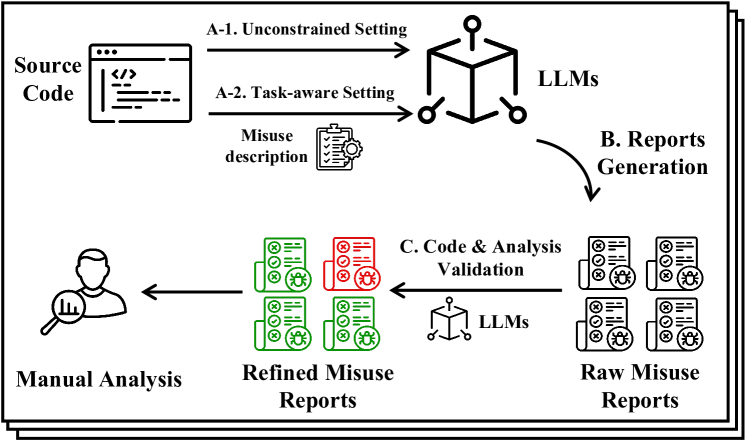
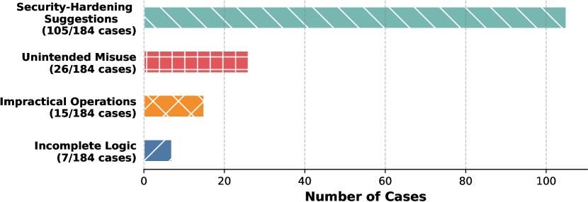
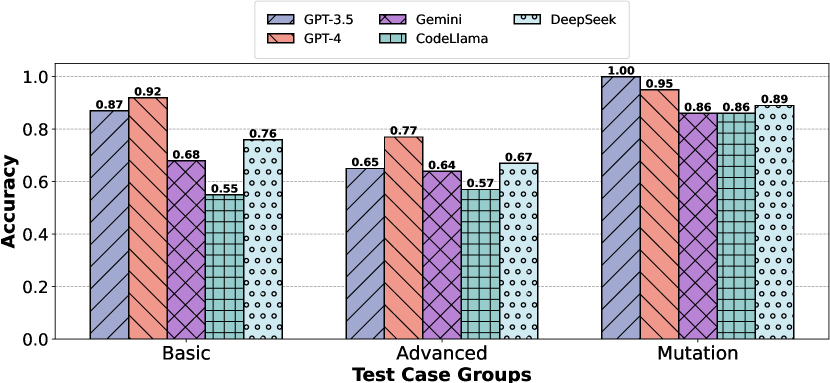
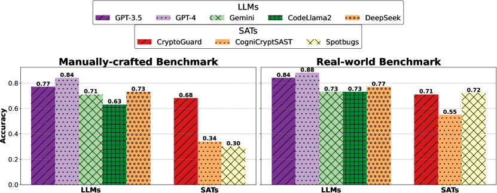
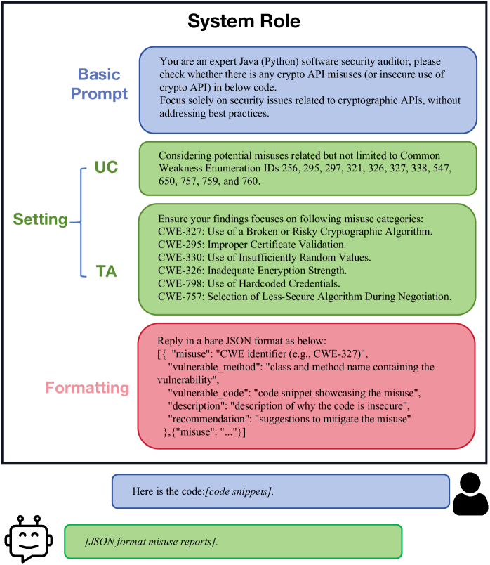
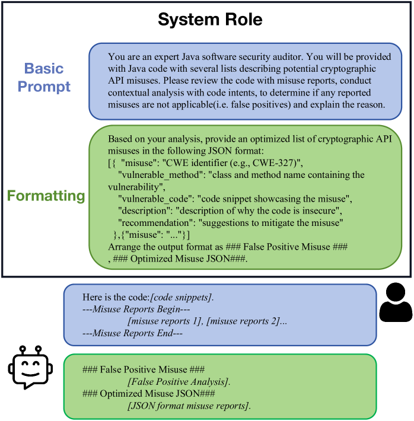
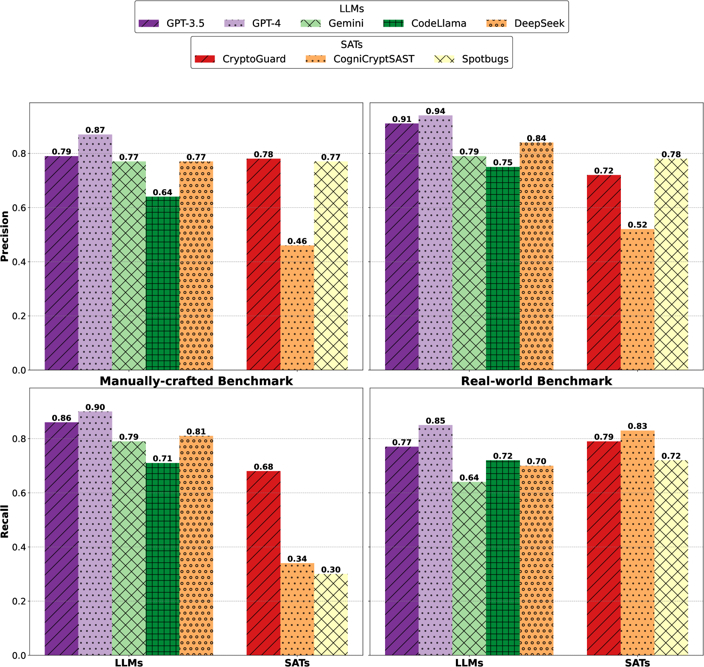
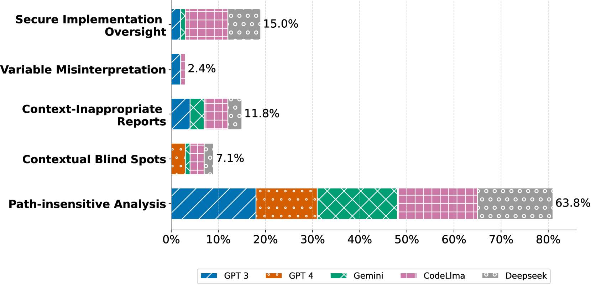

# 在 LLM 时代，我们致力于探索自动检测加密 API 误用的技术。

发布时间：2024年07月23日

`LLM应用` `软件开发`

> Exploring Automatic Cryptographic API Misuse Detection in the Era of LLMs

# 摘要

> 虽然加密API误用的自动检测技术已大幅进步，但在处理复杂目标时，由于依赖人工定义的模式，其精确度有所下降。大型语言模型（LLM）以其强大的上下文理解能力，为弥补这一缺陷提供了新思路。然而，将LLM应用于安全领域面临挑战，主要是因为其随机性和幻觉问题导致的不可靠性。本文通过引入一个系统评估框架，利用综合数据集评估LLM在加密误用检测中的表现，揭示了LLM的不稳定性可能导致大量假阳性报告。尽管如此，通过限制问题范围并利用LLM的自校正能力，我们显著提升了检测的可靠性，实现了近90%的高检测率，超越传统方法，并发现了先前未知的误用案例。此外，我们识别了影响LLM可靠性的关键失败模式，包括加密知识不足和代码语义误解。基于这些发现，我们开发了一个基于LLM的工作流程，成功在开源项目中发现了63个加密误用，其中46个已得到社区确认，23个正在处理，6个已解决。根据开发者反馈，我们提出了未来研究和开发基于LLM安全工具的建议。

> While the automated detection of cryptographic API misuses has progressed significantly, its precision diminishes for intricate targets due to the reliance on manually defined patterns. Large Language Models (LLMs), renowned for their contextual understanding, offer a promising avenue to address existing shortcomings. However, applying LLMs in this security-critical domain presents challenges, particularly due to the unreliability stemming from LLMs' stochastic nature and the well-known issue of hallucination. To explore the prevalence of LLMs' unreliable analysis and potential solutions, this paper introduces a systematic evaluation framework to assess LLMs in detecting cryptographic misuses, utilizing a comprehensive dataset encompassing both manually-crafted samples and real-world projects. Our in-depth analysis of 11,940 LLM-generated reports highlights that the inherent instabilities in LLMs can lead to over half of the reports being false positives. Nevertheless, we demonstrate how a constrained problem scope, coupled with LLMs' self-correction capability, significantly enhances the reliability of the detection. The optimized approach achieves a remarkable detection rate of nearly 90%, surpassing traditional methods and uncovering previously unknown misuses in established benchmarks. Moreover, we identify the failure patterns that persistently hinder LLMs' reliability, including both cryptographic knowledge deficiency and code semantics misinterpretation. Guided by these insights, we develop an LLM-based workflow to examine open-source repositories, leading to the discovery of 63 real-world cryptographic misuses. Of these, 46 have been acknowledged by the development community, with 23 currently being addressed and 6 resolved. Reflecting on developers' feedback, we offer recommendations for future research and the development of LLM-based security tools.

[Arxiv](https://arxiv.org/abs/2407.16576)