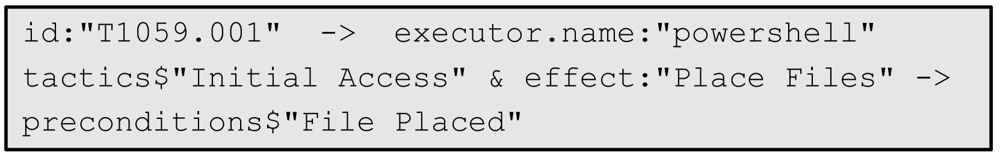

# 从沙粒到摩天楼：借助 LLM 自动构建全生命周期的网络攻击

发布时间：2024年07月23日

`Agent` `网络安全` `自动化`

> From Sands to Mansions: Enabling Automatic Full-Life-Cycle Cyberattack Construction with LLM

# 摘要

> 随着网络安全领域攻击与防御的不断升级，从攻击者视角评估防御能力变得尤为关键。然而，构建全周期的网络攻击并进行红队模拟，需要安全专家投入大量时间和专业知识。现有模拟框架存在技术覆盖不全、无法实现全周期攻击、依赖手动构建基础设施等局限，影响了攻击模拟的质量与多样性。本文中，我们利用大型语言模型（LLM）的能力，从现有攻击情报中提炼知识，并生成基于人类知识的可执行代码。我们提出AURORA框架，能自动根据网络威胁情报（CTI）报告，构建多阶段攻击计划，自动搭建模拟环境并执行攻击。同时，我们构建了攻击程序知识图谱，整合了高级网络攻击全生命周期的技术知识。基于现有CTI报告，我们成功构建并评估了20多个全周期网络攻击。相比以往框架，AURORA能在几分钟内自动完成多步骤攻击与环境的构建，且纳入的攻击技术比专业红队多40%，效率更高。为推动研究，我们开源了包含20个模拟攻击的执行文件与环境数据集。

> The escalating battles between attackers and defenders in cybersecurity make it imperative to test and evaluate defense capabilities from the attackers' perspective. However, constructing full-life-cycle cyberattacks and performing red team emulations requires significant time and domain knowledge from security experts. Existing cyberattack simulation frameworks face challenges such as limited technical coverage, inability to conduct full-life-cycle attacks, and the need for manual infrastructure building. These limitations hinder the quality and diversity of the constructed attacks. In this paper, we leveraged the capabilities of Large Language Models (LLMs) in summarizing knowledge from existing attack intelligence and generating executable machine code based on human knowledge. we proposed AURORA, an automatic end-to-end cyberattack construction and emulation framework. AURORA can autonomously build multi-stage cyberattack plans based on Cyber Threat Intelligence (CTI) reports, construct the emulation infrastructures, and execute the attack procedures. We also developed an attack procedure knowledge graph to integrate knowledge about attack techniques throughout the full life cycle of advanced cyberattacks from various sources. We constructed and evaluated more than 20 full-life-cycle cyberattacks based on existing CTI reports. Compared to previous attack simulation frameworks, AURORA can construct multi-step attacks and the infrastructures in several minutes without human intervention. Furthermore, AURORA incorporates a wider range (40% more) of attack techniques into the constructed attacks in a more efficient way than the professional red teams. To benefit further research, we open-sourced the dataset containing the execution files and infrastructures of 20 emulated cyberattacks.

[Arxiv](https://arxiv.org/abs/2407.16928)