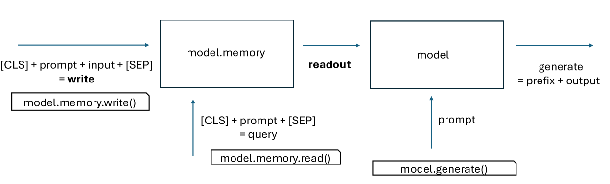
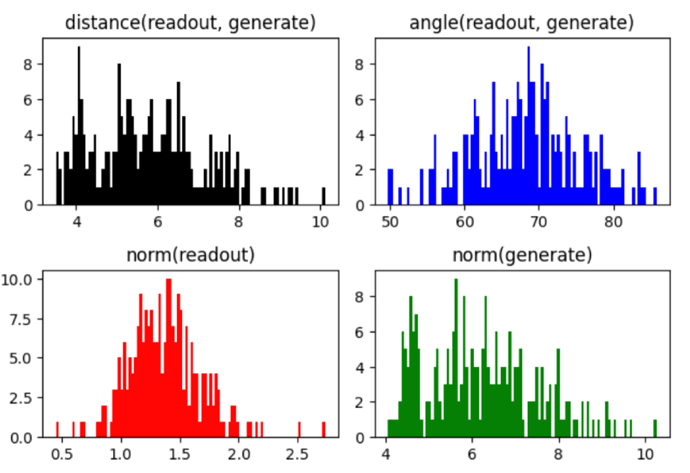
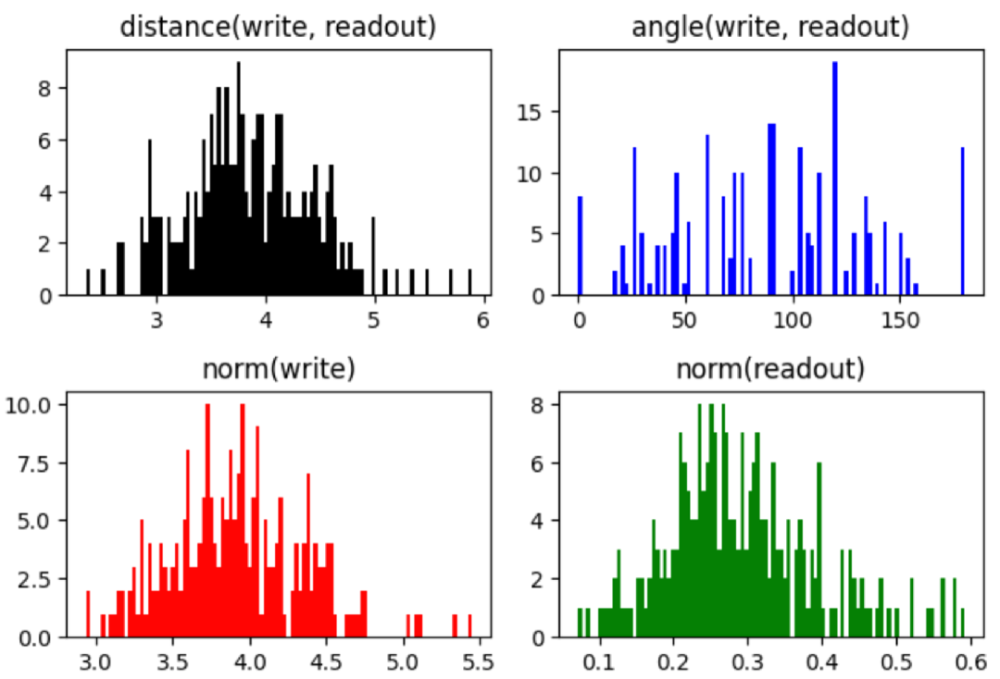
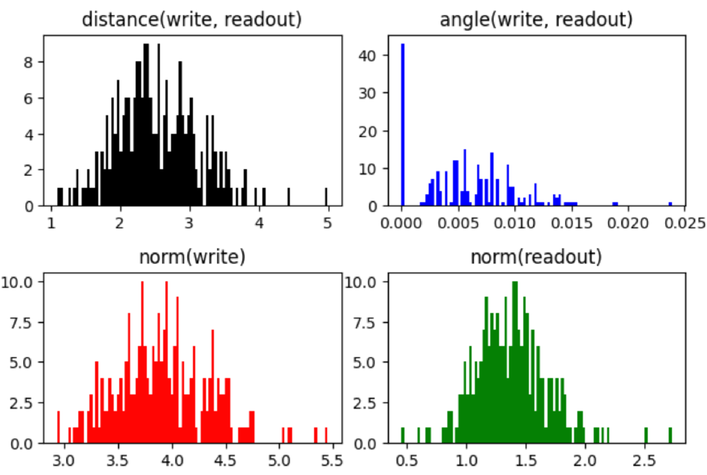
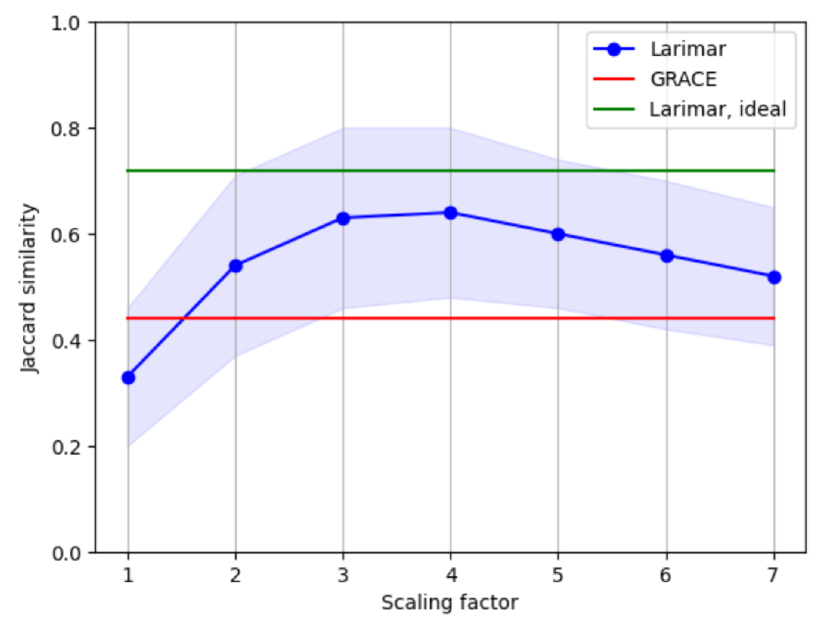
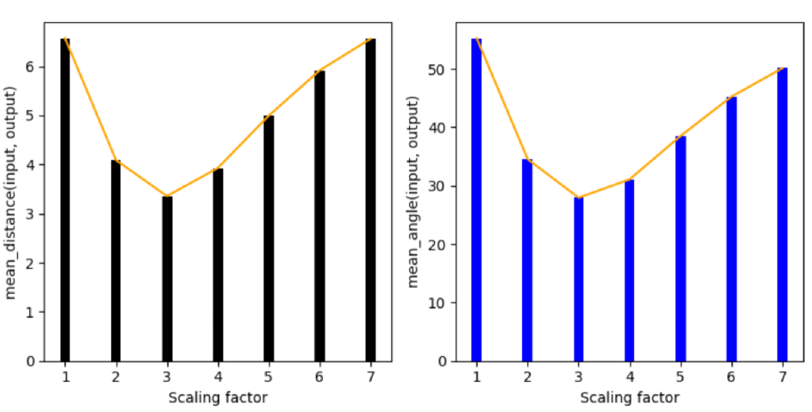

# 通过调整生成约束的尺度，我们能够有效缓解幻觉现象。

发布时间：2024年07月23日

`LLM应用` `人工智能` `媒体内容生成`

> Generation Constraint Scaling Can Mitigate Hallucination

# 摘要

> 解决 LLM 中的幻觉问题至关重要。鉴于幻觉与记忆的关联，我们研究了配备显式记忆机制的 LLM。实验表明，通过调整记忆增强解码器中的读出向量，无需额外训练即可减轻幻觉。我们的几何启发方法在生成维基百科式传记条目时，不仅提升了生成质量，还优化了运行效率，超越了现有顶尖的 LLM 编辑技术。

> Addressing the issue of hallucinations in large language models (LLMs) is a critical challenge. As the cognitive mechanisms of hallucination have been related to memory, here we explore hallucination for LLM that is enabled with explicit memory mechanisms. We empirically demonstrate that by simply scaling the readout vector that constrains generation in a memory-augmented LLM decoder, hallucination mitigation can be achieved in a training-free manner. Our method is geometry-inspired and outperforms a state-of-the-art LLM editing method on the task of generation of Wikipedia-like biography entries both in terms of generation quality and runtime complexity.

[Arxiv](https://arxiv.org/abs/2407.16908)