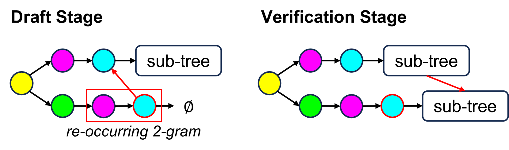

# 图结构推测解码

发布时间：2024年07月23日

`LLM应用` `人工智能` `计算机科学`

> Graph-Structured Speculative Decoding

# 摘要

> 推测解码技术通过小型语言模型草拟假设序列，再由大型语言模型验证，有效加速了LLM推理。我们研究重点在于通过生成多重假设，提升草稿令牌的接受率，赋予LLM更多选择，优化其输出。分析发现，这些假设共享常见令牌序列，提示计算优化可能。基于此，我们创新采用有向无环图（DAG）管理假设，高效预测与合并重复序列，大幅降低计算负担。此方法，即图结构推测解码（GSD），在多款LLM上，包括700亿参数的LLaMA-2，实现了1.73至1.96倍的显著加速，远超传统推测解码。

> Speculative decoding has emerged as a promising technique to accelerate the inference of Large Language Models (LLMs) by employing a small language model to draft a hypothesis sequence, which is then validated by the LLM. The effectiveness of this approach heavily relies on the balance between performance and efficiency of the draft model. In our research, we focus on enhancing the proportion of draft tokens that are accepted to the final output by generating multiple hypotheses instead of just one. This allows the LLM more options to choose from and select the longest sequence that meets its standards. Our analysis reveals that hypotheses produced by the draft model share many common token sequences, suggesting a potential for optimizing computation. Leveraging this observation, we introduce an innovative approach utilizing a directed acyclic graph (DAG) to manage the drafted hypotheses. This structure enables us to efficiently predict and merge recurring token sequences, vastly reducing the computational demands of the draft model. We term this approach Graph-structured Speculative Decoding (GSD). We apply GSD across a range of LLMs, including a 70-billion parameter LLaMA-2 model, and observe a remarkable speedup of 1.73$\times$ to 1.96$\times$, significantly surpassing standard speculative decoding.

[Arxiv](https://arxiv.org/abs/2407.16207)