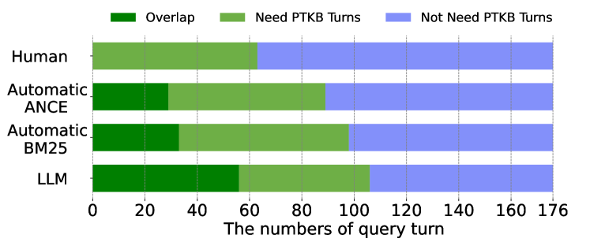
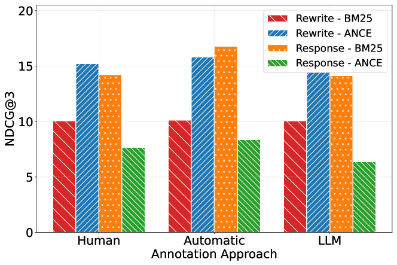

# 利用个人文本知识，实现个性化对话信息检索

发布时间：2024年07月23日

`LLM应用` `个性化服务` `信息检索`

> How to Leverage Personal Textual Knowledge for Personalized Conversational Information Retrieval

# 摘要

> 个性化对话信息检索（CIR）通过结合对话和个性化元素，基于用户背景进行多轮交互，以满足复杂的信息需求。其核心优势在于，个人文本知识库（PTKB）能提升检索效果，使结果更贴合用户背景。但PTKB存在噪音，并非所有知识都与特定查询相关。本文探讨并测试了多种从PTKB中精选知识并借助大型语言模型（LLM）重构查询的方法。实验表明，单独使用PTKB未必总能提升搜索质量，但LLM在高质量指导下能生成更精准的个性化查询。

> Personalized conversational information retrieval (CIR) combines conversational and personalizable elements to satisfy various users' complex information needs through multi-turn interaction based on their backgrounds. The key promise is that the personal textual knowledge base (PTKB) can improve the CIR effectiveness because the retrieval results can be more related to the user's background. However, PTKB is noisy: not every piece of knowledge in PTKB is relevant to the specific query at hand. In this paper, we explore and test several ways to select knowledge from PTKB and use it for query reformulation by using a large language model (LLM). The experimental results show the PTKB might not always improve the search results when used alone, but LLM can help generate a more appropriate personalized query when high-quality guidance is provided.

[Arxiv](https://arxiv.org/abs/2407.16192)