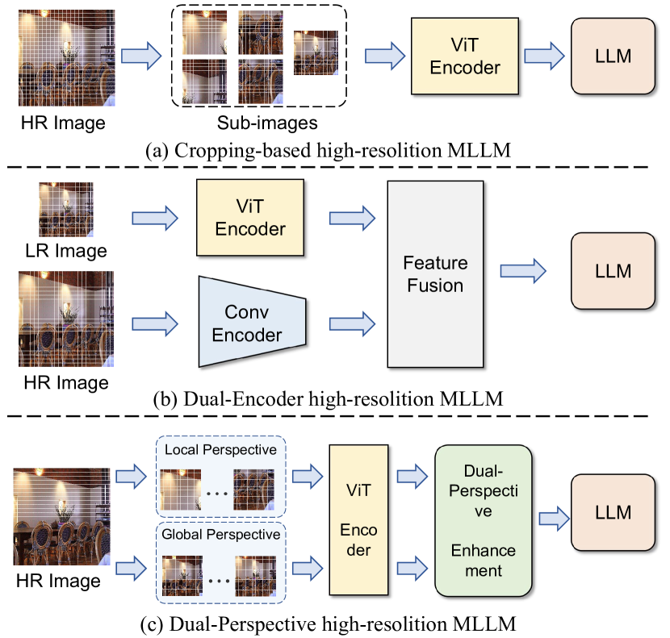
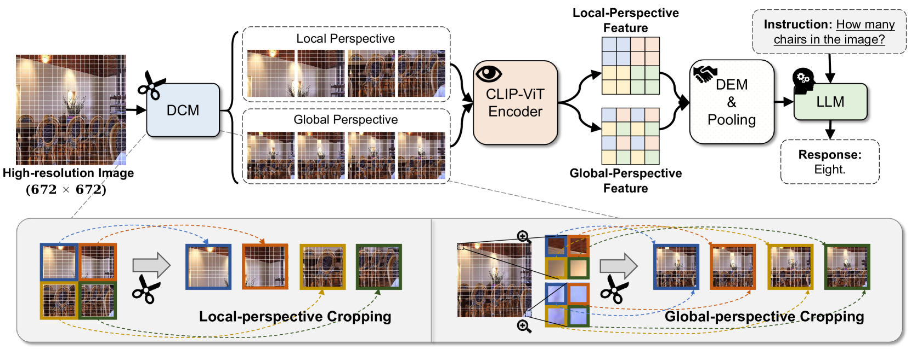
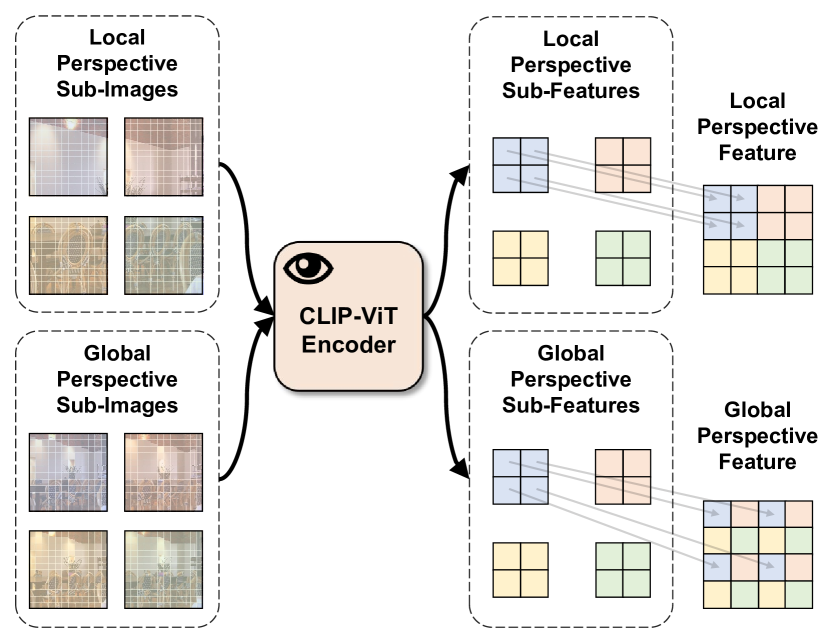
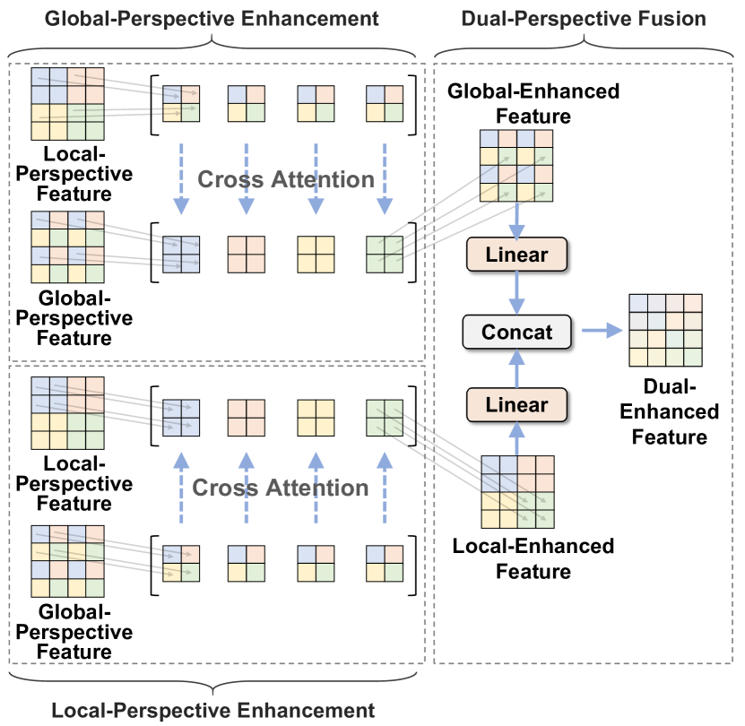
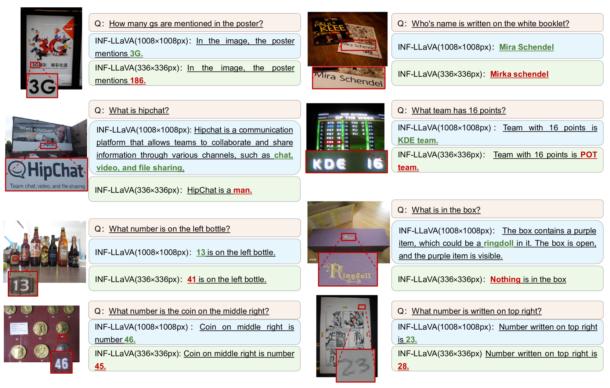
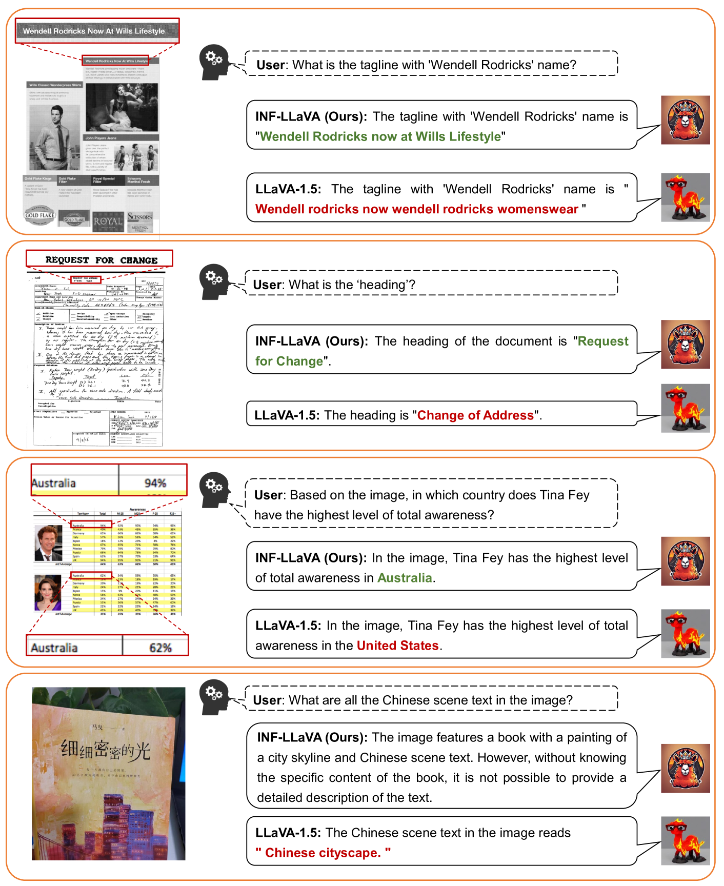
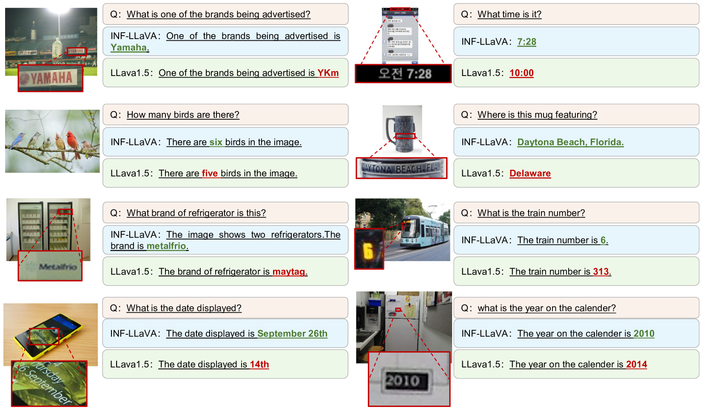
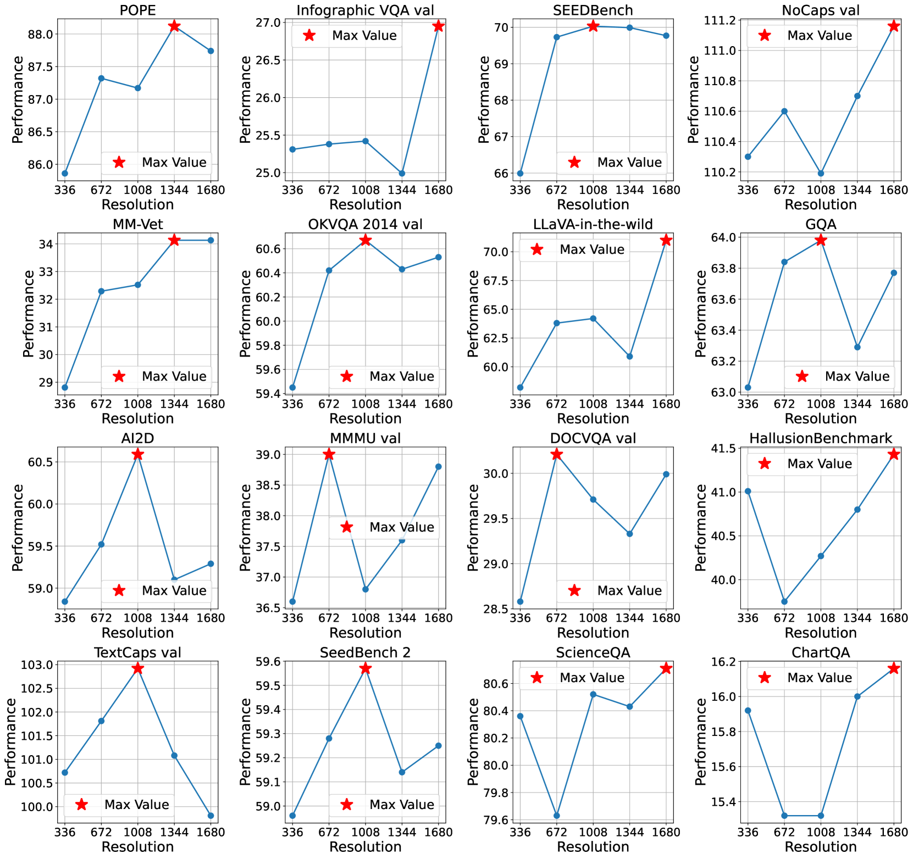

# INF-LLaVA：高分辨率多模态大型语言模型的双重视角感知技术

发布时间：2024年07月23日

`LLM应用` `计算机视觉` `人工智能`

> INF-LLaVA: Dual-perspective Perception for High-Resolution Multimodal Large Language Model

# 摘要

> 随着数据和计算资源的进步，多模态大型语言模型 (MLLMs) 在多个领域展现了其能力。然而，MLLMs 中视觉编码器的复杂度限制了图像分辨率。当前方法通过裁剪图像来处理，但这些子图像缺乏全局上下文。为此，我们提出了 INF-LLaVA，一种新型 MLLM，专为高分辨率图像感知设计。INF-LLaVA 包含两个创新模块：双视角裁剪模块 (DCM) 和双视角增强模块 (DEM)，确保子图像包含局部和全局信息，并增强这些特征的交互。实验证明，INF-LLaVA 在多个基准测试中优于现有模型。代码和模型已在 GitHub 上发布。

> With advancements in data availability and computing resources, Multimodal Large Language Models (MLLMs) have showcased capabilities across various fields. However, the quadratic complexity of the vision encoder in MLLMs constrains the resolution of input images. Most current approaches mitigate this issue by cropping high-resolution images into smaller sub-images, which are then processed independently by the vision encoder. Despite capturing sufficient local details, these sub-images lack global context and fail to interact with one another. To address this limitation, we propose a novel MLLM, INF-LLaVA, designed for effective high-resolution image perception. INF-LLaVA incorporates two innovative components. First, we introduce a Dual-perspective Cropping Module (DCM), which ensures that each sub-image contains continuous details from a local perspective and comprehensive information from a global perspective. Second, we introduce Dual-perspective Enhancement Module (DEM) to enable the mutual enhancement of global and local features, allowing INF-LLaVA to effectively process high-resolution images by simultaneously capturing detailed local information and comprehensive global context. Extensive ablation studies validate the effectiveness of these components, and experiments on a diverse set of benchmarks demonstrate that INF-LLaVA outperforms existing MLLMs. Code and pretrained model are available at https://github.com/WeihuangLin/INF-LLaVA.

[Arxiv](https://arxiv.org/abs/2407.16198)