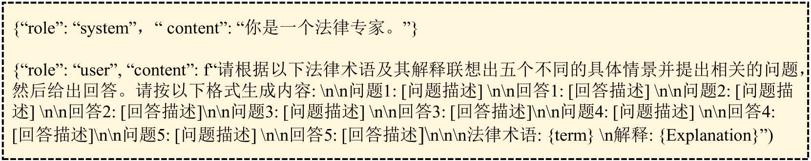

# LawLuo：一家由 LLM 代理共同运营的中国律师事务所

发布时间：2024年07月23日

`Agent` `人工智能`

> LawLuo: A Chinese Law Firm Co-run by LLM Agents

# 摘要

> 大型语言模型 (LLM) 凭借其出色的文本理解和生成能力，为非法律专业用户提供法律咨询服务展现出巨大潜力。然而，当前中文法律 LLM 仅支持单一模型与用户的对话，未能模拟律师事务所中多人员协作的真实咨询场景，这限制了用户体验的真实性。此外，这些模型还面临三大挑战：指令微调数据质量控制不足、用户模糊查询导致的模型幻觉问题、以及多轮对话后模型遵循指令能力的下降。为应对这些挑战，我们创新性地提出了 LawLuo 框架，该框架通过多个 LLM 代理的协作，模拟接待员、律师、秘书和老板的角色，共同为用户提供全面的法律咨询服务。我们还构建了 KINLED 和 MURLED 两个高质量法律对话数据集，并对 ChatGLM-3-6b 进行了微调。此外，我们研发了 ToLC 法律查询澄清算法。实验结果表明，LawLuo 在模拟律师语言风格、提供法律建议的实用性和法律知识的准确性方面，均超越了包括 GPT-4 在内的基准模型。相关代码和数据集已公开于 https://github.com/NEFUJing/LawLuo。

> Large Language Models (LLMs) demonstrate substantial potential in delivering legal consultation services to users without a legal background, attributed to their superior text comprehension and generation capabilities. Nonetheless, existing Chinese legal LLMs limit interaction to a single model-user dialogue, unlike the collaborative consultations typical of law firms, where multiple staff members contribute to a single consultation. This limitation prevents an authentic consultation experience. Additionally, extant Chinese legal LLMs suffer from critical limitations: (1) insufficient control over the quality of instruction fine-tuning data; (2) increased model hallucination resulting from users' ambiguous queries; and (3) a reduction in the model's ability to follow instructions over multiple dialogue turns. In response to these challenges, we propose a novel legal dialogue framework that leverages the collaborative capabilities of multiple LLM agents, termed LawLuo. This framework encompasses four agents: a receptionist, a lawyer, a secretary, and a boss, each responsible for different functionalities, collaboratively providing a comprehensive legal consultation to users. Additionally, we constructed two high-quality legal dialogue datasets, KINLED and MURLED, and fine-tuned ChatGLM-3-6b using these datasets. We propose a legal query clarification algorithm called ToLC. Experimental results demonstrate that LawLuo outperforms baseline LLMs, including GPT-4, across three dimensions: lawyer-like language style, the usefulness of legal advice, and the accuracy of legal knowledge. Our code and datasets are available at https://github.com/NEFUJing/LawLuo.

[Arxiv](https://arxiv.org/abs/2407.16252)