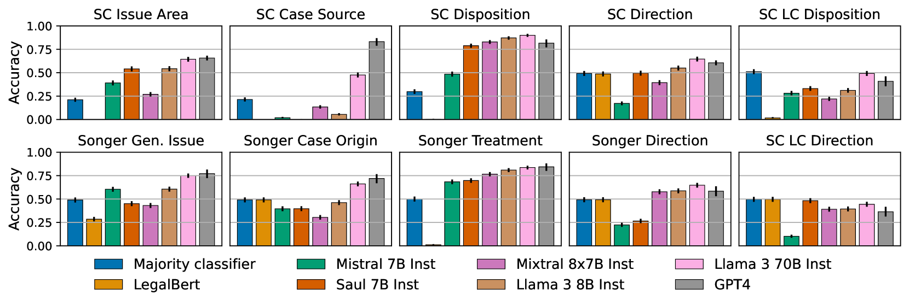

# Lawma：法律任务中专业化的强大力量

发布时间：2024年07月23日

`LLM应用` `人工智能`

> Lawma: The Power of Specialization for Legal Tasks

# 摘要

> 法律文本的标注与分类，是实证法律研究的关键环节。传统上，这些工作多由专业研究助理承担。随着语言模型的进步，越来越多的实证法律学者开始尝试利用商业模型进行提示，以期降低人工标注的高昂成本。然而，如何最有效地运用大型语言模型来处理法律任务，我们仍知之甚少。为此，我们深入研究了260项全新的法律文本分类任务。以GPT-4为基准，我们发现其零-shot准确性虽高但波动大，往往难以满足法律工作的严苛要求。相比之下，经过轻度微调的Llama 3模型在各项任务中均大幅领先GPT-4，优势显著。研究表明，大型模型更适应微调，仅需少量样本即可实现高精度分类。尤为值得一提的是，我们成功实现了单一模型对所有260项任务的同步微调，且准确性损失微乎其微。这一成果为依赖商业模型的传统做法提供了有力替代方案。对于拥有一定标注数据的实际法律任务，采用微调后的开源模型无疑是更佳选择。

> Annotation and classification of legal text are central components of empirical legal research. Traditionally, these tasks are often delegated to trained research assistants. Motivated by the advances in language modeling, empirical legal scholars are increasingly turning to prompting commercial models, hoping that it will alleviate the significant cost of human annotation. Despite growing use, our understanding of how to best utilize large language models for legal tasks remains limited. We conduct a comprehensive study of 260 legal text classification tasks, nearly all new to the machine learning community. Starting from GPT-4 as a baseline, we show that it has non-trivial but highly varied zero-shot accuracy, often exhibiting performance that may be insufficient for legal work. We then demonstrate that a lightly fine-tuned Llama 3 model vastly outperforms GPT-4 on almost all tasks, typically by double-digit percentage points. We find that larger models respond better to fine-tuning than smaller models. A few tens to hundreds of examples suffice to achieve high classification accuracy. Notably, we can fine-tune a single model on all 260 tasks simultaneously at a small loss in accuracy relative to having a separate model for each task. Our work points to a viable alternative to the predominant practice of prompting commercial models. For concrete legal tasks with some available labeled data, researchers are better off using a fine-tuned open-source model.

[Arxiv](https://arxiv.org/abs/2407.16615)